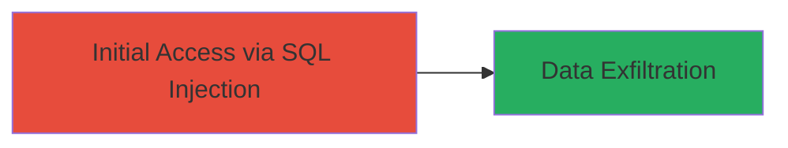

---
tags:
  - sqli
  - dod
  - web
  - injection
type: attack_chain
tools: []
tactics:
  - '[[Initial Access]]'
verified: false
platforms:
  - Web
submitted: true
complexity: medium
created_at: '2023-10-01T00:00:00Z'
procedures:
  - '[[procedures/Exploit-SQL-Injection-via-URL-Parameter]]'
step_count: 1
techniques:
  - '[[Exploit Public-Facing Application]]'
updated_at: '2025-12-14T03:46:19.941Z'
description: >-
  A SQL injection vulnerability in a U.S. Department of Defense website allowing
  arbitrary SQL command execution and potential exposure of sensitive data via
  crafted URL parameters.
skill_level: intermediate
impact_level: high
id: 406fc574-f5f3-4c49-bf79-77eecacccd4c
validated: true
mitre_tactics:
  - '[[Initial Access]]'
mitre_techniques:
  - '[[Exploit Public-Facing Application]]'
---
# SQL Injection on DoD Website to Expose Sensitive Data

Multi-stage attack chain demonstrating a complete attack workflow targeting a SQL injection vulnerability on a U.S. Department of Defense website. The attack leverages insufficient input validation on URL parameters to inject SQL payloads, enabling arbitrary command execution and potential data exfiltration.

## Chain Metrics Dashboard

| Metric | Value |
|--------|-------|
| Chain Status | Unverified |
| Total Steps | 1 |
| Execution Time | ~5 minutes |
| Skill Level | Intermediate |
| Complexity | Medium |
| Impact Level | High |

## Attack Flow Visualization



## Prerequisites & Requirements

### Required Tools

- [[tools/Burp-Suite]]
- Web browser or curl

### Target Environment

- Web platform
- Publicly accessible DoD website
- No specific ports required beyond HTTP/HTTPS (80/443)

### Initial Access Requirements

- Internet access to the target website
- No prior credentials needed
- Basic knowledge of SQL syntax

## Detailed Attack Procedures

### Step 1: Discover and Exploit SQL Injection
procedure: [[procedures/Exploit-SQL-Injection-via-URL-Parameter]]

**Objective**: Identify and exploit a SQL injection vulnerability in URL parameters to execute arbitrary SQL commands and access sensitive data.

**Instructions**: Begin by navigating to the target DoD website and identifying input fields or URL parameters that interact with a database, such as search queries or page IDs. Test for injection by appending a single quote (' ) to the parameter. If an error occurs, proceed to craft payloads. Use [[commands/curl-sqli-test]] to send a basic injection payload:

```bash
curl "https://target.dod.mil/page?id=1'" -v
```

If successful, escalate to a UNION-based injection with [[commands/curl-union-select]] to extract data:

```bash
curl "https://target.dod.mil/page?id=1' UNION SELECT database(),user(),version()--" -v
```

**Expected Output**: Database error messages or leaked information like database name, user, and version in the response.

**Success Indicators**:
- SQL error messages appear (e.g., syntax error near '')
- Arbitrary data returned from UNION SELECT
- No authentication barriers bypassed

## Attack Chain Summary

### Key Achievements

1. Identified SQL injection point in URL parameter
2. Executed arbitrary SQL commands to probe database structure
3. Potentially exposed sensitive DoD data, leading to high-impact unauthorized access

## Technique & Tactic Coverage

### MITRE ATT&CK Techniques

- [[Exploit Public-Facing Application]]

### MITRE ATT&CK Tactics

- [[Initial Access]]

---
*Last updated: 2023-10-01T00:00:00Z*
