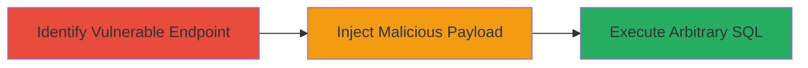

# SQL Injection via Django HasKey Lookup on Oracle Database

Multi-stage attack chain demonstrating exploitation of CVE-2024-53908 in Django applications using Oracle databases.

## Chain Metrics Dashboard

| Metric | Value |
|--------|-------|
| Chain Status | Unverified |
| Total Steps | 2 |
| Execution Time | ~5 minutes |
| Skill Level | Intermediate |
| Complexity | Medium |
| Impact Level | High |

## Attack Flow Visualization



## Prerequisites & Requirements

### Required Tools

- None specific (uses standard HTTP clients like curl)

### Target Environment

- Web application using Django with Oracle backend
- JSONField in models using HasKey lookup directly
- Exposed API or form accepting untrusted input for lhs in HasKey

### Initial Access Requirements

- Network access to the web application
- No prior credentials needed if endpoint is public-facing
- Ability to intercept and modify HTTP requests

## Detailed Attack Procedures

### Step 1: Identify Vulnerable Endpoint
procedure: [[procedures/Identify-Django-HasKey-Usage]]

**Objective**: Locate endpoints or queries in the Django application that use the HasKey lookup with user-controlled input as the lhs value.

**Instructions**: Review application source code or use black-box testing to identify JSON field queries. For example, test forms or APIs that filter on JSON keys provided by users. Use [[commands/curl-identify-endpoint]] to probe potential endpoints:

```bash
curl -X GET "http://target.com/api/items?json_key=userinput" -v
```

Monitor responses for database errors indicating Oracle JSON handling, such as ORA-XXXX errors related to JSON functions.

**Expected Output**: HTTP response revealing query structure or error messages hinting at HasKey usage (e.g., JSON key validation errors).

**Success Indicators**:
- Endpoint accepts string input for JSON key lookup
- Response times vary or errors suggest direct SQL interpolation

### Step 2: Exploit SQL Injection
procedure: [[procedures/Exploit-Django-HasKey-SQL-Injection]]

**Objective**: Inject malicious SQL payload into the lhs parameter of the HasKey lookup to execute arbitrary commands on the Oracle database.

**Instructions**: Craft a payload that closes the HasKey function and appends SQL, such as using Oracle's JSON_EXISTS or similar, but exploiting the unsanitized lhs. Send the payload using [[commands/curl-sqli-payload]]:

```bash
curl -X POST "http://target.com/api/query" -d '{"lhs": "foo'); SELECT * FROM users; --", "rhs": "jsonfield"}' -H "Content-Type: application/json" -v
```

Validate by checking for data leakage in responses or database logs.

**Expected Output**: Response containing leaked data (e.g., user table contents) or confirmation of SQL execution via error/dump.

**Success Indicators**:
- Unauthorized data returned in response
- Database logs show executed arbitrary SQL
- No application-level errors blocking injection

## Attack Chain Summary

### Key Achievements

1. Identification of vulnerable HasKey usage in Django ORM queries on Oracle
2. Successful injection leading to arbitrary SQL execution
3. Potential for data exfiltration, manipulation, or access escalation

## Technique & Tactic Coverage

### MITRE ATT&CK Techniques

- [[Exploit Public-Facing Application]]

### MITRE ATT&CK Tactics

- [[Execution]]

---
*Last updated: 2024-12-05T00:00:00Z*
