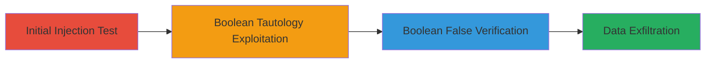

---
tags:
  - sqli
  - web
  - injection
  - database
  - khan-academy
type: attack_chain
tools: []
tactics:
  - '[[Initial Access]]'
  - '[[Collection]]'
commands:
  - '[[commands/curl-test-single-quote-sqli]]'
  - '[[commands/curl-boolean-tautology-sqli]]'
  - '[[commands/curl-boolean-false-sqli]]'
verified: false
platforms:
  - Web
submitted: true
complexity: medium
procedures:
  - '[[procedures/Test-SQL-Injection-with-Single-Quote]]'
  - '[[procedures/Exploit-SQL-Injection-with-Boolean-Tautology]]'
  - '[[procedures/Verify-SQL-Injection-with-Boolean-False]]'
step_count: 3
techniques:
  - '[[Exploit Public-Facing Application]]'
description: >-
  Multi-stage SQL injection attack exploiting the unsanitized language parameter
  in the Khan Academy /translations/videos endpoint to test for vulnerability,
  bypass filters, and extract unauthorized database contents like CSV files.
skill_level: intermediate
impact_level: high
id: bc143d37-0f23-46cf-af92-ccff1bcdeb39
created_at: '2025-12-14T03:46:20.290Z'
updated_at: '2025-12-14T03:46:20.290Z'
validated: true
mitre_tactics:
  - '[[Initial Access]]'
  - '[[Collection]]'
mitre_techniques:
  - '[[Exploit Public-Facing Application]]'
---
# SQL Injection via Language Parameter in Khan Academy Translations Endpoint

Multi-stage attack chain demonstrating a complete SQL injection workflow targeting the Khan Academy web application to unauthorizedly access database-stored CSV files.

## Chain Metrics Dashboard

| Metric | Value |
|--------|-------|
| Chain Status | Unverified |
| Total Steps | 3 |
| Execution Time | ~5 minutes |
| Skill Level | Intermediate |
| Complexity | Medium |
| Impact Level | High |

## Attack Flow Visualization



## Prerequisites & Requirements

### Required Tools

- Web browser or [[commands/curl-test-single-quote-sqli]] (for HTTP requests)

### Target Environment

- Web platform with SQL backend (e.g., Django or Node.js)
- Accessible /translations/videos/{lang}_youtube_stats.csv endpoint
- No authentication required for public endpoint

### Initial Access Requirements

- Public internet access to Khan Academy domain
- No credentials needed
- Network position: External attacker

## Detailed Attack Procedures

### Step 1: Initial Access
procedure: [[procedures/Test-SQL-Injection-with-Single-Quote]]

**Objective**: Test for SQL injection vulnerability by injecting a single quote to disrupt the query and trigger an error.

**Instructions**: Use [[commands/curl-test-single-quote-sqli]] to append a single quote to the language parameter in the URL:

```bash
curl -s "https://www.khanacademy.org/translations/videos/en'_youtube_stats.csv"
```

**Expected Output**: HTTP 500 Internal Server Error response, indicating unsanitized input reaching the database.

**Success Indicators**:
- 500 error returned
- No CSV content or malformed response

### Step 2: Execution
procedure: [[procedures/Exploit-SQL-Injection-with-Boolean-Tautology]]

**Objective**: Exploit the vulnerability with a boolean-based payload to bypass filters and retrieve all CSV files from the database.

**Instructions**: Modify the URL with a tautology payload using [[commands/curl-boolean-tautology-sqli]]:

```bash
curl -s "https://www.khanacademy.org/translations/videos/en'%20or'1'=='1_youtube_stats.csv"
```

**Expected Output**: Response containing all available CSV files or database records, not limited to English.

**Success Indicators**:
- Multiple CSV files or unexpected data returned
- Query bypass confirmed by broader results

### Step 3: Privilege Escalation
procedure: [[procedures/Verify-SQL-Injection-with-Boolean-False]]

**Objective**: Verify control over the query by using a false condition to limit results, confirming the injection's precision.

**Instructions**: Use a false boolean payload with [[commands/curl-boolean-false-sqli]] to restrict to English CSVs only:

```bash
curl -s "https://www.khanacademy.org/translations/videos/en'%20AND'1'=='0_youtube_stats.csv"
```

**Expected Output**: Response limited to English CSV files, demonstrating query manipulation.

**Success Indicators**:
- Results filtered to expected subset (English only)
- No additional unauthorized data beyond control

## Attack Chain Summary

### Key Achievements

1. Identified SQL injection vulnerability via error triggering
2. Bypassed input filters to access all CSV files
3. Verified exploitation control for targeted data extraction

## Technique & Tactic Coverage

### MITRE ATT&CK Techniques

- [[Exploit Public-Facing Application]]

### MITRE ATT&CK Tactics

- [[Initial Access]]
- [[Collection]]

---

*Last updated: 2023-10-01*
