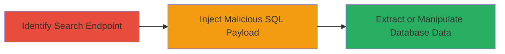

---
tags:
  - sqli
  - web
  - database
  - injection
type: attack_chain
tools:
  - '[[tools/sqlmap]]'
tactics:
  - '[[Initial Access]]'
  - '[[Collection]]'
verified: false
platforms:
  - Web
submitted: true
complexity: medium
created_at: '2023-10-01T00:00:00Z'
procedures:
  - '[[procedures/Exploit-SQL-Injection-in-Search-Functionality]]'
step_count: 1
techniques:
  - '[[Exploit Public-Facing Application]]'
updated_at: '2025-12-14T17:28:44.221Z'
description: >-
  A single-stage attack exploiting SQL injection in the search functionality of
  the Mars website to gain unauthorized access to the database, enabling data
  leakage, modification, or extraction.
skill_level: intermediate
impact_level: high
id: 296c120f-8087-4fbf-84e7-a94b4d47d2a9
validated: true
mitre_tactics:
  - '[[Initial Access]]'
  - '[[Collection]]'
mitre_techniques:
  - '[[Exploit Public-Facing Application]]'
---
---
id: 123e4567-e89b-12d3-a456-426614174000
name: SQL Injection via Mars Website Search Functionality Leading to Database Access
type: attack_chain
description: "A single-stage attack exploiting SQL injection in the search functionality of the Mars website to gain unauthorized access to the database, enabling data leakage, modification, or extraction."
verified: false
submitted: false
step_count: 1
created_at: 2023-10-01T00:00:00Z
updated_at: 2023-10-01T00:00:00Z
procedures: [[procedures/Exploit-SQL-Injection-in-Search-Functionality]]
techniques: [[Exploit Public-Facing Application]]
tactics: [[Initial Access]], [[Collection]]
tags: sqli, web, database, injection
platforms: Web
tools: [[tools/sqlmap]]
---

# SQL Injection via Mars Website Search Functionality Leading to Database Access

Multi-stage attack chain demonstrating a complete attack workflow.

## Chain Metrics Dashboard

| Metric | Value |
|--------|-------|
| Chain Status | Unverified |
| Total Steps | 1 |
| Execution Time | ~5 minutes |
| Skill Level | Intermediate |
| Complexity | Medium |
| Impact Level | High |

## Attack Flow Visualization



## Prerequisites & Requirements

### Required Tools

- [[tools/sqlmap]]

### Target Environment

- Web platform with search functionality
- Exposed database backend (e.g., MySQL, PostgreSQL)
- No specific ports required beyond standard HTTP/HTTPS (80/443)

### Initial Access Requirements

- Public internet access to the Mars website
- No credentials needed for unauthenticated search
- Browser or proxy tool like Burp Suite for manual testing

## Detailed Attack Procedures

### Step 1: Exploit Search Functionality
procedure: [[procedures/Exploit-SQL-Injection-in-Search-Functionality]]

**Objective**: Inject malicious SQL code into the search query to bypass authentication or extract sensitive data from the database.

**Instructions**: Begin by navigating to the search endpoint on the Mars website, typically at `https://mars.com/search?q=query`. Test for injection by appending a single quote (`'`) to the query parameter. If an error occurs, proceed to inject payloads using [[commands/sqlmap-test-sqli]] to automate detection and exploitation.

```bash
sqlmap -u "https://mars.com/search?q=test" --batch --dbs
```

Once vulnerable, dump tables or data as needed.

**Expected Output**: Database errors on basic injection, followed by a list of databases, tables, or dumped data upon successful exploitation.

**Success Indicators**:
- SQL error messages (e.g., syntax error near '')
- Retrieval of unintended data, such as user records or system tables
- Confirmation of database names via sqlmap output

## Attack Chain Summary

### Key Achievements

1. Identification of SQL injection point in search query handling
2. Unauthorized database access leading to potential data exfiltration
3. Ability to manipulate database contents if write permissions are gained

## Technique & Tactic Coverage

### MITRE ATT&CK Techniques

- [[Exploit Public-Facing Application]]

### MITRE ATT&CK Tactics

- [[Initial Access]]
- [[Collection]]

---
*Last updated: 2023-10-01T00:00:00Z*
