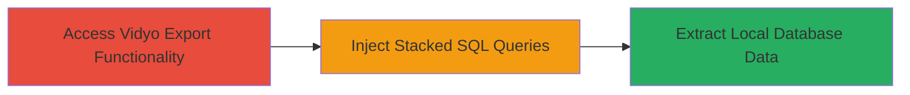

# SQL Injection via Stacked Queries in Vidyo Server Excel Export Leading to Local Database Access

Multi-stage attack chain demonstrating exploitation of a SQL injection vulnerability in the Vidyo Server's export to Excel feature, resulting in unauthorized access to the local database.

## Chain Metrics Dashboard

| Metric | Value |
|--------|-------|
| Chain Status | Unverified |
| Total Steps | 1 |
| Execution Time | ~5 minutes |
| Skill Level | Intermediate |
| Complexity | Medium |
| Impact Level | High |

## Attack Flow Visualization



## Prerequisites & Requirements

### Required Tools

- [[tools/sqlmap]]

### Target Environment

- Web-based Vidyo Server application
- Local database service (e.g., MySQL or similar backend)
- No specific ports required beyond standard HTTP/HTTPS (80/443)

### Initial Access Requirements

- Network access to the Vidyo Server web interface
- User-level access to the export functionality (may require authentication depending on server config)
- No prior credentials needed if the export endpoint is public-facing

## Detailed Attack Procedures

### Step 1: Exploit SQL Injection in Export Functionality
procedure: [[procedures/Exploit-SQL-Injection-in-Vidyo-Export-Functionality]]

**Objective**: Identify and exploit the SQL injection vulnerability in the export to Excel feature to execute stacked queries and retrieve data from the local database.

**Instructions**: Begin by navigating to the Vidyo Server's export to Excel interface. Use [[commands/sqlmap-test-payload]] to probe for SQL injection vulnerabilities in the input parameters of the export request. If confirmed, craft a stacked query payload to append additional SQL commands, such as dumping table contents.

For example, inject a payload like `'; SELECT * FROM users; --` into a vulnerable parameter (e.g., a search or filter field in the export form).

```bash
sqlmap -u "http://vidyo-server/export?param=test" --dbms=mysql --technique=S --stacked=1 --dump
```

Validate the injection by checking for database errors or unexpected data in the Excel output.

**Expected Output**: Successful injection returns database schema, table data, or error messages confirming stacked query execution. The exported Excel file may contain unintended database records.

**Success Indicators**:
- Database error messages (e.g., SQL syntax errors) in response
- Unauthorized data from local database tables appears in export
- Confirmation of stacked query execution via tool output

## Attack Chain Summary

### Key Achievements

1. Bypassed input validation in export functionality to inject SQL code
2. Executed stacked queries to access and extract data from the local database
3. Demonstrated potential for full database compromise, leading to server retirement as mitigation

## Technique & Tactic Coverage

### MITRE ATT&CK Techniques

- [[Exploit Public-Facing Application]]

### MITRE ATT&CK Tactics

- [[Initial Access]]
- [[Collection]]

---
*Last updated: 2023-10-01T00:00:00Z*
