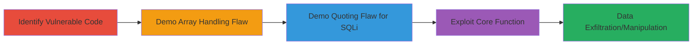

# SQL Injection via WordPress wpdb prepare Method in bbPress and Core Functions

Multi-stage attack chain demonstrating exploitation of the WordPress database class's prepare method, which mishandles arrays and quotes %s placeholders, enabling SQL injection in plugins like bbPress and core functions like delete_metadata. This affects all WordPress installations, leading to information disclosure and data manipulation.

## Chain Metrics Dashboard

| Metric | Value |
|--------|-------|
| Chain Status | Unverified |
| Total Steps | 4 |
| Execution Time | ~10 minutes |
| Skill Level | Intermediate |
| Complexity | Medium |
| Impact Level | High |

## Attack Flow Visualization



## Prerequisites & Requirements

### Required Tools

- Code editor or PHP environment for testing (e.g., local WordPress setup)
- Access to WordPress installation with bbPress plugin enabled for anonymous posting

### Target Environment

- WordPress platform with MySQL backend
- Enabled bbPress plugin allowing anonymous posts
- Core functions like delete_metadata accessible
- Network access to the WordPress site

### Initial Access Requirements

- Ability to post anonymously in bbPress or trigger metadata deletion
- No special credentials needed for anonymous exploitation
- Local or remote access to inspect wp-includes/wp-db.php

## Detailed Attack Procedures

### Step 1: Identify Vulnerable Usage
procedure: [[procedures/Identify-Vulnerable-Usage-in-bbPress-Anonymous-Posting]]

**Objective**: Locate and analyze the vulnerable $wpdb->prepare() usage in bbPress for anonymous posting to understand how user input leads to SQL injection.

**Instructions**: Review the bbPress code where anonymous user input is passed to prepare() with %s placeholders. Enable anonymous posting in bbPress settings and inspect the query construction in the plugin files.

**Expected Output**: Identification of queries like those inserting user data with quoted %s, vulnerable to injection via malicious input.

**Success Indicators**:
- Confirmed anonymous posting enabled
- Located prepare() calls with user-controlled %s in bbPress source

### Step 2: Demonstrate Array Handling
procedure: [[procedures/Demonstrate-Array-Handling-Issue-in-WordPress-Prepare]]

**Objective**: Show how passing an array as the first argument to prepare() bypasses argument processing, allowing direct SQL injection.

**Instructions**: In a test PHP script or plugin, call $wpdb->prepare() with an array as the first argument containing malicious SQL. For example, execute [[commands/test-array-handling-in-prepare]] to craft the query.

```php
$wpdb->prepare(array('SELECT * FROM users WHERE id = %d', '1; DROP TABLE users; --'), 1);
```

**Expected Output**: The query executes without processing additional arguments, injecting the payload.

**Success Indicators**:
- Query bypasses sanitization
- Malicious SQL fragment appears in the final query string

### Step 3: Demonstrate Quoting Issue
procedure: [[procedures/Demonstrate-Quoting-Issue-Leading-to-SQLi-in-Prepare]]

**Objective**: Exploit the improper quoting of %s placeholders in prepared queries with user input to break out of strings and inject SQL.

**Instructions**: Craft user input containing quotes and SQL payload for a bbPress post or similar. Use [[commands/test-quoting-flaw-in-prepare]] to simulate the injection in a quoted context.

```php
$wpdb->prepare("INSERT INTO posts (title) VALUES (%s)", "' OR 1=1; --");
```

**Expected Output**: The quoting allows breakout, resulting in an injectable query that discloses or manipulates data.

**Success Indicators**:
- Input breaks string boundaries
- SQL error or unexpected data retrieval occurs

### Step 4: Exploit Core Function
procedure: [[procedures/Exploit-SQLi-in-Core-Delete-Metadata-Function]]

**Objective**: Leverage the vulnerability in the core delete_metadata function when deleting all metadata with user-supplied values to achieve SQL injection.

**Instructions**: Trigger delete_metadata with the last argument set to true and inject via the meta_value parameter. Test with [[commands/exploit-delete-metadata-sqli]] in a custom script or via a vulnerable plugin.

```php
delete_metadata('post', $post_id, $meta_key, $meta_value, true); // $meta_value = "' OR 1=1; --"
```

**Expected Output**: Injected SQL executes, potentially deleting unintended data or disclosing information.

**Success Indicators**:
- Metadata deletion triggers injection
- Database contents altered or exposed

## Attack Chain Summary

### Key Achievements

1. Identified prepare() flaws in bbPress and core WordPress
2. Demonstrated array bypass for direct injection
3. Exploited quoting issues for string breakout
4. Achieved SQLi in core functions leading to disclosure and manipulation

## Technique & Tactic Coverage

### MITRE ATT&CK Techniques

- [[Exploit Public-Facing Application]]

### MITRE ATT&CK Tactics

- [[Execution]]
- [[Collection]]

---
*Last updated: 2023-10-01T00:00:00Z*
