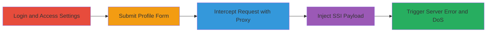

# SSI Injection via Profile Update Form Leading to Server Error DoS

Multi-stage attack chain demonstrating an attempt to exploit a potential Server-Side Includes (SSI) vulnerability in the Semmle application's profile update form. The attacker intercepts the form submission, injects an SSI directive into the 'location' field, and triggers a 500 internal server error, which may render the settings page unavailable (denial of service). Note that this was disputed as a true SSI execution, attributed instead to decoding failures with special characters like '%', but the technique highlights input sanitization risks.

## Chain Metrics Dashboard

| Metric | Value |
|--------|-------|
| Chain Status | Unverified |
| Total Steps | 5 |
| Execution Time | ~5 minutes |
| Skill Level | Intermediate |
| Complexity | Medium |
| Impact Level | Medium |

## Attack Flow Visualization

## Prerequisites & Requirements

### Required Tools

- [[tools/Burp-Suite]]

### Target Environment

- Web application (Semmle platform)
- Access to user account with profile update permissions
- No specific ports or services beyond standard HTTPS (443)

### Initial Access Requirements

- Valid user credentials for the Semmle application
- Local network access or ability to proxy traffic
- Burp Suite configured as a proxy (e.g., browser set to 127.0.0.1:8080)

## Detailed Attack Procedures

### Step 1: Login to Semmle Application
procedure: [[procedures/Access-Semmle-Account-Settings]]

**Objective**: Authenticate to the platform to gain access to account features, including the profile update form.

**Instructions**: Use the application's login form to enter credentials and authenticate. This establishes a session for subsequent interactions.

**Expected Output**: Successful login redirect to the dashboard or account page, with session cookies set.

**Success Indicators**:
- User is logged in and can access protected pages
- No authentication errors

### Step 2: Navigate to Account Settings Page
procedure: [[procedures/Access-Semmle-Account-Settings]]

**Objective**: Reach the profile update interface to prepare for form submission.

**Instructions**: From the dashboard, navigate to the settings or account management section, typically at a URL like /settings, where the public information update form is available.

**Expected Output**: The settings page loads, displaying the form fields including 'location'.

**Success Indicators**:
- Form page is accessible
- Form fields are editable

### Step 3: Fill the Form and Hit Save
procedure: [[procedures/Access-Semmle-Account-Settings]]

**Objective**: Initiate the profile update process to generate the POST request for interception.

**Instructions**: Enter sample data in the form fields and submit by clicking 'Save'. Ensure the browser is configured to route traffic through the Burp proxy to trap the request.

**Expected Output**: The form submission triggers an HTTP POST to /internal_api/v0.2/savePublicInformation, intercepted by the proxy.

**Success Indicators**:
- Request is captured in Burp
- Form data includes the 'location' parameter

### Step 4: Trap the Request with a Proxy like Burp
procedure: [[procedures/Intercept-Form-Submission-with-Burp]]

**Objective**: Intercept the outgoing POST request to allow modification before it reaches the server.

**Instructions**: With Burp Suite running and the browser proxy configured, submit the form. In Burp's Proxy tab, the request will be paused for inspection and editing.

**Expected Output**: The full POST request details, including headers and form-encoded body, are visible in Burp Repeater or Proxy.

**Success Indicators**:
- Request intercepted successfully
- Body shows application/x-www-form-urlencoded data with 'location' field

### Step 5: Enter the Payload as the Value for Location
procedure: [[procedures/Inject-SSI-Payload-in-Location-Field]]

**Objective**: Modify the 'location' parameter to inject an SSI directive, attempting to trigger server-side processing that causes an error.

**Instructions**: In the intercepted request, edit the 'location' field to include the payload <!--#config timefmt="A %B %d %Y %r"-->. Forward the modified request to the server.

**Expected Output**: Server responds with a 500 Internal Server Error. Subsequent attempts to load the settings page may fail, indicating DoS.

**Success Indicators**:
- 500 error returned
- Settings page becomes unavailable post-submission

## Attack Chain Summary

### Key Achievements

1. Successful interception and modification of profile update request
2. Injection of SSI directive causing server-side error
3. Potential temporary DoS on user settings functionality

## Technique & Tactic Coverage

### MITRE ATT&CK Techniques

- [[Exploit Public-Facing Application]] Exploit Public-Facing Application
- [[Endpoint Denial of Service]] Endpoint Denial of Service

### MITRE ATT&CK Tactics

- [[Execution]] Execution
- [[Impact]] Impact

---
*Last updated: 2023-10-01T00:00:00Z*
