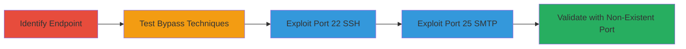

# SSRF Bypass in Slack Event Subscriptions via IPv6 Localhost

Multi-stage attack chain demonstrating exploitation of SSRF protection bypass in Slack's Event Subscriptions feature, allowing internal port scanning and service information disclosure via IPv6 localhost resolution.

## Chain Metrics Dashboard

| Metric | Value |
|--------|-------|
| Chain Status | Unverified |
| Total Steps | 5 |
| Execution Time | ~10 minutes |
| Skill Level | Intermediate |
| Complexity | Medium |
| Impact Level | High |

## Attack Flow Visualization

## Prerequisites & Requirements

### Required Tools

- Web browser or API client (e.g., curl for testing)
- Access to a Slack app with Event Subscriptions permissions

### Target Environment

- Slack API endpoint: https://api.slack.com/apps/{app_code}/event-subscriptions
- Cloud platform (Slack infrastructure)
- Internal services on ports like 22 (SSH) and 25 (SMTP)

### Initial Access Requirements

- Valid Slack app credentials (OAuth token or app code)
- Ability to configure event subscriptions
- No prior internal network access needed; exploits public-facing API

## Detailed Attack Procedures

### Step 1: Identify the Event Subscriptions Feature and Endpoint
procedure: [[procedures/Bypass-SSRF-in-Slack-Event-Subscriptions-Using-IPv6]]

**Objective**: Locate the vulnerable endpoint for setting event subscription URLs and understand basic host validation.

**Instructions**: Navigate to the Slack app management interface or use the API to access https://api.slack.com/apps/{app_code}/event-subscriptions. Attempt to set a subscription URL to a known internal host like http://localhost:80/ to observe the protection mechanism.

**Expected Output**: A 500 error indicating host validation blocks direct localhost access.

**Success Indicators**:
- Endpoint identified and basic validation confirmed via error response
- App code obtained for further testing

### Step 2: Test SSRF Bypass Techniques
procedure: [[procedures/Bypass-SSRF-in-Slack-Event-Subscriptions-Using-IPv6]]

**Objective**: Probe various SSRF payloads to identify bypasses in the host validation logic.

**Instructions**: Systematically test common SSRF vectors (e.g., 127.0.0.1, 0.0.0.0) on the subscription URL parameter. Focus on IPv6 notations, setting the URL to http://[::]:80/ to check if it resolves to localhost without triggering blocks.

**Expected Output**: Successful acceptance of the IPv6 payload without validation error, indicating a bypass.

**Success Indicators**:
- IPv6 [::] payload accepted
- No 500 error on localhost-resolving IPv6 address

### Step 3: Exploit Using IPv6 Localhost on Port 22 (SSH)
procedure: [[procedures/Bypass-SSRF-in-Slack-Event-Subscriptions-Using-IPv6]]

**Objective**: Connect to internal SSH service to retrieve version banner, demonstrating port scanning capability.

**Instructions**: Configure the event subscription URL to http://[::]:22/. Use a PoC redirector if needed (e.g., a PHP script at http://hacker.site/x.php/?u=http://[::]:22/) to capture the response from Slack's internal connection attempt.

**Expected Output**: SSH banner such as 'SSH-2.0-OpenSSH_7.2p2 Ubuntu-4ubuntu2.4 Protocol mismatch.'

**Success Indicators**:
- Internal SSH banner retrieved
- Confirmation of port 22 accessibility

### Step 4: Exploit Using IPv6 Localhost on Port 25 (SMTP)
procedure: [[procedures/Bypass-SSRF-in-Slack-Event-Subscriptions-Using-IPv6]]

**Objective**: Connect to internal SMTP service to retrieve version and response details.

**Instructions**: Set the subscription URL to http://[::]:25/. Monitor the response via the PoC redirector to capture the SMTP greeting.

**Expected Output**: SMTP response like '220 squid-iad-ypfw.tinyspeck.com ESMTP Postfix 221 2.7.0 Error: I can break rules, too. Goodbye.'

**Success Indicators**:
- Internal SMTP banner and hostname exposed
- Port 25 confirmed open internally

### Step 5: Test Non-Existent Port for Confirmation
procedure: [[procedures/Bypass-SSRF-in-Slack-Event-Subscriptions-Using-IPv6]]

**Objective**: Validate internal access by attempting connection to a closed port, confirming SSRF reachability.

**Instructions**: Set the subscription URL to http://[::]:{non-existent-port}/ (e.g., port 9999). Observe the error response indicating a failed internal connection.

**Expected Output**: Connection timeout or refusal error from internal network.

**Success Indicators**:
- Error confirms attempts are routed internally
- No external resolution; pure localhost behavior

## Attack Chain Summary

### Key Achievements

1. Bypassed SSRF protection using IPv6 [::] notation to resolve to localhost.
2. Scanned internal ports 22 and 25, retrieving SSH and SMTP service versions.
3. Demonstrated potential for broader internal reconnaissance and resource access.

## Technique & Tactic Coverage

### MITRE ATT&CK Techniques

- [[Exploit Public-Facing Application]]

### MITRE ATT&CK Tactics

- [[Initial Access]]

---
*Last updated: 2023-10-01T00:00:00Z*
