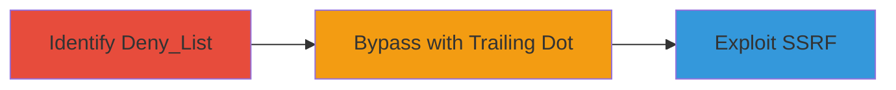

# SSRF Bypass in Smokescreen Proxy via Trailing Dot Domain

Multi-stage attack chain demonstrating a complete attack workflow exploiting a flaw in the Smokescreen proxy's deny_list to enable SSRF by appending a trailing dot to denied domains.

## Chain Metrics Dashboard

| Metric | Value |
|--------|-------|
| Chain Status | Unverified |
| Total Steps | 3 |
| Execution Time | ~5 minutes |
| Skill Level | Intermediate |
| Complexity | Medium |
| Impact Level | High |

## Attack Flow Visualization

## Prerequisites & Requirements

### Required Tools

- [[tools/Smokescreen]]

### Target Environment

- Web platform with Smokescreen proxy deployed
- Access to internal services routing through the proxy
- Go-based environment for Smokescreen

### Initial Access Requirements

- Network access to the proxy endpoint
- Ability to supply URLs to internal services
- No prior credentials needed, but internal network position advantageous

## Detailed Attack Procedures

### Step 1: Identify and Test Smokescreen Deny_List
procedure: [[procedures/Identify-and-Test-Smokescreen-Deny-List]]

**Objective**: Review and test the Smokescreen proxy's deny_list to understand its URL restriction mechanism for SSRF prevention.

**Instructions**: Examine the Smokescreen configuration and documentation to identify the deny_list feature. Test by attempting to access a known denied domain through an internal service that uses the proxy, such as sending a request to a restricted external URL like `http://example.com`.

**Expected Output**: Requests to denied domains are blocked, confirming the deny_list is active.

**Success Indicators**:
- Proxy blocks access to listed denied domains
- Logs show denial based on domain matching

### Step 2: Bypass Deny_List with Trailing Dot
procedure: [[procedures/Bypass-Deny-List-with-Trailing-Dot]]

**Objective**: Circumvent the deny_list by appending a trailing dot to a denied domain, evading the matching logic.

**Instructions**: Modify a user-supplied URL by adding a trailing dot to a denied domain, e.g., change `http://example.com` to `http://example.com.`. Submit this URL via an internal service request to the proxy.

**Expected Output**: The proxy allows the connection, as the trailing dot prevents exact domain match.

**Success Indicators**:
- Request to `example.com.` succeeds where `example.com` fails
- No block logged for the modified URL

### Step 3: Exploit SSRF via Bypassed URL
procedure: [[procedures/Exploit-SSRF-via-Bypassed-URL]]

**Objective**: Use the bypassed URL to force internal services to connect to restricted resources, achieving SSRF.

**Instructions**: Leverage the bypassed URL to target internal or external denied resources, such as metadata endpoints or scanning internal networks. For example, submit `http://169.254.169.254.` (with trailing dot if denied) to access AWS metadata if applicable.

**Expected Output**: Internal service makes unauthorized outbound connection, potentially retrieving sensitive data.

**Success Indicators**:
- Successful access to denied internal/external resource
- SSRF confirmed by response from restricted endpoint

## Attack Chain Summary

### Key Achievements

1. Identified weakness in Smokescreen's deny_list domain matching
2. Bypassed restrictions using trailing dot technique
3. Demonstrated SSRF to access unauthorized resources

## Technique & Tactic Coverage

### MITRE ATT&CK Techniques

- [[Exploit Public-Facing Application]]

### MITRE ATT&CK Tactics

- [[Initial Access]]

---

*Last updated: 2023-10-01T00:00:00Z*
