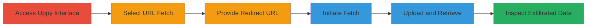

# SSRF Bypass in Uppy Companion via Redirect to Access Internal Cloud Metadata

Multi-stage attack chain demonstrating a complete SSRF exploitation workflow in the Uppy file uploader's Companion server, bypassing a blacklist fix to redirect requests to internal cloud metadata services.

## Chain Metrics Dashboard

| Metric | Value |
|--------|-------|
| Chain Status | Unverified |
| Total Steps | 6 |
| Execution Time | ~5 minutes |
| Skill Level | Intermediate |
| Complexity | Medium |
| Impact Level | High |

## Attack Flow Visualization

## Prerequisites & Requirements

### Required Tools

- Web browser (e.g., Chrome)
- Access to a redirect service like TinyURL

### Target Environment

- Uppy Companion server version 1.15.0 running on Node.js
- Web-based file upload interface (e.g., Uppy demo at https://uppy.io/)
- Internal cloud environment (e.g., DigitalOcean droplet with metadata at 169.254.169.254)

### Initial Access Requirements

- Public access to the Uppy interface
- No authentication required for demo; in production, user-level access to upload feature
- Network position allowing external redirects

## Detailed Attack Procedures

### Step 1: Access the Uppy Interface
procedure: [[procedures/Bypass-SSRF-Blacklist-in-Uppy-Companion-Using-Redirects]]

**Objective**: Gain access to the Uppy file uploader to initiate the URL-based fetch feature.

**Instructions**: Navigate to the Uppy demo site or a local setup of Uppy Companion server.

**Expected Output**: Uppy interface loaded, ready for file selection.

**Success Indicators**:
- Uppy dashboard visible
- URL fetch option available

### Step 2: Select URL-Based File Fetch
procedure: [[procedures/Bypass-SSRF-Blacklist-in-Uppy-Companion-Using-Redirects]]

**Objective**: Choose the feature that allows fetching files from external URLs, setting up for SSRF exploitation.

**Instructions**: In the Uppy interface, select the option to add a file by providing a URL instead of uploading directly.

**Expected Output**: Input field for URL appears.

**Success Indicators**:
- URL input prompt displayed
- Companion server ready to process remote fetches

### Step 3: Provide Redirecting URL to Bypass Blacklist
procedure: [[procedures/Bypass-SSRF-Blacklist-in-Uppy-Companion-Using-Redirects]]

**Objective**: Input a URL that initially passes the host IP blacklist but redirects to an internal endpoint.

**Instructions**: Enter a redirecting URL such as https://tinyurl.com/gqdv39p, which redirects to http://169.254.169.254/metadata/v1/ (an internal metadata service). The initial HTTPS host is external and whitelisted, but the HTTP redirect targets the blacklisted internal IP.

**Expected Output**: URL accepted without immediate rejection.

**Success Indicators**:
- No blacklist error on input
- Fetch process initiates

### Step 4: Initiate Fetch and Upload
procedure: [[procedures/Bypass-SSRF-Blacklist-in-Uppy-Companion-Using-Redirects]]

**Objective**: Trigger the server-side request, causing the Companion to follow the redirect and fetch internal data.

**Instructions**: Confirm the fetch and proceed with the upload process in Uppy.

**Expected Output**: Server processes the request, treating the metadata response as a file for upload.

**Success Indicators**:
- Upload progress bar advances
- No fetch errors reported

### Step 5: Download the Processed File
procedure: [[procedures/Bypass-SSRF-Blacklist-in-Uppy-Companion-Using-Redirects]]

**Objective**: Retrieve the exfiltrated internal data now stored as an uploaded file.

**Instructions**: Once the upload completes, download the file from Uppy's storage or interface.

**Expected Output**: File downloaded to local machine.

**Success Indicators**:
- File saved successfully
- File size indicates content retrieval (e.g., JSON metadata)

### Step 6: Inspect the Exfiltrated Data
procedure: [[procedures/Bypass-SSRF-Blacklist-in-Uppy-Companion-Using-Redirects]]

**Objective**: Analyze the file to confirm access to sensitive internal information.

**Instructions**: Open the downloaded file in a text editor or JSON viewer.

**Expected Output**: Contents reveal internal metadata, such as DigitalOcean droplet details including instance ID, region, and potentially credentials.

**Success Indicators**:
- Sensitive data like metadata JSON visible
- Confirmation of SSRF success via internal endpoint response

## Attack Chain Summary

### Key Achievements

1. Bypassed SSRF blacklist by exploiting unvalidated redirects in Uppy Companion 1.15.0.
2. Accessed internal cloud metadata endpoint (169.254.169.254) without direct IP access.
3. Exfiltrated sensitive server data through file upload mechanism.

## Technique & Tactic Coverage

### MITRE ATT&CK Techniques

- [[Exploit Public-Facing Application]]

### MITRE ATT&CK Tactics

- [[Initial Access]]
- [[Collection]]

---
*Last updated: 2023-10-01T00:00:00Z*
