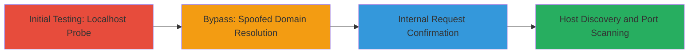

# SSRF Exploitation in Bitwarden Icons Endpoint for Internal Host Discovery

Multi-stage attack chain demonstrating exploitation of SSRF in Bitwarden's icon fetching service to bypass restrictions and enable internal reconnaissance.

## Chain Metrics Dashboard

| Metric | Value |
|--------|-------|
| Chain Status | Unverified |
| Total Steps | 2 |
| Execution Time | ~5 minutes |
| Skill Level | Intermediate |
| Complexity | Medium |
| Impact Level | High |

## Attack Flow Visualization



## Prerequisites & Requirements

### Required Tools

- [[tools/Burp-Collaborator]]
- Web browser or [[commands/curl-http-request]]

### Target Environment

- Web application on .NET Core platform
- Public-facing endpoint: https://icons.bitwarden.net
- No authentication required for icon fetching

### Initial Access Requirements

- Internet access to the target endpoint
- No credentials needed
- Ability to register a collaborator domain for out-of-band detection

## Detailed Attack Procedures

### Step 1: Test Endpoint with Localhost Domain
procedure: [[procedures/Test-SSRF-with-Localhost-Restrictions]]

**Objective**: Probe the endpoint for SSRF susceptibility by attempting to fetch an icon from localhost, revealing partial restrictions.

**Instructions**: Use [[commands/curl-http-request]] to access the endpoint with a localhost domain:

```bash
curl -i https://icons.bitwarden.net/localhost/icon.png
```

**Expected Output**: HTTP 400 Bad Request response, indicating the application blocks direct localhost access but processes the request internally.

**Success Indicators**:
- 400 Bad Request status code returned
- No icon data, but confirmation of request processing

### Step 2: Bypass Restriction Using Spoofed Domain
procedure: [[procedures/Bypass-SSRF-Localhost-via-Spoofed-Domain]]

**Objective**: Circumvent localhost blocks by using a domain that resolves to 127.0.0.1, confirming SSRF and enabling internal interactions.

**Instructions**: First, generate a unique subdomain in Burp Collaborator (e.g., spoofed.burpcollaborator.net). Then, use [[commands/curl-http-request]] to test the endpoint:

```bash
curl -i https://icons.bitwarden.net/spoofed.burpcollaborator.net/icon.png
```

Monitor Burp Collaborator for incoming DNS resolutions or HTTP requests from the target server.

**Expected Output**: HTTP 404 Not Found response from the endpoint, with out-of-band interactions logged in Burp Collaborator confirming the server resolved the domain to 127.0.0.1 and made an internal request.

**Success Indicators**:
- 404 Not Found status code
- DNS lookup or HTTP interaction detected in Burp Collaborator
- Potential for further internal port scanning by varying ports in the URL (e.g., localhost:8080)

## Attack Chain Summary

### Key Achievements

1. Identified SSRF vulnerability in icon fetching endpoint
2. Bypassed localhost restrictions using external DNS spoofing
3. Confirmed internal request capability for host discovery and infrastructure reconnaissance

## Technique & Tactic Coverage

### MITRE ATT&CK Techniques

- [[Exploit Public-Facing Application]]
- [[Gather Victim Host Information]]

### MITRE ATT&CK Tactics

- [[Initial Access]]
- [[Reconnaissance]]

---
*Last updated: 2023-10-01T00:00:00Z*
