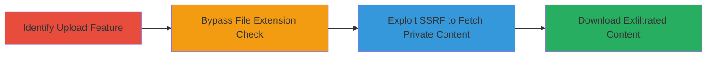

# SSRF Exploitation in Concrete CMS Upload Feature for Private Network Pivoting

Multi-stage attack chain demonstrating exploitation of SSRF in the Concrete CMS 'upload from remote servers' feature to fetch and download content from internal private network resources, enabling reconnaissance, fingerprinting, and potential pivoting.

## Chain Metrics Dashboard

| Metric | Value |
|--------|-------|
| Chain Status | Unverified |
| Total Steps | 4 |
| Execution Time | ~5 minutes |
| Skill Level | Intermediate |
| Complexity | Medium |
| Impact Level | High |

## Attack Flow Visualization

## Prerequisites & Requirements

### Required Tools

- Web browser or proxy tool like Burp Suite for testing uploads

### Target Environment

- Concrete CMS instance (PHP-based web application)
- Access to the CMS dashboard with upload permissions
- Network position allowing access to the public-facing CMS

### Initial Access Requirements

- Authenticated user account in Concrete CMS (e.g., editor or admin role)
- No special credentials beyond standard login
- Public internet access to the CMS URL

## Detailed Attack Procedures

### Step 1: Identify Upload Feature
procedure: [[procedures/Identify-Upload-Feature-in-Concrete-CMS]]

**Objective**: Locate and understand the 'upload from remote servers' feature to confirm SSRF potential.

**Instructions**: Navigate to the file manager or media upload section in the Concrete CMS dashboard. Look for the option to upload files from remote URLs, which fetches content via HTTP and saves it locally or to integrated storage like S3.

**Expected Output**: Confirmation of the feature availability, typically under Dashboard > Files > Upload from Remote.

**Success Indicators**:
- Feature option visible in UI
- Ability to input a test public URL (e.g., http://example.com/test.jpg) and see it process

### Step 2: Bypass File Extension Validation
procedure: [[procedures/Bypass-File-Extension-Validation-in-Upload]]

**Objective**: Circumvent restrictions on file types to allow fetching arbitrary content, including from executable endpoints.

**Instructions**: When using the upload feature, append a permitted extension path to the target URL, such as http://target.com/index.php/test.png. The server ignores the path after the main endpoint, treating the response as the appended extension type.

**Expected Output**: The feature accepts the URL and fetches the content without rejecting based on extension.

**Success Indicators**:
- Upload succeeds with a non-image URL disguised as .png
- No error on file type validation

### Step 3: Exploit SSRF for Private IP Access
procedure: [[procedures/Exploit-SSRF-for-Private-IP-Access]]

**Objective**: Use the feature to request resources from private LAN IPs, bypassing network restrictions since the server makes the internal request.

**Instructions**: Input a private IP URL in the upload field, ensuring it returns HTTP 200, e.g., http://192.168.1.157/info.php/test.html. The CMS fetches the internal page (like phpinfo) and processes it as uploadable content.

**Expected Output**: Internal content fetched and temporarily stored by the CMS.

**Success Indicators**:
- No rejection of private IP (e.g., 192.168.x.x or 10.x.x.x)
- HTTP 200 response from internal service triggers successful processing

### Step 4: Download Fetched Internal Content
procedure: [[procedures/Download-Fetched-Internal-Content]]

**Objective**: Retrieve the exfiltrated internal data via the CMS interface for analysis or further exploitation.

**Instructions**: After the upload completes, access the file manager to download the saved file, which may be stored locally on the server or in S3 buckets integrated with the CMS.

**Expected Output**: Downloadable file containing internal application output (e.g., phpinfo details).

**Success Indicators**:
- File appears in CMS file list
- Successful download of internal content

## Attack Chain Summary

### Key Achievements

1. Bypassed upload validations to enable SSRF on private networks
2. Fetched sensitive internal web application data (e.g., phpinfo for fingerprinting)
3. Exfiltrated content via legitimate CMS download mechanisms
4. Enabled potential pivoting by revealing internal services and GET-based vulnerabilities

## Technique & Tactic Coverage

### MITRE ATT&CK Techniques

- [[Exploit Public-Facing Application]] Exploit Public-Facing Application
- [[Network Service Scanning]] Network Service Scanning

### MITRE ATT&CK Tactics

- [[Initial Access]] Initial Access
- [[Discovery]] Discovery

---
*Last updated: 2023-10-01T00:00:00Z*
