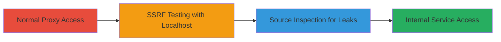

---
tags:
  - ssrf
  - proxy
  - internal-network
  - couchbase
type: attack_chain
tools: []
tactics:
  - '[[Initial Access]]'
  - '[[Reconnaissance]]'
verified: false
platforms:
  - Web
submitted: true
complexity: medium
created_at: '2023-10-01T00:00:00Z'
procedures:
  - '[[procedures/Access-DuckDuckGo-Proxy-Normally]]'
  - '[[procedures/Test-SSRF-with-Internal-Localhost-URLs]]'
  - '[[procedures/Inspect-Page-Source-for-Internal-Service-Leaks]]'
step_count: 3
techniques:
  - '[[Exploit Public-Facing Application]]'
updated_at: '2025-12-14T04:08:48.537Z'
description: >-
  A multi-step attack chain exploiting SSRF in the DuckDuckGo proxy endpoint to
  scan internal networks and access restricted services like Couchbase.
skill_level: intermediate
impact_level: high
id: 988a1ab4-9caa-4fb7-a69c-232c18e44a5e
validated: true
mitre_tactics:
  - '[[Initial Access]]'
  - '[[Reconnaissance]]'
mitre_techniques:
  - '[[Exploit Public-Facing Application]]'
---
# SSRF Exploitation in DuckDuckGo Proxy to Access Internal Services

Multi-stage attack chain demonstrating a complete SSRF workflow against the DuckDuckGo proxy endpoint, allowing internal network reconnaissance and access to restricted services.

## Chain Metrics Dashboard

| Metric | Value |
|--------|-------|
| Chain Status | Unverified |
| Total Steps | 3 |
| Execution Time | ~5 minutes |
| Skill Level | Intermediate |
| Complexity | Medium |
| Impact Level | High |

## Attack Flow Visualization



## Prerequisites & Requirements

### Required Tools

- Web browser (e.g., Chrome or Firefox with developer tools)

### Target Environment

- Web platform
- Access to external internet
- Target endpoint: https://proxy.duckduckgo.com/iur/
- Services/ports: Internal ports like 8091, 8092, 9998, 18091 (Couchbase and others)

### Initial Access Requirements

- No credentials required
- Public network access to the proxy endpoint
- No prior access needed

## Detailed Attack Procedures

### Step 1: Normal Proxy Access
procedure: [[procedures/Access-DuckDuckGo-Proxy-Normally]]

**Objective**: Understand the normal behavior of the proxy endpoint to establish a baseline for exploitation.

**Instructions**: Visit the endpoint with a legitimate external URL to confirm it fetches and processes the image_host parameter correctly.

Use a web browser to navigate to:

```url
https://proxy.duckduckgo.com/iur/?f=1&image_host=https://tudomanyok.hu/
```

Observe that the proxy fetches the content without issues.

**Expected Output**: The page loads an image or content from the external URL, confirming proxy functionality.

**Success Indicators**:
- Page renders external content successfully
- No errors in response

### Step 2: SSRF Testing with Internal URLs
procedure: [[procedures/Test-SSRF-with-Internal-Localhost-URLs]]

**Objective**: Exploit the SSRF vulnerability by supplying internal localhost URLs to trigger requests to internal services.

**Instructions**: Modify the image_host parameter to point to localhost addresses on various internal ports. Test multiple variations to identify open services.

In a web browser, visit URLs like:

```url
https://proxy.duckduckgo.com/iur/?f=1&image_host=https://127.0.0.1:18091/
```

```url
https://proxy.duckduckgo.com/iur/?f=1&image_host=http://127.0.0.1:9998/
```

```url
https://proxy.duckduckgo.com/iur/?f=1&image_host=http://127.0.0.1:8092/
```

```url
https://proxy.duckduckgo.com/iur/?f=1&image_host=http://127.0.0.1:8091/
```

Monitor responses for differences indicating internal access.

**Expected Output**: Responses may show errors, delays, or partial content from internal services, confirming SSRF success.

**Success Indicators**:
- Varied response times or content leaks for different ports
- Successful proxying of internal requests

### Step 3: Source Inspection for Leaks
procedure: [[procedures/Inspect-Page-Source-for-Internal-Service-Leaks]]

**Objective**: Reveal hidden internal service details by inspecting the page source, which may expose information not visible in the rendered view.

**Instructions**: After testing an internal URL, right-click and select "View Page Source" to check for leaked content.

Target a specific internal path, such as:

```url
https://proxy.duckduckgo.com/iur/?f=1&image_host=https://127.0.0.1:18091/ui/
```

Then inspect the source code for indicators of internal applications like Couchbase console elements.

**Expected Output**: Source code contains references to internal services, such as Couchbase UI elements or paths.

**Success Indicators**:
- Internal service indicators (e.g., Couchbase console tags) in source
- Confirmation of access to non-public applications

## Attack Chain Summary

### Key Achievements

1. Confirmed SSRF vulnerability in the image_host parameter due to lack of internal URL validation.
2. Scanned internal ports (8091, 8092, 9998, 18091) to identify open services.
3. Accessed and leaked details from internal Couchbase console, bypassing external restrictions.

## Technique & Tactic Coverage

### MITRE ATT&CK Techniques

- [[Exploit Public-Facing Application]]

### MITRE ATT&CK Tactics

- [[Initial Access]]
- [[Reconnaissance]]

---
*Last updated: 2023-10-01T00:00:00Z*
