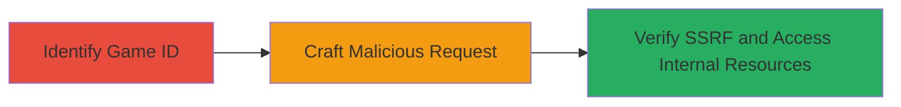

# SSRF Exploitation in Lichess Game Export API to Access Internal Endpoints

Multi-stage attack chain demonstrating exploitation of an SSRF vulnerability in the Lichess game export API, allowing unauthorized access to internal endpoints, cloud metadata services like AWS instance metadata, and potential internal network scanning without authentication.

## Chain Metrics Dashboard

| Metric | Value |
|--------|-------|
| Chain Status | Unverified |
| Total Steps | 3 |
| Execution Time | ~5 minutes |
| Skill Level | Intermediate |
| Complexity | Medium |
| Impact Level | High |

## Attack Flow Visualization



## Prerequisites & Requirements

### Required Tools

- [[tools/webhook-site]]

### Target Environment

- Lichess production website (https://lichess.org)
- No specific ports required; operates over standard HTTPS (443)
- Public internet access to Lichess endpoints

### Initial Access Requirements

- No credentials required; exploits public-facing API endpoints
- Direct network access to lichess.org
- No prior access needed

## Detailed Attack Procedures

### Step 1: Identify Valid Game ID
procedure: [[procedures/identify-valid-game-id-on-lichess]]

**Objective**: Obtain a valid game ID from Lichess to use in the exploit request, ensuring the endpoint processes the malicious parameter.

**Instructions**: Browse the Lichess website to find a recent or public game and extract its ID from the URL.

**Expected Output**: A valid game ID, such as a string like "abc123def456".

**Success Indicators**:
- Valid game ID retrieved from Lichess game page
- ID can be used in API requests without 404 errors

### Step 2: Craft Malicious Request to Game Export Endpoint
procedure: [[procedures/craft-malicious-request-to-game-export-endpoint]]

**Objective**: Send a forged request to the game export API with an arbitrary URL in the 'players' parameter to trigger SSRF and force the server to request internal or sensitive endpoints.

**Instructions**: Use [[commands/curl-send-ssrf-request]] to target endpoints like /game/export/[GAME_ID] with a malicious URL, such as AWS metadata service.

```bash
curl "https://lichess.org/game/export/[GAME_ID]?players=http://169.254.169.254/latest/meta-data/"
```

Alternative endpoints include /api/games/export/_ids or /api/games/user/[USERNAME].

**Expected Output**: Server response indicating the request was processed; potential data from internal endpoint if accessible.

**Success Indicators**:
- No client-side errors; request accepted by Lichess
- Server-side fetch of arbitrary URL confirmed in next step

### Step 3: Verify SSRF Exploitation Using Webhook
procedure: [[procedures/verify-ssrf-exploitation-using-webhook]]

**Objective**: Confirm the SSRF by capturing the server's outbound request to the controlled URL, validating access to internal resources.

**Instructions**: Set up a listener with [[tools/webhook-site]] and replace the arbitrary URL in Step 2 with the webhook URL to monitor incoming requests from Lichess server.

**Expected Output**: Incoming HTTP request logged on webhook.site, showing origin from Lichess IP and details of the fetched resource.

**Success Indicators**:
- Webhook receives request from Lichess server
- Request payload includes sensitive data if targeting metadata services

## Attack Chain Summary

### Key Achievements

1. Identified exploitable public endpoint in Lichess API
2. Triggered SSRF to access internal AWS metadata without auth
3. Verified exploitation via external monitoring, enabling further internal scanning

## Technique & Tactic Coverage

### MITRE ATT&CK Techniques

- [[Exploit Public-Facing Application]] Exploit Public-Facing Application
- [[Steal Application Access Token]] Steal Application Access Token

### MITRE ATT&CK Tactics

- [[Initial Access]] Initial Access
- [[Discovery]] Discovery

---
*Last updated: 2023-10-01T00:00:00Z*
