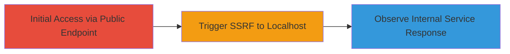

---
tags:
  - ssrf
  - web
  - php
  - internal-network
  - reconnaissance
type: attack_chain
tools: []
tactics:
  - '[[Initial Access]]'
  - '[[Discovery]]'
verified: false
platforms:
  - Web
submitted: true
complexity: low
created_at: '2023-10-01T00:00:00Z'
procedures:
  - '[[procedures/Exploit-SSRF-in-Rompager-Check-via-Unvalidated-IP-Parameter]]'
step_count: 2
techniques:
  - '[[Exploit Public-Facing Application]]'
updated_at: '2025-12-14T04:39:02.158Z'
description: >-
  A multi-step attack chain exploiting a Server-Side Request Forgery (SSRF)
  vulnerability in the rompager.php script to force the server into making
  unauthorized requests to localhost and internal network services on ports 80
  and 7547.
skill_level: beginner
impact_level: high
id: d048d4fb-7d1c-4666-b023-fc3721b02540
validated: true
mitre_tactics:
  - '[[Initial Access]]'
  - '[[Discovery]]'
mitre_techniques:
  - '[[Exploit Public-Facing Application]]'
---
# SSRF Exploitation in RomPager Check Script to Access Internal Localhost Services

Multi-stage attack chain demonstrating a complete attack workflow exploiting SSRF in a public-facing PHP script to probe internal services.

## Chain Metrics Dashboard

| Metric | Value |
|--------|-------|
| Chain Status | Unverified |
| Total Steps | 2 |
| Execution Time | ~1 minute |
| Skill Level | Beginner |
| Complexity | Low |
| Impact Level | High |

## Attack Flow Visualization



## Prerequisites & Requirements

### Required Tools

- Browser or [[curl]]

### Target Environment

- Web platform with PHP and cURL enabled
- Exposed endpoint: https://target.com/rompager.php
- Ports 80 and 7547 open internally

### Initial Access Requirements

- Public network access to the target web application
- No authentication required

## Detailed Attack Procedures

### Step 1: Access the Vulnerable Endpoint
procedure: [[procedures/Exploit-SSRF-in-Rompager-Check-via-Unvalidated-IP-Parameter]]

**Objective**: Trigger the SSRF by supplying a malicious 'ip' parameter to force the server to request localhost.

**Instructions**: Use [[commands/curl-ssrf-trigger]] to send a GET request to the rompager endpoint with ip=localhost:

```bash
curl "https://rompager.hboeck.de/?ip=localhost"
```

**Expected Output**: Response indicating attempts to connect to http://localhost:80 and http://localhost:7547, such as error messages or service probes.

**Success Indicators**:
- Response mentions 'Port 80' or 'Port 7547'
- Confirmation of internal connection attempts

### Step 2: Analyze Response for Internal Exposure
procedure: [[procedures/Exploit-SSRF-in-Rompager-Check-via-Unvalidated-IP-Parameter]]

**Objective**: Interpret the server's response to confirm SSRF success and potential internal service exposure.

**Instructions**: Review the output from the previous curl request for indicators of internal requests. For further testing, modify the IP to other internal addresses like 127.0.0.1 or 192.168.x.x using the same command pattern.

**Expected Output**: Messages like 'No RomPager found' under specific ports, confirming the script executed CURL to the target IP.

**Success Indicators**:
- Evidence of localhost or internal IP probing
- Potential leakage of internal service details

## Attack Chain Summary

### Key Achievements

1. Successful SSRF exploitation without authentication
2. Forced server requests to localhost on ports 80 and 7547
3. Potential for broader internal network reconnaissance

## Technique & Tactic Coverage

### MITRE ATT&CK Techniques

- [[Exploit Public-Facing Application]]

### MITRE ATT&CK Tactics

- [[Initial Access]]
- [[Discovery]]

---
*Last updated: 2023-10-01T00:00:00Z*
