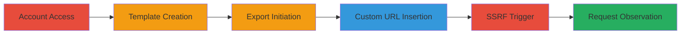

# SSRF Exploitation in Stripo Email Template Export to ActiveCampaign

Multi-stage attack chain demonstrating a complete SSRF workflow in Stripo's platform, enabling attackers to force the server to make arbitrary HTTP/HTTPS requests to internal or external endpoints.

## Chain Metrics Dashboard

| Metric | Value |
|--------|-------|
| Chain Status | Unverified |
| Total Steps | 7 |
| Execution Time | ~10 minutes |
| Skill Level | Intermediate |
| Complexity | Medium |
| Impact Level | High |

## Attack Flow Visualization



## Prerequisites & Requirements

### Required Tools

- A listening server (e.g., using [[commands/setup-ssrf-listener]] to capture incoming requests)

### Target Environment

- Stripo platform (https://my.stripo.email)
- ActiveCampaign export feature
- Web browser for UI interactions

### Initial Access Requirements

- Valid Stripo account credentials
- Attacker-controlled server with public endpoint for receiving SSRF requests
- No special network access beyond internet connectivity

## Detailed Attack Procedures

### Step 1: Login to Stripo Account
procedure: [[procedures/Trigger-SSRF-via-ActiveCampaign-Export-in-Stripo]]

**Objective**: Gain access to the Stripo dashboard to prepare for template manipulation.

**Instructions**: Open a web browser and navigate to the Stripo login page. Enter valid credentials to authenticate.

**Expected Output**: Successful login redirect to the dashboard.

**Success Indicators**:
- Dashboard loads with user-specific content
- No authentication errors

### Step 2: Navigate to Templates Page
procedure: [[procedures/Trigger-SSRF-via-ActiveCampaign-Export-in-Stripo]]

**Objective**: Access the template management interface.

**Instructions**: From the dashboard, click on the templates section or directly visit https://my.stripo.email/cabinet/#/templates/.

**Expected Output**: Templates list or creation page appears.

**Success Indicators**:
- URL matches /templates/
- Template options are visible

### Step 3: Create and Select a Template
procedure: [[procedures/Trigger-SSRF-via-ActiveCampaign-Export-in-Stripo]]

**Objective**: Prepare a template to enable the export feature.

**Instructions**: Click 'Create your first mail' if no templates exist, then select a basic template to edit or view.

**Expected Output**: Template editor opens with a selected design.

**Success Indicators**:
- Template is loaded and editable
- Export button becomes available

### Step 4: Initiate Export
procedure: [[procedures/Trigger-SSRF-via-ActiveCampaign-Export-in-Stripo]]

**Objective**: Access the export options for the template.

**Instructions**: In the template editor, locate and click the 'Export' button.

**Expected Output**: Export modal or menu opens with integration options.

**Success Indicators**:
- Export interface displays
- Various export providers listed

### Step 5: Select ActiveCampaign Export Option
procedure: [[procedures/Trigger-SSRF-via-ActiveCampaign-Export-in-Stripo]]

**Objective**: Target the vulnerable ActiveCampaign integration.

**Instructions**: In the export options, click on 'ActiveCampaign' to proceed.

**Expected Output**: ActiveCampaign-specific form appears with API URL and key fields.

**Success Indicators**:
- Form fields for API URL and API Key are present
- No immediate validation errors

### Step 6: Insert Custom Values in API Fields
procedure: [[procedures/Trigger-SSRF-via-ActiveCampaign-Export-in-Stripo]]

**Objective**: Inject the SSRF payload by specifying an attacker-controlled URL.

**Instructions**: In the API URL field, enter your attacker server address (e.g., http://attacker.com:8080/callback). In the API Key field, enter a fake string like 'fakekey123'.

**Expected Output**: Fields accept the input without rejection.

**Success Indicators**:
- Custom URL is saved in the form
- Form remains submittable

### Step 7: Trigger the Export and Observe Server Logs
procedure: [[procedures/Trigger-SSRF-via-ActiveCampaign-Export-in-Stripo]]

**Objective**: Execute the SSRF by forcing the server to request the malicious URL.

**Instructions**: Click 'Export' to submit. Simultaneously, monitor your listener server using [[commands/setup-ssrf-listener]] to capture the incoming request.

```bash
python3 -m http.server 8080
```

**Expected Output**: Stripo server sends an HTTP request to your URL, logged on your server.

**Success Indicators**:
- Incoming request from Stripo's IP in logs
- Request details confirm SSRF (e.g., headers or payload from export)

## Attack Chain Summary

### Key Achievements

1. Successful authentication and navigation in Stripo
2. Template preparation and export targeting
3. SSRF trigger confirming arbitrary request capability

## Technique & Tactic Coverage

### MITRE ATT&CK Techniques

- [[Exploit Public-Facing Application]]

### MITRE ATT&CK Tactics

- [[Initial Access]]

---
*Last updated: 2023-10-01T00:00:00Z*
