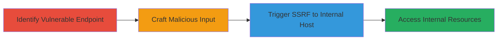

# SSRF Exploitation in Undici NPM Package via Malicious Pathname

Multi-stage attack chain demonstrating a complete attack workflow exploiting the SSRF vulnerability in the undici npm package.

## Chain Metrics Dashboard

| Metric | Value |
|--------|-------|
| Chain Status | Unverified |
| Total Steps | 3 |
| Execution Time | ~5 minutes |
| Skill Level | Intermediate |
| Complexity | Medium |
| Impact Level | High |

## Attack Flow Visualization



## Prerequisites & Requirements

### Required Tools

- [[tools/undici]]

### Target Environment

- Node.js runtime
- Application using undici <= 5.8.1
- Access to user input fields that feed into undici.request pathname

### Initial Access Requirements

- Ability to interact with the application's input mechanisms (e.g., API endpoints, forms)
- No special credentials needed if input is unauthenticated

## Detailed Attack Procedures

### Step 1: Identify Vulnerable Endpoint
procedure: [[procedures/Identify-Undici-Request-with-User-Controlled-Pathname]]

**Objective**: Locate code or endpoints where undici.request accepts user-controlled input for the pathname option.

**Instructions**: Review the application's source code or test inputs to identify where pathname is derived from user data. Use debugging tools to inspect request construction.

**Expected Output**: Confirmation of vulnerable undici.request call with user-controlled pathname.

**Success Indicators**:
- User input directly influences pathname
- No validation on pathname for absolute/protocol-relative URLs

### Step 2: Craft Malicious Input
procedure: [[procedures/Craft-Malicious-Protocol-Relative-URL-for-Pathname]]

**Objective**: Prepare inputs like '//127.0.0.1' or 'http://127.0.0.1' to override the origin.

**Instructions**: Submit the crafted input via the identified endpoint. For example, if it's an API, use a tool like curl to send the payload.

**Expected Output**: Input accepted without rejection.

**Success Indicators**:
- Payload reaches the undici.request without sanitization
- No error on absolute URL in pathname

### Step 3: Trigger and Observe SSRF
procedure: [[procedures/Execute-and-Observe-SSRF-to-Internal-Host]]

**Objective**: Force the server to request internal resources and observe the outcome.

**Instructions**: Execute the request with the malicious pathname using [[commands/undici-request-ssrf-demo]]:

```javascript
const undici = require("undici");
undici.request({origin: "http://example.com", pathname: "//127.0.0.1"});
```

Monitor server logs or internal services for incoming requests.

**Expected Output**: Request directed to http://127.0.0.1/ instead of the base URL.

**Success Indicators**:
- Traffic to localhost or internal IP
- Potential data exposure from internal services

## Attack Chain Summary

### Key Achievements

1. Identified vulnerable undici usage
2. Bypassed origin validation with protocol-relative URLs
3. Achieved SSRF to internal hosts, enabling reconnaissance or data exfiltration

## Technique & Tactic Coverage

### MITRE ATT&CK Techniques

- [[Exploit Public-Facing Application]]

### MITRE ATT&CK Tactics

- [[Initial Access]]

---
*Last updated: 2023-10-01T00:00:00Z*
