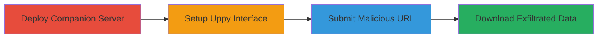

---
tags:
  - ssrf
  - uppy
  - npm
  - node.js
  - metadata-exfiltration
  - internal-access
type: attack_chain
tools:
  - '[[tools/npm]]'
  - '[[tools/Uppy]]'
tactics:
  - '[[Initial Access]]'
  - '[[Discovery]]'
verified: false
platforms:
  - Web
  - Node.js
  - Linux
submitted: true
complexity: medium
created_at: '2023-10-01T00:00:00Z'
procedures:
  - '[[procedures/Deploy-Uppy-Companion-Server]]'
  - '[[procedures/Create-Uppy-HTML-Interface]]'
  - '[[procedures/Submit-Malicious-Internal-URL]]'
  - '[[procedures/Download-Exfiltrated-Internal-Content]]'
step_count: 4
techniques:
  - '[[Exploit Public-Facing Application]]'
  - '[[Active Scanning]]'
updated_at: '2025-12-14T04:08:55.573Z'
description: >-
  A multi-stage attack exploiting SSRF in the Uppy Companion server to access
  and exfiltrate internal server metadata and resources via arbitrary URL
  fetching.
skill_level: intermediate
impact_level: high
id: 121dce97-7dde-41ed-8083-e863f149a29d
validated: true
mitre_tactics:
  - '[[Initial Access]]'
  - '[[Discovery]]'
mitre_techniques:
  - '[[Exploit Public-Facing Application]]'
  - '[[Active Scanning]]'
---
# SSRF Exploitation in Uppy Companion Server to Exfiltrate Internal Metadata

Multi-stage attack chain demonstrating exploitation of a Server-Side Request Forgery (SSRF) vulnerability in the Uppy npm module's Companion server to fetch and exfiltrate internal resources like AWS metadata or local files.

## Chain Metrics Dashboard

| Metric | Value |
|--------|-------|
| Chain Status | Unverified |
| Total Steps | 4 |
| Execution Time | ~10 minutes |
| Skill Level | Intermediate |
| Complexity | Medium |
| Impact Level | High |

## Attack Flow Visualization



## Prerequisites & Requirements

### Required Tools

- [[tools/npm]]
- [[tools/Uppy]]

### Target Environment

- Node.js runtime (version 12+ recommended)
- Ports: 3020 (Companion server), 3000 (local demo server if needed)
- Network access to internal resources (e.g., localhost, 169.254.169.254 for metadata)

### Initial Access Requirements

- Local machine with npm installed
- No prior credentials needed; exploits public-facing Companion server if deployed
- Administrative privileges for global npm install (sudo on Linux)

## Detailed Attack Procedures

### Step 1: Deploy Companion Server
procedure: [[procedures/Deploy-Uppy-Companion-Server]]

**Objective**: Install and start the vulnerable Uppy Companion server to enable URL fetching via the /get endpoint.

**Instructions**: Use [[commands/install-uppy-companion-globally]] to install the package:

```bash
sudo npm install -g @uppy/companion
```

Then create a config file conf.json with basic settings (e.g., {"server": {"host": "localhost", "port": 3020}, "debug": true}) and start with [[commands/start-uppy-companion-server]]:

```bash
companion --config conf.json
```

**Expected Output**: Server logs indicating startup on localhost:3020.

**Success Indicators**:
- Installation completes without errors
- Server binds to port 3020 and listens for requests

### Step 2: Create Uppy HTML Interface
procedure: [[procedures/Create-Uppy-HTML-Interface]]

**Objective**: Build a client-side HTML page integrating the Uppy library to interact with the Companion server.

**Instructions**: Create an index.html file including Uppy assets from CDN and initialize with URL plugin targeting the companion URL:

```html
<!DOCTYPE html>
<html>
<head>
  <link rel="stylesheet" href="https://releases.transloadit.com/uppy/v1.8.0/uppy.min.css">
</head>
<body>
  <script src="https://releases.transloadit.com/uppy/v1.8.0/uppy.min.js"></script>
  <script>
    const uppy = new Uppy.Core({
      plugins: [
        'Dashboard',
        'Url',
        'Tus'
      ]
    }).use(Uppy.Dashboard, { target: '#uppy' })
      .use(Uppy.Url, { companionUrl: 'http://localhost:3020' })
      .use(Uppy.Tus, { endpoint: 'https://master.tus.io/files/' });
  </script>
  <div id="uppy"></div>
</body>
</html>
```

Load the page in a browser.

**Expected Output**: Uppy dashboard interface loads with upload options.

**Success Indicators**:
- Dashboard appears without JavaScript errors
- URL plugin is functional

### Step 3: Submit Malicious Internal URL
procedure: [[procedures/Submit-Malicious-Internal-URL]]

**Objective**: Use the Uppy interface to trigger SSRF by submitting an internal URL, causing the Companion server to fetch and process it.

**Instructions**: In the browser, open the HTML page, click 'Add More' > 'Link', enter an internal URL like http://169.254.169.254/metadata/v1/ or http://127.0.0.1:3000/x.txt, then initiate upload.

**Expected Output**: Upload progress completes; file appears in dashboard with internal content embedded.

**Success Indicators**:
- No validation errors on URL submission
- Upload succeeds, indicating server-side fetch occurred

### Step 4: Download Exfiltrated Internal Content
procedure: [[procedures/Download-Exfiltrated-Internal-Content]]

**Objective**: Retrieve the downloaded file containing the response from the internal URL to exfiltrate data like metadata.

**Instructions**: After upload, click the file in the Uppy dashboard to download it. Open the file to view contents (e.g., JSON with id, hostname, user-data from metadata endpoint).

**Expected Output**: Downloaded file contains raw response from internal service (e.g., AWS instance metadata listing).

**Success Indicators**:
- File downloads successfully
- Content reveals internal information (e.g., server details, not external error)

## Attack Chain Summary

### Key Achievements

1. Successful deployment of vulnerable Companion server
2. Triggering SSRF to access internal metadata endpoints
3. Exfiltration of sensitive server information via file download

## Technique & Tactic Coverage

### MITRE ATT&CK Techniques

- [[Exploit Public-Facing Application]] Exploit Public-Facing Application
- [[Active Scanning]] Active Scanning

### MITRE ATT&CK Tactics

- [[Initial Access]] Initial Access
- [[Discovery]] Discovery

---
*Last updated: 2023-10-01T00:00:00Z*
