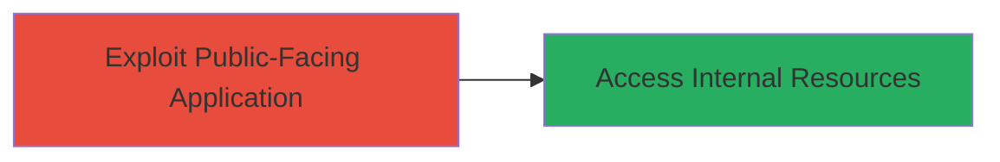

---
tags:
  - ssrf
  - dod
  - web
  - internal-access
type: attack_chain
tools: []
tactics:
  - '[[Initial Access]]'
verified: false
platforms:
  - Web
submitted: true
complexity: low
created_at: '2023-10-01T00:00:00Z'
procedures:
  - '[[procedures/Exploit-SSRF-via-Crafted-URLs]]'
step_count: 1
techniques:
  - '[[Exploit Public-Facing Application]]'
updated_at: '2025-12-14T04:39:02.515Z'
description: >-
  A single-stage attack demonstrating Server-Side Request Forgery (SSRF) on a
  U.S. Department of Defense webserver, allowing custom outbound requests to
  potentially access internal resources.
skill_level: intermediate
impact_level: low
id: 7b7f348b-e23c-466e-8280-ca15aff6fe53
validated: true
mitre_tactics:
  - '[[Initial Access]]'
mitre_techniques:
  - '[[Exploit Public-Facing Application]]'
---
# SSRF Exploitation on DoD Webserver for Internal Resource Access

Multi-stage attack chain demonstrating a complete attack workflow.

## Chain Metrics Dashboard

| Metric | Value |
|--------|-------|
| Chain Status | Unverified |
| Total Steps | 1 |
| Execution Time | ~5 minutes |
| Skill Level | Intermediate |
| Complexity | Low |
| Impact Level | Low |

## Attack Flow Visualization



## Prerequisites & Requirements

### Required Tools

- None specific; uses standard HTTP clients like curl or browser.

### Target Environment

- Web platform (DoD webserver)
- Publicly accessible HTTP endpoint vulnerable to SSRF
- No specific ports required beyond standard HTTP/HTTPS (80/443)

### Initial Access Requirements

- Network access to the public DoD webserver
- No credentials needed for initial exploitation
- Ability to craft and send HTTP requests

## Detailed Attack Procedures

### Step 1: Discover and Exploit SSRF
procedure: [[procedures/Exploit-SSRF-via-Crafted-URLs]]

**Objective**: Identify the SSRF vulnerability and demonstrate it by crafting URLs that force the server to make unauthorized outbound requests, potentially accessing internal resources.

**Instructions**: Begin by identifying an input field or parameter on the DoD webserver that accepts URLs (e.g., an image loader or redirect feature). Craft a malicious URL that points to an internal resource, such as localhost or a private IP. Use [[commands/curl-ssrf-test]] to send the request:

```bash
curl -X GET "https://dod-website.example.com/vulnerable-endpoint?url=http://169.254.169.254/latest/meta-data/" -v
```

Monitor the response for signs of internal data leakage, such as AWS metadata if applicable, or confirm the server-side request via a controlled external server (e.g., your own webhook).

**Expected Output**: Server response containing internal data or confirmation of the forged request (e.g., hit on your listener server).

**Success Indicators**:
- Unauthorized internal resource data appears in the response
- Logs on a controlled server show incoming request from the DoD server IP
- No direct error, but indirect evidence of SSRF success

## Attack Chain Summary

### Key Achievements

1. Successful demonstration of SSRF on a DoD webserver
2. Potential exposure of internal network resources
3. Low-severity impact highlighting need for URL validation

## Technique & Tactic Coverage

### MITRE ATT&CK Techniques

- [[Exploit Public-Facing Application]]

### MITRE ATT&CK Tactics

- [[Initial Access]]

---
*Last updated: 2023-10-01T00:00:00Z*
