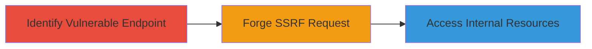

---
tags:
  - ssrf
  - web
  - informatica
type: attack_chain
tools:
  - '[[tools/curl]]'
tactics:
  - '[[Initial Access]]'
commands:
  - '[[commands/curl-ssrf-test]]'
platforms:
  - Web
complexity: medium
procedures:
  - '[[procedures/Exploit-SSRF-on-Wiki-Subdomains]]'
step_count: 1
techniques:
  - '[[Exploit Public-Facing Application]]'
description: >-
  A server-side request forgery vulnerability on Informatica wiki subdomains
  allowing unauthorized access to internal resources via forged requests.
skill_level: intermediate
impact_level: medium
id: c4562d1e-dbac-4d00-a37f-74c0d8072fcd
created_at: '2025-12-14T04:39:09.941Z'
updated_at: '2025-12-14T04:39:09.941Z'
verified: false
validated: true
submitted: true
mitre_tactics:
  - '[[Initial Access]]'
mitre_techniques:
  - '[[Exploit Public-Facing Application]]'
---
# SSRF Exploitation on Informatica Wiki Subdomains for Internal Resource Access

Multi-stage attack chain demonstrating a complete attack workflow targeting SSRF on infawiki.informatica.com and infawikitest.informatica.com.

## Chain Metrics Dashboard

| Metric | Value |
|--------|-------|
| Chain Status | Unverified |
| Total Steps | 1 |
| Execution Time | ~5 minutes |
| Skill Level | Intermediate |
| Complexity | Medium |
| Impact Level | Medium |

## Attack Flow Visualization



## Prerequisites & Requirements

### Required Tools

- [[tools/curl]]

### Target Environment

- Web platform
- Accessible subdomains: infawiki.informatica.com, infawikitest.informatica.com
- No specific ports required beyond standard HTTP/HTTPS (80/443)

### Initial Access Requirements

- Public internet access to the target subdomains
- No credentials needed for initial testing
- Basic knowledge of HTTP request manipulation

## Detailed Attack Procedures

### Step 1: Identify and Exploit SSRF Vulnerability
procedure: [[procedures/Exploit-SSRF-on-Wiki-Subdomains]]

**Objective**: Forge server-side requests to access internal resources on the vulnerable wiki subdomains.

**Instructions**: Begin by testing the wiki endpoints for SSRF by sending crafted requests using [[commands/curl-ssrf-test]] to redirect to internal IPs like localhost or metadata services:

```bash
curl -X GET "https://infawiki.informatica.com/search?query=http://169.254.169.254/latest/meta-data/" -v
```

Monitor the response for signs of internal data leakage, such as AWS metadata if applicable, or connection errors indicating SSRF success.

**Expected Output**: Response containing internal resource data or error messages revealing server-side processing of the forged URL.

**Success Indicators**:
- Unauthorized internal content in response
- Server errors confirming request forgery
- Potential access to metadata endpoints

## Attack Chain Summary

### Key Achievements

1. Identification of SSRF on wiki subdomains
2. Successful forgery of server-side requests
3. Potential unauthorized access to internal network resources

## Technique & Tactic Coverage

### MITRE ATT&CK Techniques

- [[Exploit Public-Facing Application]]

### MITRE ATT&CK Tactics

- [[Initial Access]]

---
*Last updated: 2023-10-01*
