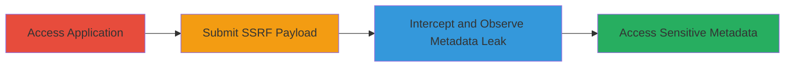

# SSRF Exploitation to Access AWS Instance Metadata via Import from URL Feature

Multi-stage attack chain demonstrating exploitation of an SSRF vulnerability in a DoD web application's 'Import from URL' feature to leak AWS EC2 instance metadata, enabling potential internal network access and data exfiltration.

## Chain Metrics Dashboard

| Metric | Value |
|--------|-------|
| Chain Status | Unverified |
| Total Steps | 3 |
| Execution Time | ~5 minutes |
| Skill Level | Intermediate |
| Complexity | Medium |
| Impact Level | High |

## Attack Flow Visualization



## Prerequisites & Requirements

### Required Tools

- [[tools/Burp-Suite]] (for request interception)

### Target Environment

- Web application hosted on AWS EC2
- Exposed 'Import from URL' feature at /api/v1/download-url
- Network access to the public-facing application

### Initial Access Requirements

- No credentials required (publicly accessible endpoint)
- Ability to send HTTP requests to the target
- Proxy tool for interception (e.g., Burp Suite)

## Detailed Attack Procedures

### Step 1: Access the Target Application

procedure: [[procedures/Exploit-SSRF-to-Leak-AWS-Metadata]]

**Objective**: Navigate to the vulnerable web application to identify the 'Import from URL' feature.

**Instructions**: Open a browser and visit the redacted target URL (https://██████████). Locate and interact with the main page to find the 'Import from URL' button, which triggers requests to the /api/v1/download-url endpoint.

**Expected Output**: The application interface loads, displaying the 'Import from URL' functionality.

**Success Indicators**:
- Application page accessible without errors
- 'Import from URL' button visible and clickable

### Step 2: Submit SSRF Payload via Import Feature

procedure: [[procedures/Exploit-SSRF-to-Leak-AWS-Metadata]]

**Objective**: Inject an SSRF payload by submitting an internal AWS metadata URL through the user-supplied ?url= parameter.

**Instructions**: Click the 'Import from URL' button and enter the payload `http://169.254.169.254/latest/meta-data/` in the URL field. Submit the form to trigger the backend request to the vulnerable endpoint.

Use [[commands/curl-ssrf-aws-metadata]] to simulate or verify the request if testing outside the UI:

```bash
curl -X GET "https://██████████/api/v1/download-url?url=http://169.254.169.254/latest/meta-data/" -v
```

**Expected Output**: The server processes the internal request and prepares a response with metadata paths.

**Success Indicators**:
- Form submission succeeds without validation errors
- Backend request to AWS metadata endpoint is initiated

### Step 3: Intercept Request and Observe Metadata Leak

procedure: [[procedures/Exploit-SSRF-to-Leak-AWS-Metadata]]

**Objective**: Capture the outgoing SSRF request and analyze the leaked AWS metadata response.

**Instructions**: Configure a proxy like Burp Suite to intercept traffic. Replay or monitor the request to /api/v1/download-url?url=http://169.254.169.254/latest/meta-data/. Examine the server's response for leaked internal paths.

**Expected Output**: HTTP 200 response containing a directory listing of AWS metadata endpoints, such as ami-id, instance-id, security-groups, etc.

**Success Indicators**:
- Intercepted request shows server fetching from 169.254.169.254
- Response leaks sensitive metadata paths like instance-id and security-groups

## Attack Chain Summary

### Key Achievements

1. Successful SSRF exploitation bypassing URL validation
2. Leakage of AWS EC2 instance metadata including instance details and security groups
3. Potential for further internal tunneling and data exfiltration from DoD systems

## Technique & Tactic Coverage

### MITRE ATT&CK Techniques

- [[Exploit Public-Facing Application]]

### MITRE ATT&CK Tactics

- [[Initial Access]]
- [[Discovery]]

---
*Last updated: 2023-10-01T00:00:00Z*
