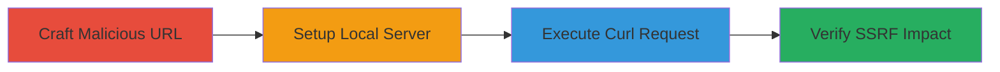

# SSRF Exploitation via Curl Hostname Parsing with GBK Best-Fit Mapping

Multi-stage attack chain demonstrating SSRF in curl-based applications on systems with Chinese language settings, exploiting GBK (cp936) best-fit mapping to convert superscript characters like ¹ and ² to digits 1 and 2, allowing hostnames such as '¹²7.0.0.1' to resolve to '127.0.0.1'.

## Chain Metrics Dashboard

| Metric | Value |
|--------|-------|
| Chain Status | Unverified |
| Total Steps | 4 |
| Execution Time | ~5 minutes |
| Skill Level | Intermediate |
| Complexity | Medium |
| Impact Level | High |

## Attack Flow Visualization



## Prerequisites & Requirements

### Required Tools

- [[tools/curl]]
- [[tools/Flask]]
- [[tools/Python]]

### Target Environment

- Systems with Chinese language settings (e.g., LANG=zh_CN.UTF-8 on Linux, or equivalent on macOS/Windows)
- curl version 8.7.1 or below with IDN enabled
- Ports: 80 (for local server)
- Network access: Localhost access for testing

### Initial Access Requirements

- Administrative access to set language encoding if needed
- No external credentials required for PoC; in real scenarios, access to an application using curl for HTTP requests

## Detailed Attack Procedures

### Step 1: Craft Malicious URL
procedure: [[procedures/Craft-Malicious-URL-with-Superscript-Characters]]

**Objective**: Create a URL with superscript characters that map to IP digits via GBK best-fit, bypassing host validations.

**Instructions**: Reference the GBK best-fit table to select characters like ¹ (U+00B9, maps to 0x31 '1') and ² (U+00B2, maps to 0x32 '2'). Construct hostname '¹²7.0.0.1' for localhost resolution.

**Expected Output**: Valid URL string ready for use in requests.

**Success Indicators**:
- URL contains non-ASCII characters that visually resemble but differ from digits
- Confirmation via Unicode table that mappings exist

### Step 2: Setup Local HTTP Server
procedure: [[procedures/Setup-Local-HTTP-Server-for-Testing]]

**Objective**: Establish a listener to capture incoming SSRF requests and confirm exploitation.

**Instructions**: Use [[commands/flask-simple-server]] to start a Flask server on port 80:

```python
from flask import Flask
app = Flask(__name__)
@app.route('/')
def index():
    return 'FindVuln'
if __name__ == '__main__':
    app.run(host='0.0.0.0', port=80, threaded=True)
```

Run the script in a terminal.

**Expected Output**: Server logs showing '* Running on all addresses (0.0.0.0)' and '* Running on http://127.0.0.1:80'.

**Success Indicators**:
- Server binds to 0.0.0.0:80 without errors
- Accessible via browser at http://127.0.0.1/

### Step 3: Execute Curl Request
procedure: [[procedures/Execute-Curl-with-Crafted-URL]]

**Objective**: Trigger the SSRF by sending the crafted URL through curl, exploiting the encoding conversion.

**Instructions**: Ensure system language is set to Chinese (e.g., export LANG=zh_CN.UTF-8 on Linux). Then execute [[commands/curl-gbk-ssrf-test]]:

```bash
curl -g 'http://¹²7.0.0.1' -v -o /dev/null
```

**Expected Output**: Verbose logs indicating connection to 127.0.0.1:80, with response 'FindVuln'.

**Success Indicators**:
- Curl resolves hostname to 127.0.0.1 despite visual differences
- Request reaches local server

### Step 4: Verify SSRF Exploitation
procedure: [[procedures/Verify-SSRF-Request-Reception]]

**Objective**: Confirm the request was redirected internally, proving SSRF success.

**Instructions**: Check Flask server logs for incoming request to '/' with response 'FindVuln'. Review curl verbose output for connection details.

**Expected Output**: Server log entry showing GET / from 127.0.0.1, and curl output confirming HTTP/1.1 200 OK.

**Success Indicators**:
- Internal host access without direct localhost specification
- Potential for broader impact like internal network scanning or RCE in vulnerable apps

## Attack Chain Summary

### Key Achievements

1. Bypassed hostname blocklists using encoding tricks
2. Demonstrated SSRF leading to internal localhost access
3. Highlighted risks in curl-dependent applications on localized systems

## Technique & Tactic Coverage

### MITRE ATT&CK Techniques

- [[Exploit Public-Facing Application]]
- [[Command-Line Interface]]

### MITRE ATT&CK Tactics

- [[Execution]]
- [[Initial Access]]

---

*Last updated: 2023-10-01T00:00:00Z*
