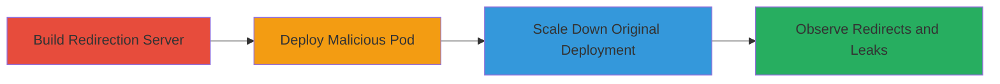

---
tags:
  - ssrf
  - kubernetes
  - metrics-server
  - token-leak
  - cloud
type: attack_chain
tools:
  - '[[tools/Docker]]'
  - '[[tools/kubectl]]'
tactics:
  - '[[Initial Access]]'
  - '[[Collection]]'
verified: false
platforms:
  - Kubernetes
  - AKS
  - GKE
  - EKS
submitted: true
complexity: medium
created_at: '2023-10-01T00:00:00Z'
procedures:
  - '[[procedures/Build-Malicious-Redirection-Server]]'
  - '[[procedures/Deploy-Malicious-Pod-to-Hijack-Metrics-Server]]'
  - '[[procedures/Scale-Down-Original-Metrics-Server]]'
  - '[[procedures/Observe-Redirected-Traffic-and-Token-Leakage]]'
step_count: 4
techniques:
  - '[[Exploit Public-Facing Application]]'
  - '[[Steal Application Access Token]]'
updated_at: '2025-12-14T17:32:39.002Z'
description: >-
  Multi-stage attack hijacking the metrics-server in Kubernetes to exploit SSRF
  through 30X redirects, leading to bearer token leakage and potential spamming
  from control plane components.
skill_level: intermediate
impact_level: high
id: 6d46ee4c-632a-4739-9039-7413b99cf346
validated: true
mitre_tactics:
  - '[[Initial Access]]'
  - '[[Collection]]'
mitre_techniques:
  - '[[Exploit Public-Facing Application]]'
  - '[[Steal Application Access Token]]'
---
# SSRF Exploitation via Hijacked Metrics-Server in Kubernetes

Multi-stage attack chain demonstrating SSRF in Kubernetes aggregated API servers by hijacking metrics-server to issue 30X redirects, causing control plane clients to follow them and leak bearer tokens.

## Chain Metrics Dashboard

| Metric | Value |
|--------|-------|
| Chain Status | Unverified |
| Total Steps | 4 |
| Execution Time | ~15 minutes |
| Skill Level | Intermediate |
| Complexity | Medium |
| Impact Level | High |

## Attack Flow Visualization



## Prerequisites & Requirements

### Required Tools

- [[tools/Docker]]
- [[tools/kubectl]]

### Target Environment

- Kubernetes cluster (AKS, GKE, EKS)
- Access to kube-system namespace
- kubectl configured with cluster admin privileges

### Initial Access Requirements

- Cluster credentials or pod execution rights
- Ability to deploy pods in kube-system

## Detailed Attack Procedures

### Step 1: Build Malicious Redirection Server
procedure: [[procedures/Build-Malicious-Redirection-Server]]

**Objective**: Create a Docker image for a Go-based server that returns 30X redirects to hijack API responses.

**Instructions**: Use [[tools/Docker]] to build the image from main.go, tagging it as weinong/go-redirect.

```bash
docker build -t weinong/go-redirect .
```

**Expected Output**: Docker image built successfully.

**Success Indicators**:
- Image available: `docker images | grep go-redirect`
- Server responds with 30X on test run

### Step 2: Deploy Malicious Pod to Hijack Metrics-Server
procedure: [[procedures/Deploy-Malicious-Pod-to-Hijack-Metrics-Server]]

**Objective**: Deploy a pod matching the metrics-server label selector in kube-system to intercept traffic.

**Instructions**: Apply the YAML manifest using [[tools/kubectl]]:

```bash
kubectl apply -f go-redirect.yaml
```

**Expected Output**: Pod deployed and running in kube-system.

**Success Indicators**:
- Pod status: `kubectl get pods -n kube-system | grep go-redirect`
- Service endpoints updated to include malicious pod

### Step 3: Scale Down Original Metrics-Server
procedure: [[procedures/Scale-Down-Original-Metrics-Server]]

**Objective**: Ensure the malicious pod becomes the primary endpoint by scaling down the legitimate deployment.

**Instructions**: Execute the reproduction script with [[commands/run-reproduction-script]] to handle scaling:

```bash
./run.sh
```

For GKE/AKS adaptations:

```bash
USE_GKE=1 ./run.sh
```

**Expected Output**: Original deployment scaled to 0 replicas.

**Success Indicators**:
- Deployment status: `kubectl get deployment metrics-server -n kube-system`
- No legitimate pods responding

### Step 4: Observe Redirected Traffic and Token Leakage
procedure: [[procedures/Observe-Redirected-Traffic-and-Token-Leakage]]

**Objective**: Monitor control plane components following redirects, capturing leaked bearer tokens.

**Instructions**: Trigger API calls from control plane (e.g., kube-controller-manager) and log redirects to an external endpoint.

**Expected Output**: Logs showing redirects to attacker-controlled IP (e.g., 20.85.59.5) with Authorization headers.

**Success Indicators**:
- Token leakage in logs: grep for "Bearer" in output.txt
- Spamming or external access confirmed

## Attack Chain Summary

### Key Achievements

1. Hijacked aggregated API server traffic
2. Induced SSRF via blind 30X redirect following
3. Leaked bearer tokens from control plane components
4. Enabled potential spamming attacks from cloud providers

## Technique & Tactic Coverage

### MITRE ATT&CK Techniques

- [[Exploit Public-Facing Application]]
- [[Steal Application Access Token]]

### MITRE ATT&CK Tactics

- [[Initial Access]]
- [[Collection]]

---

*Last updated: 2023-10-01T00:00:00Z*
