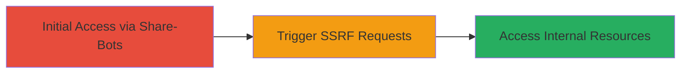

# SSRF Exploitation via VK.com Share-Bots Due to Lack of Flood Control

Multi-stage attack chain demonstrating a complete attack workflow targeting the SSRF vulnerability in VK.com's Share-bots feature, reported on HackerOne in 2017. The lack of flood control permitted unrestricted server-side requests, potentially allowing access to internal networks or services.

## Chain Metrics Dashboard

| Metric | Value |
|--------|-------|
| Chain Status | Unverified |
| Total Steps | 1 |
| Execution Time | ~5 minutes |
| Skill Level | Intermediate |
| Complexity | Medium |
| Impact Level | High |

## Attack Flow Visualization



## Prerequisites & Requirements

### Required Tools

- None specific; uses standard HTTP client like curl.

### Target Environment

- Target Platform: Web application (VK.com)
- Required Services/Ports: HTTP/HTTPS on port 80/443
- Network Access Requirements: Public internet access to VK.com endpoints

### Initial Access Requirements

- No credentials required for public Share-bots feature
- Attacker must be able to interact with VK.com's sharing interface
- No prior access needed beyond standard user agent

## Detailed Attack Procedures

### Step 1: Trigger SSRF via Share-Bots
procedure: [[procedures/Exploit-SSRF-in-VK-Share-Bots]]

**Objective**: Exploit the lack of flood control in the Share-bots feature to send forged server-side requests, potentially accessing internal VK.com resources or external unauthorized services.

**Instructions**: Interact with the Share-bots endpoint to submit multiple share requests containing malicious URLs that trigger SSRF. Use [[commands/curl-trigger-share-bot]] to simulate rapid requests without rate limiting:

```bash
curl -X POST 'https://vk.com/share-bot-endpoint' -d 'url=http://internal.vk.com/metadata' -H 'User-Agent: Mozilla/5.0'
```

Repeat the request multiple times to bypass any implicit controls and observe server responses for signs of internal access.

**Expected Output**: Server responses indicating successful request forwarding, such as error messages from internal services or delayed responses due to internal network traversal.

**Success Indicators**:
- Receipt of internal service responses (e.g., 200 OK from non-public endpoints)
- No rate-limiting errors despite multiple requests
- Potential data leakage in response headers or body

## Attack Chain Summary

### Key Achievements

1. Bypassed flood control to send unrestricted SSRF payloads via Share-bots.
2. Demonstrated potential for internal network reconnaissance or access.
3. Highlighted resolution through VK.com's triage and fix in April 2017.

## Technique & Tactic Coverage

### MITRE ATT&CK Techniques

- [[Exploit Public-Facing Application]]

### MITRE ATT&CK Tactics

- [[Initial Access]]

---
*Last updated: 2023-10-01T12:00:00Z*
