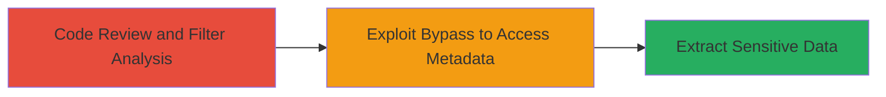

# SSRF Filter Bypass in Nextcloud to Access Cloud Metadata Services

Multi-stage attack chain demonstrating a complete attack workflow exploiting lax local domain checking in Nextcloud's SSRF prevention, allowing unauthorized access to sensitive cloud metadata services.

## Chain Metrics Dashboard

| Metric | Value |
|--------|-------|
| Chain Status | Unverified |
| Total Steps | 2 |
| Execution Time | ~30 minutes |
| Skill Level | Intermediate |
| Complexity | Medium |
| Impact Level | High |

## Attack Flow Visualization



## Prerequisites & Requirements

### Required Tools

- Code editor or IDE for source review (e.g., VS Code)
- Web browser or curl for testing requests

### Target Environment

- Nextcloud instance hosted on Google Cloud or Alibaba Cloud
- PHP-based web application
- Access to Nextcloud source code or a vulnerable deployment

### Initial Access Requirements

- Read access to Nextcloud source code for analysis
- Network access to the Nextcloud instance (authenticated user if required by the feature)
- No special credentials needed beyond standard user access for exploitation testing

## Detailed Attack Procedures

### Step 1: Analyze SSRF Filters in preventLocalAddress
procedure: [[procedures/Analyze-Nextcloud-preventLocalAddress-Function]]

**Objective**: Identify weaknesses in Nextcloud's local address validation to uncover bypass opportunities for SSRF.

**Instructions**: Review the source code of the preventLocalAddress function (also known as ThrowIfLocalAddress) to examine its filtering logic. Focus on checks for localhost, .local, .localhost domains, hostname-only validation, and IP range filters using FILTER_FLAG_NO_PRIV_RANGE and FILTER_FLAG_NO_RES_RANGE.

Locate the function in the Nextcloud server codebase, typically in files handling URL processing (e.g., sharing or calendar features). Manually inspect the code to note that cloud-specific endpoints like metadata.google.internal are not blocked by domain suffixes or IP filters.

**Expected Output**: Documentation of filter gaps, such as unblocked domains and IPs (e.g., 100.100.100.200 for Alibaba Cloud).

**Success Indicators**:
- Identification of incomplete validation logic
- Confirmation that private/reserved IP flags do not cover cloud metadata ranges

### Step 2: Exploit Bypass to Access Cloud Metadata
procedure: [[procedures/Test-SSRF-Bypass-with-Cloud-Metadata-Endpoints]]

**Objective**: Leverage the identified filter gaps to perform SSRF and retrieve internal cloud metadata, potentially exposing sensitive information like instance credentials or tokens.

**Instructions**: Target a Nextcloud feature that invokes the preventLocalAddress function for URL validation, such as webcal imports or file sharing links. Craft a payload using the bypassed URL, for example, http://metadata.google.internal/ for Google Cloud or http://100.100.100.200/latest/meta-data/ for Alibaba Cloud.

Use a tool like curl to send a request to the vulnerable endpoint, appending the malicious URL as a parameter (e.g., ?url=http://metadata.google.internal/computeMetadata/v1/instance/service-accounts/default/token). Monitor the response for metadata leakage.

For Google Cloud testing:

```bash
curl "https://nextcloud-instance.com/vulnerable-endpoint?url=http://metadata.google.internal/computeMetadata/v1/" -H "Metadata-Flavor: Google"
```

For Alibaba Cloud:

```bash
curl "https://nextcloud-instance.com/vulnerable-endpoint?url=http://100.100.100.200/latest/meta-data/instance-id"
```

**Expected Output**: Response containing cloud metadata, such as instance IDs, service account tokens, or IAM roles.

**Success Indicators**:
- Successful SSRF response with internal metadata
- No blocking by preventLocalAddress function

## Attack Chain Summary

### Key Achievements

1. Uncovered lax filtering in Nextcloud's SSRF prevention mechanism through code review.
2. Demonstrated bypass using cloud-specific metadata endpoints not covered by existing checks.
3. Enabled potential exfiltration of sensitive cloud configuration data, leading to further compromise.

## Technique & Tactic Coverage

### MITRE ATT&CK Techniques

- [[Exploit Public-Facing Application]] Exploit Public-Facing Application
- [[Steal Application Access Token]] Steal Application Access Token

### MITRE ATT&CK Tactics

- [[Initial Access]] Initial Access
- [[Collection]] Collection

---
*Last updated: 2023-10-01T00:00:00Z*
