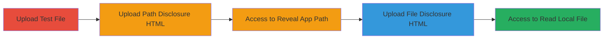

---
tags:
  - ssrf
  - nextcloud
  - ios
  - mobile
  - file-disclosure
  - local-storage
type: attack_chain
tools: []
tactics:
  - '[[Discovery]]'
  - '[[Collection]]'
verified: false
platforms:
  - iOS
  - Mobile
submitted: true
complexity: medium
created_at: '2023-10-01T00:00:00Z'
procedures:
  - '[[procedures/Upload-Test-File-to-Verify-Local-Storage]]'
  - '[[procedures/Upload-HTML-for-Application-Path-Disclosure]]'
  - '[[procedures/Access-HTML-to-Reveal-App-Path]]'
  - '[[procedures/Upload-HTML-with-Iframe-for-Local-File-Read]]'
  - '[[procedures/Access-HTML-to-Disclose-Local-File-Content]]'
step_count: 5
techniques:
  - '[[Exploit Public-Facing Application]]'
  - '[[File and Directory Discovery]]'
updated_at: '2025-12-14T04:39:09.556Z'
description: >-
  Multi-stage attack exploiting SSRF in Nextcloud iOS app's local storage to
  disclose arbitrary local files using manipulated HTML with JavaScript and
  iframes.
skill_level: intermediate
impact_level: high
id: 4a6e3117-8c3b-4dad-9e42-ed5d4457c1f1
validated: true
mitre_tactics:
  - '[[Discovery]]'
  - '[[Collection]]'
mitre_techniques:
  - '[[Exploit Public-Facing Application]]'
  - '[[File and Directory Discovery]]'
---
# SSRF Local File Disclosure in Nextcloud iOS App via Malicious HTML Uploads

Multi-stage attack chain demonstrating exploitation of a Server-Side Request Forgery (SSRF) vulnerability in the Nextcloud iOS mobile app's local storage feature. The attack allows arbitrary local file disclosure using the file:// protocol by uploading manipulated HTML files that execute JavaScript to reveal the application path and load local files via iframes. This leads to sensitive data exposure, such as reading documents and files on the device.

## Chain Metrics Dashboard

| Metric | Value |
|--------|-------|
| Chain Status | Unverified |
| Total Steps | 5 |
| Execution Time | ~5 minutes |
| Skill Level | Intermediate |
| Complexity | Medium |
| Impact Level | High |

## Attack Flow Visualization

## Prerequisites & Requirements

### Required Tools

- Nextcloud iOS mobile app installed on a test device
- Access to local storage feature in the app

### Target Environment

- iOS platform
- Nextcloud app version vulnerable to SSRF (pre-patch)
- Local file system access via app

### Initial Access Requirements

- Installed and running Nextcloud iOS app
- Ability to upload files to local storage
- No special credentials beyond app access

## Detailed Attack Procedures

### Step 1: Verify Upload Capability
procedure: [[procedures/Upload-Test-File-to-Verify-Local-Storage]]

**Objective**: Confirm the ability to upload files to the local storage feature.

**Instructions**: Open the Nextcloud iOS app, navigate to the local storage section, and upload a simple text file containing 'test ssrf' to demonstrate basic functionality.

**Expected Output**: File uploads successfully and can be listed in the app.

**Success Indicators**:
- File appears in local storage
- No upload errors

### Step 2: Upload Manipulated HTML for Path Disclosure
procedure: [[procedures/Upload-HTML-for-Application-Path-Disclosure]]

**Objective**: Create and upload an HTML file disguised as a common file type to execute JavaScript for revealing the app path.

**Instructions**: Prepare a file with content `<svg/onload=document.write(document.location)>`, change its extension to mimic a common file (e.g., .txt), and upload it to local storage via the app.

**Expected Output**: File uploads without validation errors.

**Success Indicators**:
- File is accepted despite HTML content
- File is viewable in the app

### Step 3: Access File to Reveal Application Path
procedure: [[procedures/Access-HTML-to-Reveal-App-Path]]

**Objective**: View the uploaded HTML file to trigger JavaScript execution and disclose the local application path.

**Instructions**: In the Nextcloud app, navigate to local storage and open the manipulated file to execute the onload JavaScript.

**Expected Output**: The app path is displayed via the document.write output.

**Success Indicators**:
- JavaScript executes without blocking
- Application path (e.g., file:///path/to/app/) is visible

### Step 4: Upload HTML with Iframe for Local File Disclosure
procedure: [[procedures/Upload-HTML-with-Iframe-for-Local-File-Read]]

**Objective**: Upload another manipulated HTML file using an iframe to load and display content from a target local file via file:// protocol.

**Instructions**: Using the revealed path, create HTML content `<iframe src="file://[path]/ssrfpoc.txt" width="400" height="400"></iframe>`, disguise as a common file, and upload to local storage.

**Expected Output**: File uploads successfully.

**Success Indicators**:
- Iframe src uses file:// without sanitization
- File is ready for access

### Step 5: Access File to Disclose Local Content
procedure: [[procedures/Access-HTML-to-Disclose-Local-File-Content]]

**Objective**: View the iframe HTML to load and expose the content of the target local file.

**Instructions**: Open the uploaded iframe HTML file in the app to trigger the SSRF and display the local file's content.

**Expected Output**: The content of ssrfpoc.txt (e.g., 'test ssrf') is loaded in the iframe.

**Success Indicators**:
- Local file content is visible
- Arbitrary file read confirmed

## Attack Chain Summary

### Key Achievements

1. Verified upload to local storage without content validation
2. Disclosed application path using JavaScript execution
3. Achieved SSRF-based local file disclosure via file:// iframes
4. Exposed sensitive device files and documents

## Technique & Tactic Coverage

### MITRE ATT&CK Techniques

- [[Exploit Public-Facing Application]] Exploit Public-Facing Application
- [[File and Directory Discovery]] File and Directory Discovery

### MITRE ATT&CK Tactics

- [[Discovery]] Discovery
- [[Collection]] Collection

---
*Last updated: 2023-10-01T00:00:00Z*
